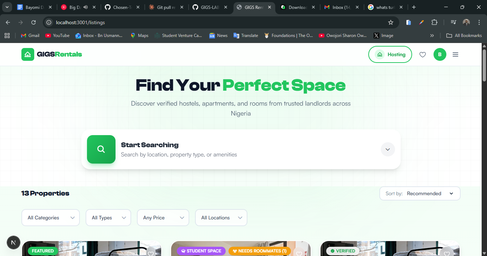

# GIGS-Rental 🏠

> **The ultimate rental platform for students and young professionals**



A comprehensive, modern rental platform that connects students and young professionals with affordable accommodation, roommate matches, and local experiences. Built with cutting-edge technology for seamless browsing, secure bookings, and community engagement.

---

## 🎯 What is GIGS-Rental?

GIGS-Rental simplifies the rental search process for students and young professionals while providing landlords and hostel owners with specialized tools to manage properties. Whether you're looking for a dorm room, shared apartment, or your perfect roommate, GIGS-Rental has you covered.

### Key Features

✨ **Multi-Category Listings**
- Accommodation (Hostels, Apartments, Houses, Rooms)
- Shared Living Spaces
- Local Experiences & Activities
- Services (Cleaning, Transport, Utilities)

💬 **Smart Connectivity**
- In-app messaging system
- Roommate matching algorithm
- Real-time notifications

💰 **Financial Tools**
- Bill splitting calculator
- Earnings tracking for hosts
- Commission-based booking system

📊 **Host Dashboard**
- Real-time analytics
- Listing performance metrics
- Booking management
- Review management

🔐 **Trust & Safety**
- Verified user profiles
- OAuth integration (Google)
- OTP-based email verification
- Safety guidelines

---

## 📋 Project Structure

This is a **monorepo** built with [Turborepo](https://turborepo.dev/), organizing multiple apps and shared packages:

```
├── apps/
│   ├── backend/          # NestJS REST API & application server
│   ├── dashboard/        # Next.js host dashboard for property management
│   └── web/              # Next.js marketing website & user portal
├── packages/
│   ├── auth/             # Shared authentication library
│   ├── ui/               # Reusable React component library
│   ├── config/           # Shared configuration (Tailwind, etc.)
│   ├── eslint-config/    # ESLint configurations
│   └── typescript-config/# TypeScript configurations
├── docs/                 # Project documentation & specifications
└── plans/                # Development planning & flows
```

---

## 🛠️ Tech Stack

### Frontend
- **Framework:** [Next.js](https://nextjs.org/) (React 18)
- **Styling:** [Tailwind CSS](https://tailwindcss.com/)
- **Language:** [TypeScript](https://www.typescriptlang.org/)
- **Components:** Custom UI library (`@repo/ui`)

### Backend
- **Framework:** [NestJS](https://nestjs.com/)
- **Language:** [TypeScript](https://www.typescriptlang.org/)
- **API:** RESTful architecture

### Tooling
- **Package Manager:** pnpm
- **Monorepo:** Turborepo
- **Linting:** ESLint
- **Formatting:** Prettier
- **Testing:** Jest

---

## 🚀 Quick Start

### Prerequisites
- Node.js 18+ 
- pnpm (recommended) or npm

### Installation

```bash
# Clone the repository
git clone <repository-url>
cd GIGS-Rental

# Install dependencies
pnpm install

# Build all packages
pnpm build

# Start development servers
pnpm dev
```

This will start:
- **Web App:** http://localhost:3000
- **Dashboard:** http://localhost:3001
- **Backend API:** http://localhost:3333

---

## 📦 Apps Overview

### 🌐 Web App (`apps/web`)
Marketing website and user portal for browsing listings, searching properties, and managing bookings.

### 📈 Dashboard (`apps/dashboard`)
Host management portal for creating listings, tracking analytics, managing bookings, and monitoring earnings.

### 🔧 Backend API (`apps/backend`)
NestJS-powered REST API handling authentication, listings, bookings, messaging, and user management.

---

## 📚 Documentation

Comprehensive project documentation is available in the `docs/` folder:

- [Project Charter](./docs/01-project-charter.md) - Project overview & objectives
- [Software Requirements](./docs/02-software-requirements-specification.md) - Detailed requirements
- [System Architecture](./docs/03-system-architecture.md) - Technical design
- [Data Flow Documentation](./docs/04-data-flow-documentation.md) - Data flow diagrams
- [Technology Stack](./docs/05-technology-stack.md) - Tech decisions
- [Codebase Structure](./docs/06-codebase-structure.md) - Code organization
- [Frontend Components](./docs/07-frontend-components.md) - UI component specs
- [Database Schema](./docs/08-database-schema.md) - Database design
- [Deployment & DevOps](./docs/09-deployment-devops.md) - Deployment guide
- [API Documentation](./docs/10-api-documentation.md) - API endpoints

---

## 🧪 Testing & Quality

### Run Tests
```bash
# Run all tests
pnpm test

# Run tests in watch mode
pnpm test:watch

# Run E2E tests
pnpm test:e2e
```

### Code Quality
```bash
# Lint all code
pnpm lint

# Format code
pnpm format
```

---

## 🎨 Design System

The project includes a shared UI component library (`@repo/ui`) with reusable React components:

- Buttons, Cards, Modals
- Form inputs, Dropdowns, Tabs
- File uploads, OTP inputs
- Toast notifications, Loaders
- Tables & Data visualization

---

## 🌟 Project Milestones

| Milestone | Target Date | Status |
|-----------|-------------|--------|
| Project Setup | Jan 15, 2026 | ✅ Completed |
| Authentication System | Feb 1, 2026 | ✅ Completed |
| Listing Creation | Feb 28, 2026 | ✅ Completed |
| Search & Discovery | Mar 15, 2026 | ✅ Completed |
| Beta Launch | Apr 1, 2026 | 🔄 In Progress |
| Public Launch | May 1, 2026 | ⏳ Planned |

---

## 📊 Success Metrics

- **500+** registered users in first month
- **100+** active listings within 30 days
- **4.5+** star user rating
- **10%** month-over-month user growth
- **<3s** page load time
- **90+** Lighthouse score

---

## 🤝 Contributing

This project is developed by a dedicated team. For contribution guidelines, please refer to the architecture documentation.

---

## 📄 License

[Add your license information here]

---

## 📞 Get In Touch

- **Report Issues:** [GitHub Issues]
- **Documentation:** See `docs/` folder
- **Questions:** Check [Help Center](./docs/) 

---

**Built with ❤️ for students and young professionals everywhere**

You can build a specific package by using a [filter](https://turborepo.dev/docs/crafting-your-repository/running-tasks#using-filters):

```
# With [global `turbo`](https://turborepo.dev/docs/getting-started/installation#global-installation) installed (recommended)
turbo build --filter=docs

# Without [global `turbo`](https://turborepo.dev/docs/getting-started/installation#global-installation), use your package manager
npx turbo build --filter=docs
yarn exec turbo build --filter=docs
pnpm exec turbo build --filter=docs
```

### Develop

To develop all apps and packages, run the following command:

```
cd my-turborepo

# With [global `turbo`](https://turborepo.dev/docs/getting-started/installation#global-installation) installed (recommended)
turbo dev

# Without [global `turbo`](https://turborepo.dev/docs/getting-started/installation#global-installation), use your package manager
npx turbo dev
yarn exec turbo dev
pnpm exec turbo dev
```

You can develop a specific package by using a [filter](https://turborepo.dev/docs/crafting-your-repository/running-tasks#using-filters):

```
# With [global `turbo`](https://turborepo.dev/docs/getting-started/installation#global-installation) installed (recommended)
turbo dev --filter=web

# Without [global `turbo`](https://turborepo.dev/docs/getting-started/installation#global-installation), use your package manager
npx turbo dev --filter=web
yarn exec turbo dev --filter=web
pnpm exec turbo dev --filter=web
```

### Remote Caching

> [!TIP]
> Vercel Remote Cache is free for all plans. Get started today at [vercel.com](https://vercel.com/signup?utm_source=remote-cache-sdk&utm_campaign=free_remote_cache).

Turborepo can use a technique known as [Remote Caching](https://turborepo.dev/docs/core-concepts/remote-caching) to share cache artifacts across machines, enabling you to share build caches with your team and CI/CD pipelines.

By default, Turborepo will cache locally. To enable Remote Caching you will need an account with Vercel. If you don't have an account you can [create one](https://vercel.com/signup?utm_source=turborepo-examples), then enter the following commands:

```
cd my-turborepo

# With [global `turbo`](https://turborepo.dev/docs/getting-started/installation#global-installation) installed (recommended)
turbo login

# Without [global `turbo`](https://turborepo.dev/docs/getting-started/installation#global-installation), use your package manager
npx turbo login
yarn exec turbo login
pnpm exec turbo login
```

This will authenticate the Turborepo CLI with your [Vercel account](https://vercel.com/docs/concepts/personal-accounts/overview).

Next, you can link your Turborepo to your Remote Cache by running the following command from the root of your Turborepo:

```
# With [global `turbo`](https://turborepo.dev/docs/getting-started/installation#global-installation) installed (recommended)
turbo link

# Without [global `turbo`](https://turborepo.dev/docs/getting-started/installation#global-installation), use your package manager
npx turbo link
yarn exec turbo link
pnpm exec turbo link
```

## Useful Links

Learn more about the power of Turborepo:

- [Tasks](https://turborepo.dev/docs/crafting-your-repository/running-tasks)
- [Caching](https://turborepo.dev/docs/crafting-your-repository/caching)
- [Remote Caching](https://turborepo.dev/docs/core-concepts/remote-caching)
- [Filtering](https://turborepo.dev/docs/crafting-your-repository/running-tasks#using-filters)
- [Configuration Options](https://turborepo.dev/docs/reference/configuration)
- [CLI Usage](https://turborepo.dev/docs/reference/command-line-reference)
