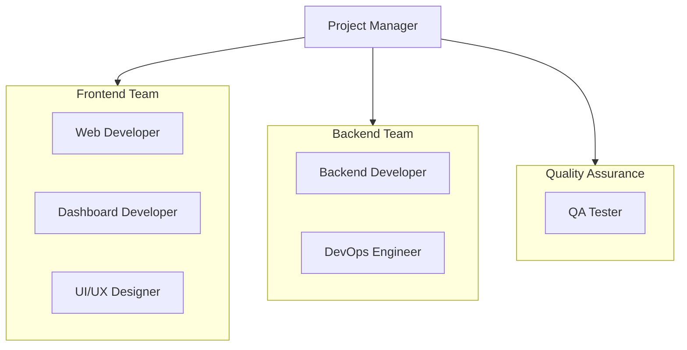
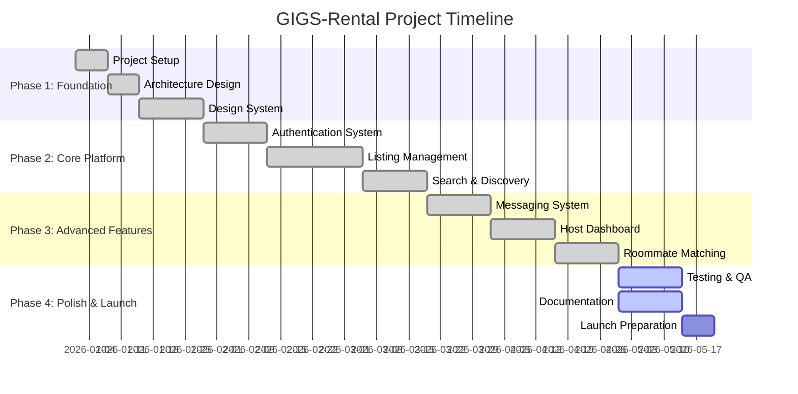

# GIGS-Rental Project Charter

## 1. Executive Summary

**Project Name:** GIGS-Rental  
**Project Type:** Student Accommodation & Rental Platform  
**Date:** March 2026  
**Version:** 1.0

GIGS-Rental is a comprehensive rental platform designed specifically for students and young professionals seeking affordable accommodation. The platform connects property listers (landlords, hostel owners) with renters (students, young professionals) while providing additional services like roommate matching, bill splitting, and local experiences.

---

## 2. Project Purpose and Justification

### 2.1 Problem Statement
- Students struggle to find verified, affordable accommodation near campuses
- Property owners lack a dedicated platform to reach student demographics
- No integrated solution for roommate matching and bill management
- Fragmented experience across multiple platforms

### 2.2 Project Purpose
Create a unified platform that:
- Simplifies the rental search process for students
- Provides landlords with specialized tools for student housing
- Integrates roommate matching and bill splitting features
- Offers local experiences and services

### 2.3 Business Case
- **Target Market:** University students, young professionals, landlords, hostel operators
- **Revenue Model:** Commission on bookings, premium listings, featured placements
- **Competitive Advantage:** Student-focused features, integrated tools, verified listings

---

## 3. Project Objectives

### 3.1 Primary Objectives

| Objective | Success Criteria | Priority |
|-----------|------------------|----------|
| Launch accommodation listing platform | 1000+ verified listings within 6 months | High |
| Implement roommate matching system | 70% match satisfaction rate | High |
| Deploy bill splitting feature | 500+ active bill groups | Medium |
| Create seamless booking experience | <2% booking abandonment rate | High |
| Build responsive mobile-first design | 90+ Lighthouse mobile score | High |

### 3.2 Secondary Objectives
- Expand to experiences and services marketplace
- Implement AI-powered recommendations
- Build host dashboard with analytics
- Create community features and reviews

---

## 4. Scope

### 4.1 In-Scope

#### Core Platform Features
- **Multi-Category Listings:**
  - Accommodation (Hostels, Apartments, Houses, Rooms)
  - Shared Living (Roommate spaces, Shared rooms)
  - Experiences (Tours, Activities, Events)
  - Services (Cleaning, Transport, Utilities)

- **User Management:**
  - Role-based authentication (Lister, Renter, Both)
  - Profile management and verification
  - OAuth integration (Google)
  - OTP-based email verification

- **Listing Management:**
  - Dynamic listing creation flow
  - Multi-step property onboarding
  - Photo upload and management
  - Pricing and availability management

- **Search & Discovery:**
  - Advanced filtering and search
  - Map-based property browsing
  - Saved properties and favorites
  - Recommendation engine

- **Booking & Communication:**
  - In-app messaging system
  - Booking management
  - Calendar integration
  - Notification system

- **Host Features:**
  - Host dashboard with analytics
  - Earnings tracking
  - Review management
  - Listing performance metrics

- **Additional Tools:**
  - Roommate matching system
  - Bill splitting calculator
  - Safety guidelines
  - Help center

#### Marketing Website
- Landing page with feature showcase
- About Us, Pricing, Contact pages
- Legal pages (Privacy, Terms, Cookies)
- Blog and content marketing
- Career page

### 4.2 Out-of-Scope (Future Phases)
- Native mobile applications (iOS/Android)
- Payment processing integration
- Insurance and legal services
- International expansion
- Property management software integration

---

## 5. Project Organization

### 5.1 Team Structure

### 5.2 Stakeholders

| Stakeholder | Role | Interest |
|-------------|------|----------|
| Students | End Users | Finding affordable accommodation |
| Landlords | End Users | Listing properties |
| Hostel Owners | End Users | Managing hostel bookings |
| Investors | Business | ROI and growth |
| Development Team | Technical | Technical excellence |

---

## 6. High-Level Requirements

### 6.1 Functional Requirements

#### FR-001: User Registration and Authentication
- Users can register via email or Google OAuth
- OTP verification for email registration
- Role selection during onboarding (Lister, Renter, or Both)
- Profile completion workflow

#### FR-002: Listing Creation
- Dynamic multi-step listing creation based on category
- Support for Accommodation, Experience, and Service listings
- Photo upload with preview
- Location mapping integration
- Pricing configuration

#### FR-003: Search and Discovery
- Text-based search with filters
- Category-based browsing
- Price range filtering
- Amenity filtering
- Location-based search

#### FR-004: Booking and Messaging
- Contact property owners via in-app messaging
- Booking request system
- Calendar availability view
- Notification system for messages and bookings

#### FR-005: Host Dashboard
- Analytics and statistics view
- Listing management
- Booking management
- Earnings tracking
- Review management

#### FR-006: Roommate Matching
- Profile-based matching algorithm
- Filter by habits, schedule, preferences
- Compatibility scoring
- Direct messaging between potential roommates

#### FR-007: Bill Splitting
- Create bill groups
- Add expenses and split calculations
- Track who owes what
- Settlement tracking

### 6.2 Non-Functional Requirements

| Requirement | Description | Target |
|-------------|-------------|--------|
| Performance | Page load time | < 3 seconds |
| Availability | Uptime | 99.5% |
| Scalability | Concurrent users | 10,000+ |
| Security | Data protection | GDPR compliant |
| Accessibility | WCAG compliance | Level AA |
| Browser Support | Modern browsers | Last 2 versions |

---

## 7. Project Timeline

### 7.1 Phase Breakdown

### 7.2 Milestones

| Milestone | Target Date | Status |
|-----------|-------------|--------|
| Project Setup Complete | Jan 15, 2026 | Completed |
| Authentication Working | Feb 1, 2026 | Completed |
| Listing Creation Live | Feb 28, 2026 | Completed |
| Search & Discovery | Mar 15, 2026 | Completed |
| Beta Launch | Apr 1, 2026 | In Progress |
| Public Launch | May 1, 2026 | Planned |

---

## 8. Budget Overview

### 8.1 Resource Allocation

| Category | Allocation | Notes |
|----------|------------|-------|
| Development | 60% | Frontend, Backend, DevOps |
| Design | 15% | UI/UX, Graphics |
| Infrastructure | 10% | Hosting, CDN, Services |
| Marketing | 10% | Launch campaign |
| Contingency | 5% | Buffer for unforeseen issues |

---

## 9. Risk Management

### 9.1 Identified Risks

| Risk | Probability | Impact | Mitigation |
|------|-------------|--------|------------|
| Scope creep | Medium | High | Strict change control process |
| Technical debt | Medium | Medium | Code reviews, refactoring sprints |
| Performance issues | Low | High | Load testing, optimization |
| Security vulnerabilities | Low | Critical | Security audits, penetration testing |
| Third-party dependency failure | Low | Medium | Fallback strategies |

---

## 10. Success Criteria

### 10.1 Project Success Metrics

1. **Technical Metrics:**
   - 100% test coverage for critical paths
   - Zero critical bugs at launch
   - Lighthouse performance score > 90

2. **User Metrics:**
   - 500+ registered users in first month
   - 100+ active listings within 30 days
   - 4.5+ star user rating

3. **Business Metrics:**
   - 10% month-over-month user growth
   - 25% listing conversion rate
   - 5% booking completion rate

---

## 11. Approval

| Role | Name | Signature | Date |
|------|------|-----------|------|
| Project Sponsor | [Name] | _____________ | _______ |
| Project Manager | [Name] | _____________ | _______ |
| Technical Lead | [Name] | _____________ | _______ |

---

## 12. Document Control

| Version | Date | Author | Changes |
|---------|------|--------|---------|
| 1.0 | 2026-03-24 | Technical Team | Initial charter creation |

---

*This document serves as the foundation for the GIGS-Rental project and should be reviewed and updated as the project evolves.*