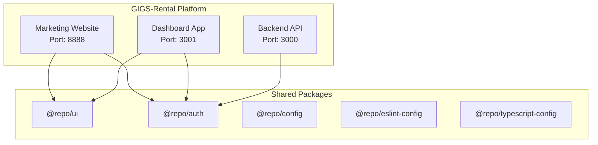
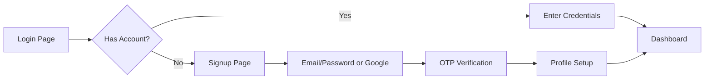
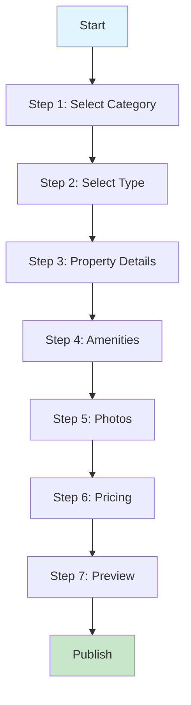
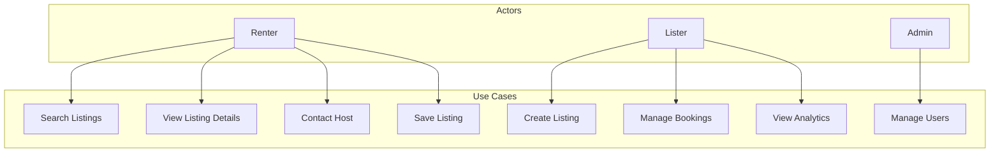

# Software Requirements Specification (SRS)

## GIGS-Rental Platform

**Version:** 1.0  
**Date:** March 24, 2026  
**Status:** Draft  

---

## Table of Contents

1. [Introduction](#1-introduction)
2. [Overall Description](#2-overall-description)
3. [System Features](#3-system-features)
4. [External Interface Requirements](#4-external-interface-requirements)
5. [Non-Functional Requirements](#5-non-functional-requirements)
6. [Data Requirements](#6-data-requirements)
7. [Appendices](#7-appendices)

---

## 1. Introduction

### 1.1 Purpose

This Software Requirements Specification (SRS) document provides a comprehensive description of the GIGS-Rental platform. It establishes the functional and non-functional requirements for the system, serving as a reference for development, testing, and project management teams.

### 1.2 Scope

The GIGS-Rental platform encompasses:
- **Web Applications:** Marketing website and dashboard application
- **Backend Services:** API services and business logic
- **Shared Libraries:** UI components, authentication, and configuration

### 1.3 Definitions and Acronyms

| Term | Definition |
|------|------------|
| Lister | User who posts properties for rent |
| Renter | User seeking accommodation |
| Listing | A property or service posted on the platform |
| OTP | One-Time Password |
| OAuth | Open Authorization standard |
| SSR | Server-Side Rendering |
| CSR | Client-Side Rendering |

### 1.4 References

- Project Charter (Document 01)
- Dynamic Listing Flow Architecture (plans/dynamic-listing-flow.md)
- Turborepo Documentation
- Next.js Documentation

---

## 2. Overall Description

### 2.1 Product Perspective

GIGS-Rental is a web-based platform built as a monorepo using Turborepo. It consists of multiple interconnected applications sharing common packages.



### 2.2 User Classes and Characteristics

#### 2.2.1 Student Renters
- **Description:** University students seeking accommodation
- **Technical Profile:** Mobile-first users, moderate tech literacy
- **Primary Needs:** Affordable housing, roommate matching, proximity to campus

#### 2.2.2 Property Listers
- **Description:** Landlords, hostel owners, property managers
- **Technical Profile:** Desktop users, varying tech literacy
- **Primary Needs:** Easy listing creation, booking management, analytics

#### 2.2.3 Service Providers
- **Description:** Local businesses offering services (cleaning, transport)
- **Technical Profile:** Mobile and desktop users
- **Primary Needs:** Service listing, booking management, customer communication

#### 2.2.4 Experience Hosts
- **Description:** Tour guides, activity organizers
- **Technical Profile:** Mobile-first users
- **Primary Needs:** Event listing, calendar management, guest communication

#### 2.2.5 Platform Administrators
- **Description:** Internal team managing the platform
- **Technical Profile:** High technical literacy
- **Primary Needs:** User management, content moderation, analytics

### 2.3 Operating Environment

| Component | Environment |
|-----------|-------------|
| Frontend Applications | Node.js 18+, Next.js 16, React 19 |
| Backend API | Node.js 18+, NestJS 11 |
| Database | PostgreSQL (planned), currently localStorage |
| Browser Support | Chrome, Firefox, Safari, Edge (latest 2 versions) |
| Mobile Support | Responsive design, iOS Safari, Android Chrome |

### 2.4 Design and Implementation Constraints

- **Monorepo Structure:** Must use Turborepo for workspace management
- **TypeScript:** All code must be written in TypeScript
- **Shared Components:** UI components must be reusable across apps
- **Authentication:** Must support both OAuth and email/password
- **Styling:** Tailwind CSS with custom design system

---

## 3. System Features

### 3.1 User Authentication and Authorization (AUTH-001)

#### 3.1.1 Description
Users must be able to authenticate via multiple methods and maintain session state across the platform.

#### 3.1.2 Functional Requirements

| ID | Requirement | Priority |
|----|-------------|----------|
| AUTH-001.1 | Users can register with email and password | High |
| AUTH-001.2 | Users can register/login with Google OAuth | High |
| AUTH-001.3 | Email registration requires OTP verification | High |
| AUTH-001.4 | Users can select role during onboarding (Lister/Renter/Both) | High |
| AUTH-001.5 | Users can switch between Lister and Renter modes | High |
| AUTH-001.6 | Password reset functionality via email | Medium |
| AUTH-001.7 | Session persistence using localStorage (current implementation) | High |
| AUTH-001.8 | JWT token-based authentication (future implementation) | Medium |

#### 3.1.3 User Interface



### 3.2 Listing Management (LIST-001)

#### 3.2.1 Description
Users can create, edit, and manage various types of listings with dynamic forms based on category.

#### 3.2.2 Listing Categories

| Category | Types | Description |
|----------|-------|-------------|
| Accommodation | Hostel, Apartment, House, Room | Physical properties for rent |
| Experience | Tour, Activity, Event | Local experiences and activities |
| Service | Cleaning, Transport, Utilities | Services for renters |

#### 3.2.3 Functional Requirements

| ID | Requirement | Priority |
|----|-------------|----------|
| LIST-001.1 | Dynamic step-based listing creation | High |
| LIST-001.2 | Category selection determines available fields | High |
| LIST-001.3 | Property type selection within category | High |
| LIST-001.4 | Photo upload with preview and reordering | High |
| LIST-001.5 | Location selection with map integration | High |
| LIST-001.6 | Amenities selection with icons | High |
| LIST-001.7 | Pricing configuration (per night/month) | High |
| LIST-001.8 | Listing preview before publish | High |
| LIST-001.9 | Draft save functionality | Medium |
| LIST-001.10 | Listing status management (Draft, Pending, Published, Rejected) | Medium |

#### 3.2.4 Listing Creation Flow



### 3.3 Search and Discovery (SEARCH-001)

#### 3.3.1 Description
Users can search and filter listings based on various criteria.

#### 3.3.2 Functional Requirements

| ID | Requirement | Priority |
|----|-------------|----------|
| SEARCH-001.1 | Text-based search | High |
| SEARCH-001.2 | Category filtering | High |
| SEARCH-001.3 | Price range filtering | High |
| SEARCH-001.4 | Location/distance filtering | High |
| SEARCH-001.5 | Amenity filtering | High |
| SEARCH-001.6 | Property type filtering | High |
| SEARCH-001.7 | Sort by price, relevance, date | Medium |
| SEARCH-001.8 | Save search preferences | Low |

### 3.4 Messaging System (MSG-001)

#### 3.4.1 Description
In-app messaging between renters and listers for inquiries and booking coordination.

#### 3.4.2 Functional Requirements

| ID | Requirement | Priority |
|----|-------------|----------|
| MSG-001.1 | Initiate conversation from listing | High |
| MSG-001.2 | Real-time messaging interface | High |
| MSG-001.3 | Message persistence in localStorage | High |
| MSG-001.4 | Unread message count badge | High |
| MSG-001.5 | Conversation list view | High |
| MSG-001.6 | Message read receipts | Medium |
| MSG-001.7 | File attachments (future) | Low |

### 3.5 Host Dashboard (HOST-001)

#### 3.5.1 Description
Comprehensive dashboard for property listers to manage their listings and track performance.

#### 3.5.2 Functional Requirements

| ID | Requirement | Priority |
|----|-------------|----------|
| HOST-001.1 | Overview statistics (views, bookings, earnings) | High |
| HOST-001.2 | Occupancy rate chart | High |
| HOST-001.3 | Recent bookings list | High |
| HOST-001.4 | Listing management interface | High |
| HOST-001.5 | Earnings tracking and history | High |
| HOST-001.6 | Calendar view for availability | High |
| HOST-001.7 | Reviews and ratings management | Medium |
| HOST-001.8 | Message inbox | High |
| HOST-001.9 | Settings and profile management | Medium |

### 3.6 Roommate Matching (ROOMMATE-001)

#### 3.6.1 Description
System for matching potential roommates based on preferences and lifestyle compatibility.

#### 3.6.2 Functional Requirements

| ID | Requirement | Priority |
|----|-------------|----------|
| ROOMMATE-001.1 | Create roommate profile with preferences | High |
| ROOMMATE-001.2 | Filter by habits (smoking, pets, etc.) | High |
| ROOMMATE-001.3 | Filter by schedule (sleep time, study habits) | High |
| ROOMMATE-001.4 | Filter by major/field of study | Medium |
| ROOMMATE-001.5 | Compatibility scoring | Medium |
| ROOMMATE-001.6 | Express interest in potential roommates | High |
| ROOMMATE-001.7 | View detailed roommate profiles | High |

### 3.7 Bill Splitting (BILL-001)

#### 3.7.1 Description
Tool for roommates to track and split shared expenses.

#### 3.7.2 Functional Requirements

| ID | Requirement | Priority |
|----|-------------|----------|
| BILL-001.1 | Create bill groups | High |
| BILL-001.2 | Add expenses with categories | High |
| BILL-001.3 | Automatic split calculation | High |
| BILL-001.4 | Unequal split support | Medium |
| BILL-001.5 | Track who paid what | High |
| BILL-001.6 | Settlement tracking | High |
| BILL-001.7 | Expense history view | Medium |
| BILL-001.8 | Export to PDF/CSV (future) | Low |

---

## 4. External Interface Requirements

### 4.1 User Interfaces

#### 4.1.1 Marketing Website (apps/web)
- **Purpose:** Public-facing marketing and information
- **Port:** 8888
- **Key Pages:**
  - Home (Landing page)
  - About Us
  - Pricing
  - Contact
  - Blog
  - Careers
  - Legal (Privacy, Terms, Cookies, Safety)

#### 4.1.2 Dashboard Application (apps/dashboard)
- **Purpose:** Core platform functionality
- **Port:** 3001
- **Key Sections:**
  - Authentication (Login, Signup, Onboarding, Password Reset)
  - Listings (Browse, Detail, Create, Saved)
  - Hosting (Dashboard, Listings, Calendar, Earnings, Reviews, Messages, Settings)
  - Profile Management

### 4.2 Hardware Interfaces

Not applicable - web-based platform only.

### 4.3 Software Interfaces

#### 4.3.1 External Services

| Service | Purpose | Integration Type |
|---------|---------|------------------|
| Google OAuth | Authentication | OAuth 2.0 |
| Phosphor Icons | Icon library | NPM package |
| Unsplash | Stock images | Direct URL |

#### 4.3.2 Internal Packages

| Package | Purpose | Consumers |
|---------|---------|-----------|
| @repo/ui | Shared UI components | web, dashboard |
| @repo/auth | Authentication logic | web, dashboard, backend |
| @repo/config | Tailwind configuration | web, dashboard |
| @repo/eslint-config | Linting rules | All packages |
| @repo/typescript-config | TypeScript configs | All packages |

### 4.4 Communications Interfaces

| Protocol | Usage |
|----------|-------|
| HTTP/HTTPS | API communication |
| WebSocket | Real-time messaging (future) |
| REST | API endpoints |

---

## 5. Non-Functional Requirements

### 5.1 Performance Requirements

| Requirement | Target | Measurement |
|-------------|--------|-------------|
| Page Load Time | < 3 seconds | Lighthouse |
| Time to Interactive | < 5 seconds | Lighthouse |
| API Response Time | < 500ms | Server metrics |
| Simultaneous Users | 10,000 | Load testing |

### 5.2 Security Requirements

| Requirement | Description |
|-------------|-------------|
| SEC-001 | All authentication must use secure protocols (HTTPS) |
| SEC-002 | Passwords must be hashed (bcrypt for future JWT implementation) |
| SEC-003 | OTP must expire after 10 minutes |
| SEC-004 | Session tokens must expire after 24 hours |
| SEC-005 | Input validation on all forms |
| SEC-006 | XSS protection via React's built-in escaping |
| SEC-007 | CSRF protection for state-changing operations |

### 5.3 Availability Requirements

- **Uptime Target:** 99.5%
- **Scheduled Maintenance:** < 4 hours/month
- **Recovery Time Objective (RTO):** < 1 hour
- **Recovery Point Objective (RPO):** < 15 minutes

### 5.4 Maintainability Requirements

| Requirement | Description |
|-------------|-------------|
| MAINT-001 | Code must follow ESLint rules |
| MAINT-002 | All functions must have TypeScript types |
| MAINT-003 | Component documentation required |
| MAINT-004 | Test coverage > 80% for critical paths |

### 5.5 Usability Requirements

| Requirement | Description |
|-------------|-------------|
| USE-001 | Mobile-first responsive design |
| USE-002 | WCAG 2.1 Level AA compliance |
| USE-003 | Consistent navigation patterns |
| USE-004 | Error messages must be user-friendly |
| USE-005 | Loading states for all async operations |

---

## 6. Data Requirements

### 6.1 Data Models

#### 6.1.1 User Entity

```typescript
interface User {
  id: string;
  email: string;
  name: string;
  phone?: string;
  role: "lister" | "renter" | "both";
  avatar?: string;
  isProfileComplete: boolean;
  createdAt: Date;
  updatedAt: Date;
}
```

#### 6.1.2 Listing Entity

```typescript
interface Listing {
  id: string;
  title: string;
  description: string;
  category: "accommodation" | "experience" | "service";
  type: string;
  location: {
    address: string;
    city: string;
    coordinates?: [number, number];
  };
  price: {
    amount: number;
    currency: string;
    period: "night" | "month";
  };
  amenities: string[];
  images: string[];
  hostId: string;
  status: "draft" | "pending" | "published" | "rejected";
  createdAt: Date;
  updatedAt: Date;
}
```

#### 6.1.3 Conversation Entity

```typescript
interface Conversation {
  id: string;
  listingId: string;
  listingTitle: string;
  listingImage: string;
  participants: string[];
  participantNames: Record<string, string>;
  lastMessage: string;
  lastMessageTime: number;
  unreadCount: number;
}

interface Message {
  id: string;
  conversationId: string;
  senderId: string;
  content: string;
  timestamp: number;
  read: boolean;
}
```

### 6.2 Data Storage

| Data Type | Current Storage | Future Storage |
|-----------|-----------------|----------------|
| User Data | localStorage | PostgreSQL + Redis |
| Listings | localStorage | PostgreSQL |
| Messages | localStorage | PostgreSQL |
| Images | Base64/URLs | Cloud Storage (S3) |
| Sessions | localStorage | Redis |

---

## 7. Appendices

### Appendix A: Glossary

| Term | Definition |
|------|------------|
| Bento Grid | A layout style with varying card sizes |
| Brutalist Design | Design style with bold borders and shadows |
| Hydration | Process of making server-rendered HTML interactive |
| Monorepo | Single repository containing multiple packages |
| Turborepo | Build system for JavaScript/TypeScript monorepos |

### Appendix B: Analysis Models

#### B.1 Use Case Diagram



### Appendix C: Issues List

| Issue ID | Description | Status | Priority |
|----------|-------------|--------|----------|
| ISS-001 | localStorage has size limitations for images | Known | Medium |
| ISS-002 | No real-time messaging yet (polling only) | Known | Medium |
| ISS-003 | Google OAuth requires production credentials | Known | High |

---

**Document Control**

| Version | Date | Author | Changes |
|---------|------|--------|---------|
| 1.0 | 2026-03-24 | Technical Team | Initial SRS creation |

---

*End of Software Requirements Specification*