# System Architecture Documentation

## GIGS-Rental Platform

**Version:** 1.0  
**Date:** March 24, 2026  
**Status:** Current Architecture

---

## Table of Contents

1. [Architecture Overview](#1-architecture-overview)
2. [Monorepo Structure](#2-monorepo-structure)
3. [Application Architecture](#3-application-architecture)
4. [Component Architecture](#4-component-architecture)
5. [Data Flow Architecture](#5-data-flow-architecture)
6. [State Management](#6-state-management)
7. [Authentication Architecture](#7-authentication-architecture)
8. [Deployment Architecture](#8-deployment-architecture)

---

## 1. Architecture Overview

### 1.1 High-Level System Architecture

```mermaid
flowchart TB
    subgraph "Client Layer"
        WEB[Marketing Website\nNext.js App Router]
        DASH[Dashboard App\nNext.js App Router]
    end
    
    subgraph "API Layer"
        API[NestJS Backend API]
    end
    
    subgraph "Shared Layer"
        UI[@repo/ui Components]
        AUTH[@repo/auth Logic]
        CONFIG[@repo/config]
    end
    
    subgraph "Data Layer"
        LOCAL[(Browser localStorage\nCurrent Implementation)]
        DB[(PostgreSQL\nFuture Implementation)]
        CACHE[(Redis\nFuture Implementation)]
    end
    
    subgraph "External Services"
        GOOGLE[Google OAuth]
        PHOSPHOR[Phosphor Icons CDN]
        UNSPLASH[Unsplash Images]
    end
    
    WEB --> UI
    WEB --> AUTH
    DASH --> UI
    DASH --> AUTH
    DASH --> API
    API --> AUTH
    
    WEB --> LOCAL
    DASH --> LOCAL
    API -.-> DB
    
    WEB --> GOOGLE
    DASH --> GOOGLE
    WEB --> PHOSPHOR
    DASH --> PHOSPHOR
    WEB --> UNSPLASH
    DASH --> UNSPLASH
```

### 1.2 Architecture Principles

| Principle | Description | Implementation |
|-----------|-------------|----------------|
| Separation of Concerns | Clear boundaries between apps and packages | Monorepo structure with shared packages |
| DRY (Don't Repeat Yourself) | Reusable components and logic | @repo/ui and @repo/auth packages |
| Mobile-First | Design for mobile, enhance for desktop | Responsive Tailwind classes |
| Progressive Enhancement | Core functionality works without JS | Next.js SSR and static generation |
| Type Safety | Compile-time error prevention | TypeScript throughout |

---

## 2. Monorepo Structure

### 2.1 Turborepo Workspace Configuration

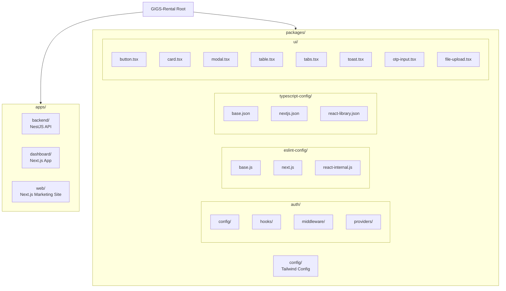

### 2.2 Package Dependencies

```mermaid
flowchart LR
    subgraph "Applications"
        DASH[dashboard]
        WEB[web]
        API[backend]
    end
    
    subgraph "Shared Packages"
        UI[@repo/ui]
        AUTH[@repo/auth]
        CONFIG[@repo/config]
        ESLINT[@repo/eslint-config]
        TSCONFIG[@repo/typescript-config]
    end
    
    DASH --> UI
    DASH --> AUTH
    DASH --> CONFIG
    DASH --> ESLINT
    DASH --> TSCONFIG
    
    WEB --> UI
    WEB --> AUTH
    WEB --> CONFIG
    WEB --> ESLINT
    WEB --> TSCONFIG
    
    API --> AUTH
    API --> ESLINT
    API --> TSCONFIG
```

---

## 3. Application Architecture

### 3.1 Marketing Website (apps/web)

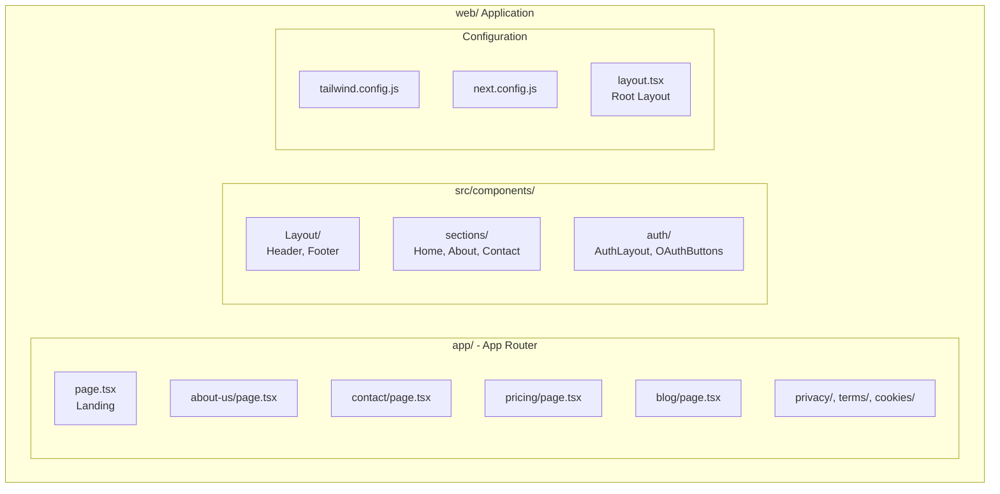

#### 3.1.1 Route Structure

| Route | File | Description |
|-------|------|-------------|
| `/` | `app/page.tsx` | Landing page with hero, features, FAQ |
| `/about-us` | `app/about-us/page.tsx` | Company information, team, mission |
| `/contact` | `app/contact/page.tsx` | Contact form and information |
| `/pricing` | `app/pricing/page.tsx` | Pricing plans and features |
| `/blog` | `app/blog/page.tsx` | Content marketing blog |
| `/careers` | `app/careers/page.tsx` | Job listings |
| `/for-landlords` | `app/for-landlords/page.tsx` | Landlord-focused landing |
| `/roommate-match` | `app/roommate-match/page.tsx` | Roommate matching feature |
| `/help-center` | `app/help-center/page.tsx` | FAQ and support |
| `/safety-guidelines` | `app/safety-guidelines/page.tsx` | Safety information |
| `/privacy` | `app/privacy/page.tsx` | Privacy policy |
| `/terms` | `app/terms/page.tsx` | Terms of service |
| `/cookies` | `app/cookies/page.tsx` | Cookie policy |

### 3.2 Dashboard Application (apps/dashboard)

```mermaid
flowchart TB
    subgraph "dashboard/ Application"
        subgraph "app/ - App Router"
            D_AUTH[auth/\nlogin, signup,\nonboarding,\nforgot-password,\nverify-otp,\nreset-password]
            D_LISTINGS[listings/\npage, [id]/,\ncreate/, saved/]
            D_HOSTING[hosting/\npage, calendar/,\nearnings/, listings/,\nmessages/, reviews/,\nsettings/]
            D_PROFILE[profile/\npage]
        end
        
        subgraph "src/"
            D_CONTEXT[context/\nAuthContext, MessageContext]
            D_COMPONENTS[components/\nlayout/, auth/,\nlistings/, mobile/]
        end
        
        subgraph "Configuration"
            D_TAILWIND[tailwind.config.js]
            D_NEXT[next.config.js]
            D_LAYOUT[layout.tsx]
        end
    end
```

#### 3.2.1 Route Structure

**Authentication Routes:**
| Route | File | Purpose |
|-------|------|---------|
| `/auth/login` | `auth/login/LoginClient.tsx` | User login |
| `/auth/signup` | `auth/signup/SignupClient.tsx` | User registration |
| `/auth/onboarding` | `auth/onboarding/OnboardingClient.tsx` | Profile completion |
| `/auth/forgot-password` | `auth/forgot-password/ForgotPasswordClient.tsx` | Password reset request |
| `/auth/verify-otp` | `auth/verify-otp/VerifyOtpClient.tsx` | OTP verification |
| `/auth/reset-password` | `auth/reset-password/ResetPasswordClient.tsx` | New password entry |

**Listing Routes:**
| Route | File | Purpose |
|-------|------|---------|
| `/listings` | `listings/page.tsx` | Browse all listings |
| `/listings/[id]` | `listings/[id]/page.tsx` | Listing detail view |
| `/listings/[id]/contact` | `listings/[id]/contact/page.tsx` | Contact host form |
| `/listings/[id]/message` | `listings/[id]/message/page.tsx` | Message host |
| `/listings/[id]/roommates` | `listings/[id]/roommates/page.tsx` | Find roommates |
| `/listings/[id]/split-bills` | `listings/[id]/split-bills/page.tsx` | Bill splitting tool |
| `/listings/create` | `listings/create/page.tsx` | Create new listing |
| `/listings/saved` | `listings/saved/page.tsx` | Saved favorites |

**Host Routes:**
| Route | File | Purpose |
|-------|------|---------|
| `/hosting` | `hosting/page.tsx` | Host dashboard overview |
| `/hosting/calendar` | `hosting/calendar/page.tsx` | Availability calendar |
| `/hosting/earnings` | `hosting/earnings/page.tsx` | Earnings tracking |
| `/hosting/listings` | `hosting/listings/page.tsx` | Manage listings |
| `/hosting/messages` | `hosting/messages/page.tsx` | Host inbox |
| `/hosting/reviews` | `hosting/reviews/page.tsx` | Review management |
| `/hosting/settings` | `hosting/settings/page.tsx` | Account settings |

### 3.3 Backend API (apps/backend)

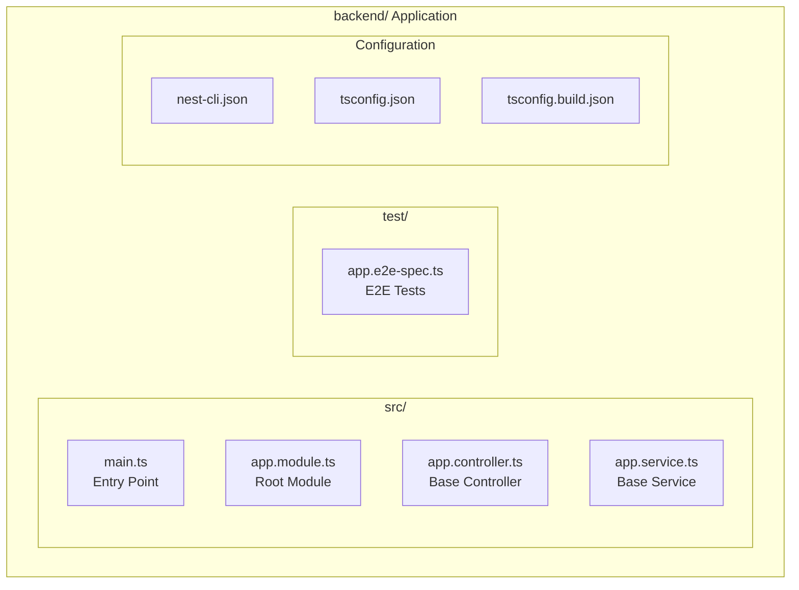

---

## 4. Component Architecture

### 4.1 Shared UI Components (@repo/ui)

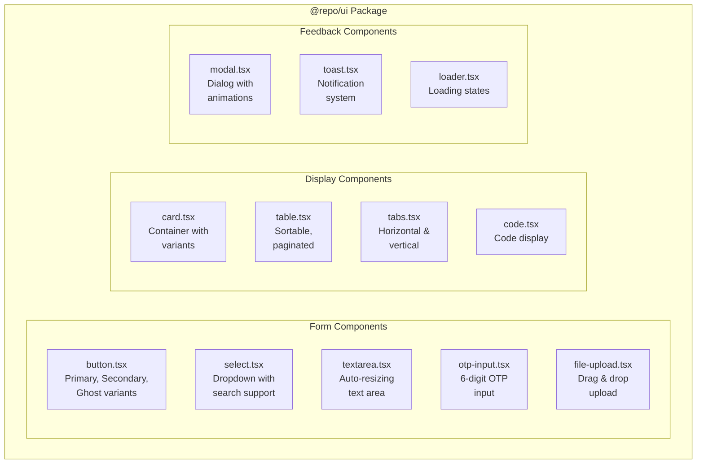

### 4.2 Component Hierarchy (Dashboard)

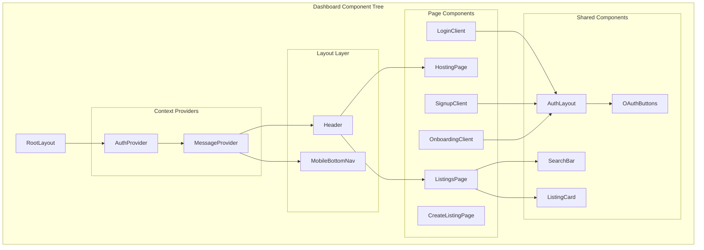

### 4.3 Design System - Brutalist Style

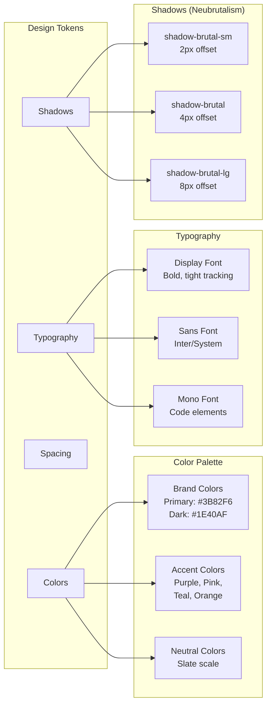

---

## 5. Data Flow Architecture

### 5.1 Listing Creation Data Flow

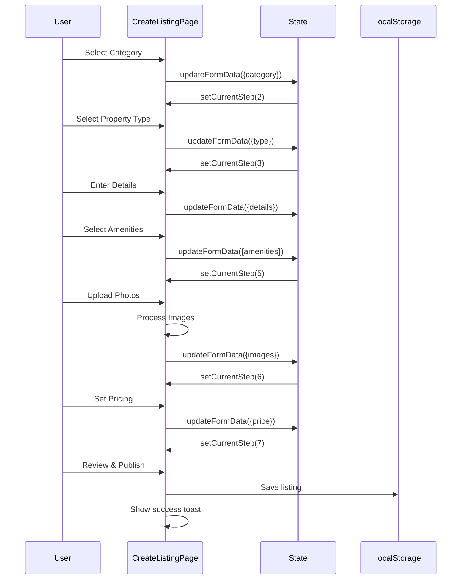

### 5.2 Authentication Data Flow

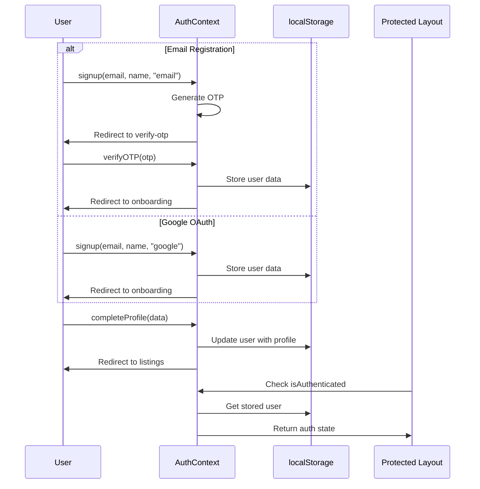

### 5.3 Messaging Data Flow

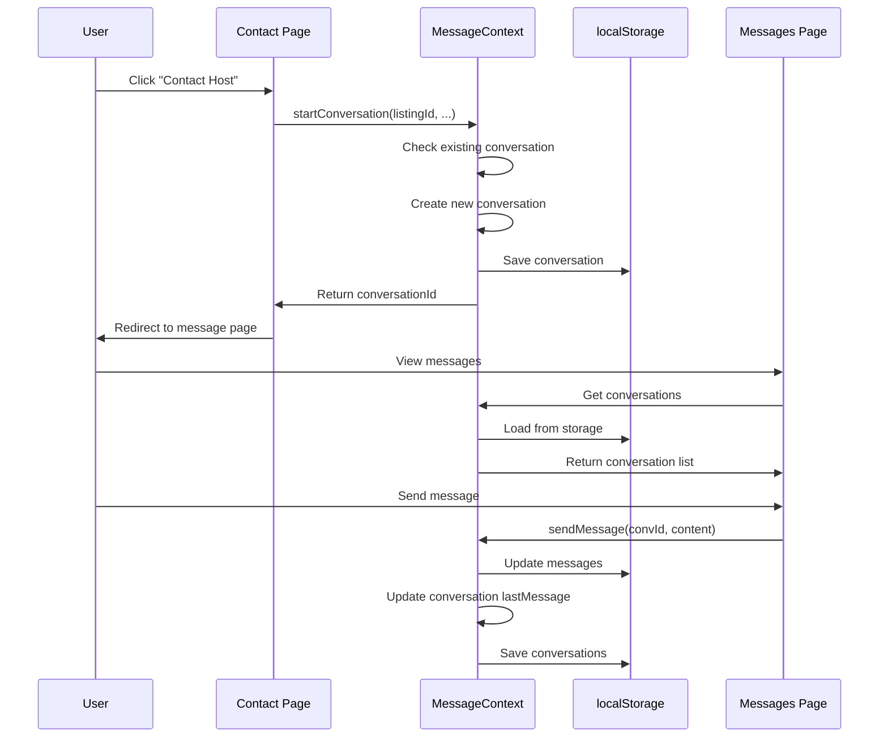

---

## 6. State Management

### 6.1 State Architecture

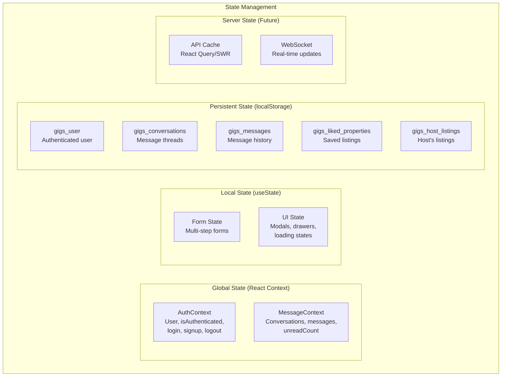

### 6.2 Context Providers Hierarchy

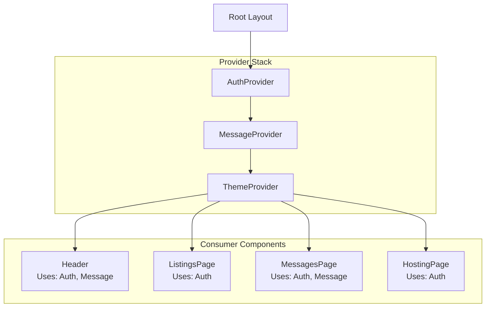

---

## 7. Authentication Architecture

### 7.1 Authentication Flow

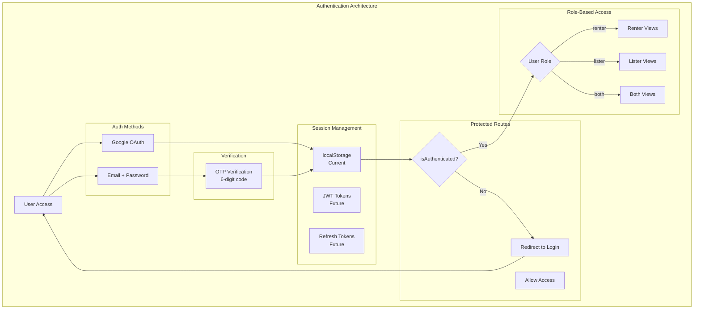

### 7.2 Auth Package Structure

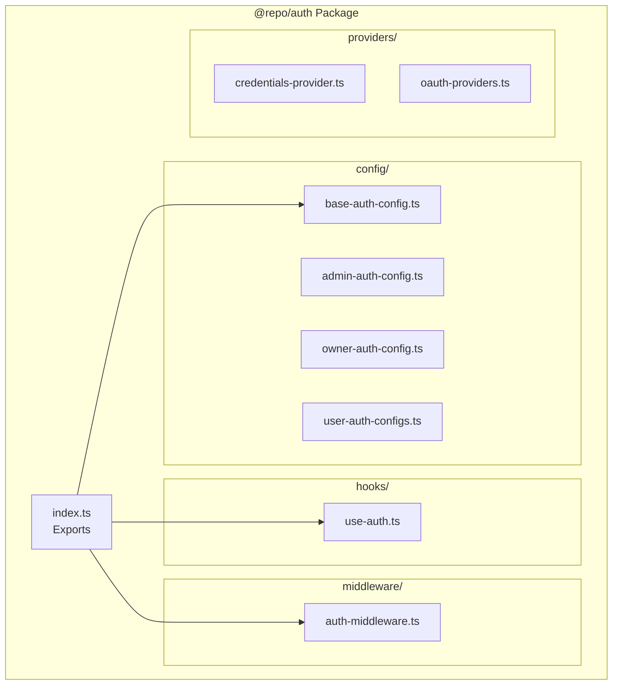

---

## 8. Deployment Architecture

### 8.1 Current Development Setup

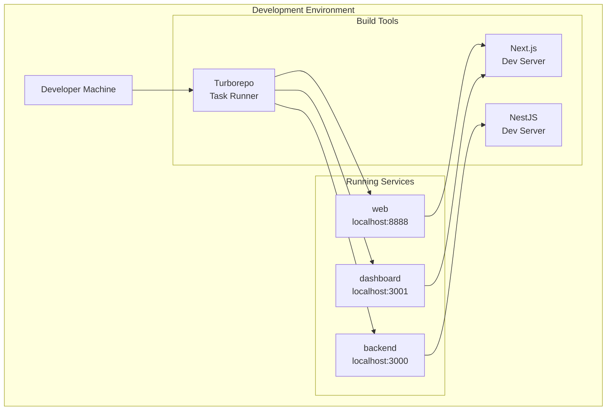

### 8.2 Future Production Architecture

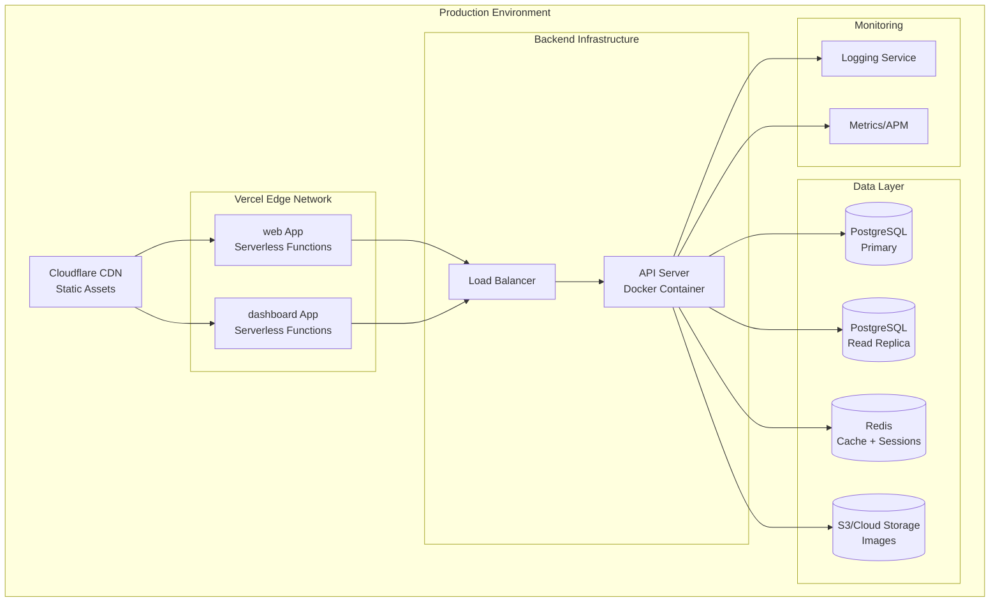

---

**Document Control**

| Version | Date | Author | Changes |
|---------|------|--------|---------|
| 1.0 | 2026-03-24 | Technical Team | Initial architecture documentation |

---

*End of System Architecture Documentation*