# Data Flow Documentation

## GIGS-Rental Platform

**Version:** 1.0  
**Date:** March 24, 2026  
**Status:** Current Implementation

---

## Table of Contents

1. [Overview](#1-overview)
2. [User Registration Flow](#2-user-registration-flow)
3. [Listing Creation Flow](#3-listing-creation-flow)
4. [Search and Discovery Flow](#4-search-and-discovery-flow)
5. [Messaging Flow](#5-messaging-flow)
6. [Host Dashboard Flow](#6-host-dashboard-flow)
7. [Roommate Matching Flow](#7-roommate-matching-flow)
8. [Bill Splitting Flow](#8-bill-splitting-flow)
9. [Data Storage Patterns](#9-data-storage-patterns)

---

## 1. Overview

This document provides detailed data flow diagrams for all major features of the GIGS-Rental platform. Each flow is presented with sequence diagrams, data transformations, and storage operations.

### 1.1 Data Storage Overview

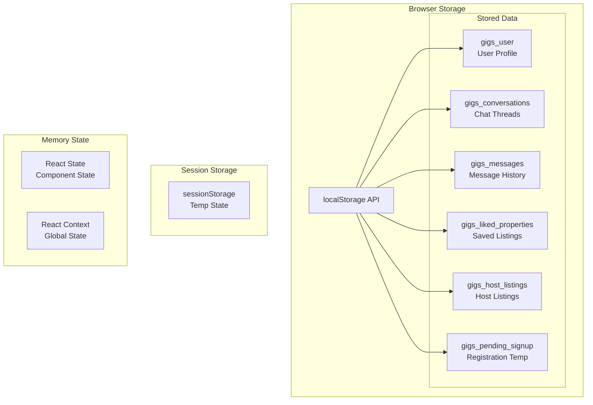
```mermaid
flowchart TB
    subgraph "Browser Storage"
        LOCAL[localStorage API]
        
        subgraph "Stored Data"
            U[gigs_user\nUser Profile]
            C[gigs_conversations\nChat Threads]
            M[gigs_messages\nMessage History]
            L[gigs_liked_properties\nSaved Listings]
            H[gigs_host_listings\nHost Listings]
            P[gigs_pending_signup\nRegistration Temp]
        end
    end
    
    subgraph "Session Storage"
        SESSION[sessionStorage\nTemp State]
    end
    
    subgraph "Memory State"
        REACT[React State\nComponent State]
        CONTEXT[React Context\nGlobal State]
    end
    
    LOCAL --> U
    LOCAL --> C
    LOCAL --> M
    LOCAL --> L
    LOCAL --> H
    LOCAL --> P
```

---

## 2. User Registration Flow

### 2.1 Email Registration with OTP

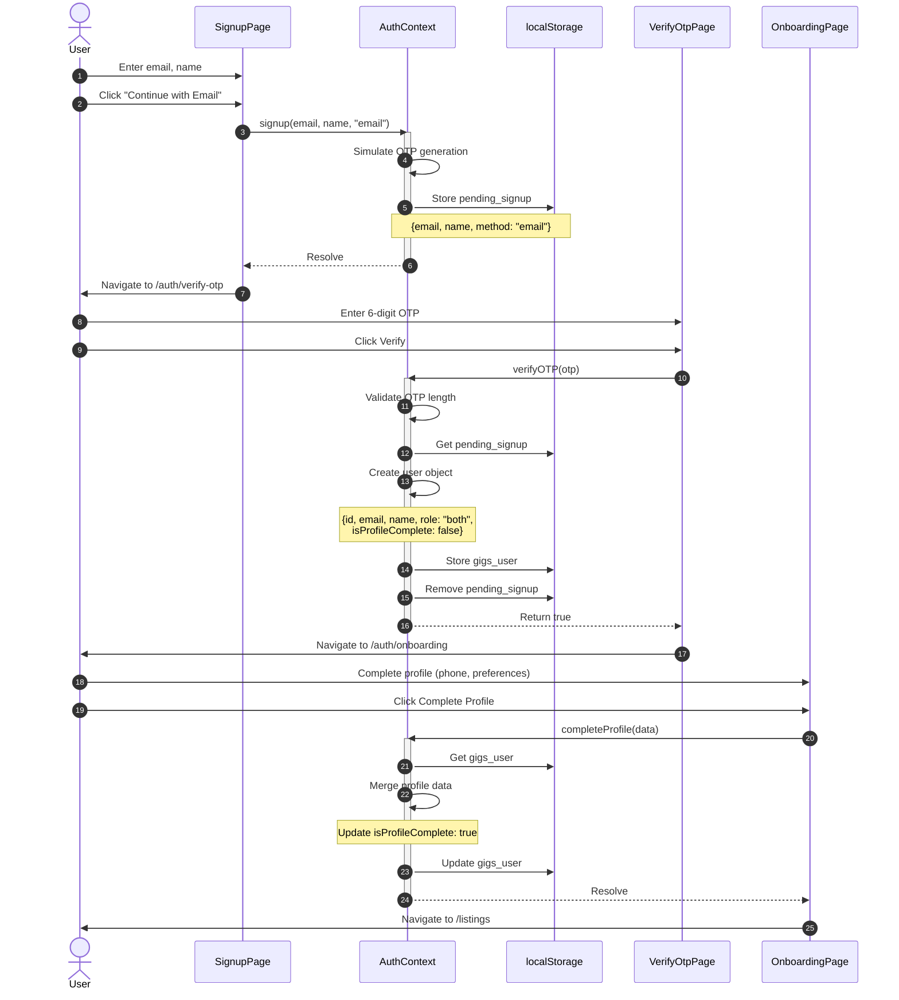
```mermaid
sequenceDiagram
    autonumber
    actor U as User
    participant P as SignupPage
    participant C as AuthContext
    participant LS as localStorage
    participant OTP as VerifyOtpPage
    participant OB as OnboardingPage
    
    U->>P: Enter email, name
    U->>P: Click "Continue with Email"
    P->>C: signup(email, name, "email")
    
    activate C
    C->>C: Simulate OTP generation
    C->>LS: Store pending_signup
    Note over C,LS: {email, name, method: "email"}
    C-->>P: Resolve
    deactivate C
    
    P->>U: Navigate to /auth/verify-otp
    
    U->>OTP: Enter 6-digit OTP
    U->>OTP: Click Verify
    OTP->>C: verifyOTP(otp)
    
    activate C
    C->>C: Validate OTP length
    C->>LS: Get pending_signup
    C->>C: Create user object
    Note over C: {id, email, name, role: "both",<br/>isProfileComplete: false}
    C->>LS: Store gigs_user
    C->>LS: Remove pending_signup
    C-->>OTP: Return true
    deactivate C
    
    OTP->>U: Navigate to /auth/onboarding
    
    U->>OB: Complete profile (phone, preferences)
    U->>OB: Click Complete Profile
    OB->>C: completeProfile(data)
    
    activate C
    C->>LS: Get gigs_user
    C->>C: Merge profile data
    Note over C: Update isProfileComplete: true
    C->>LS: Update gigs_user
    C-->>OB: Resolve
    deactivate C
    
    OB->>U: Navigate to /listings
```

### 2.2 Google OAuth Registration

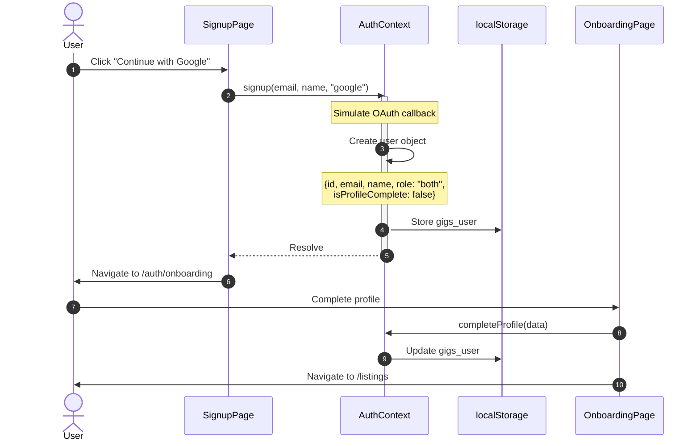
```mermaid
sequenceDiagram
    autonumber
    actor U as User
    participant P as SignupPage
    participant C as AuthContext
    participant LS as localStorage
    participant OB as OnboardingPage
    
    U->>P: Click "Continue with Google"
    P->>C: signup(email, name, "google")
    
    activate C
    Note over C: Simulate OAuth callback
    C->>C: Create user object
    Note over C: {id, email, name, role: "both",<br/>isProfileComplete: false}
    C->>LS: Store gigs_user
    C-->>P: Resolve
    deactivate C
    
    P->>U: Navigate to /auth/onboarding
    
    U->>OB: Complete profile
    OB->>C: completeProfile(data)
    C->>LS: Update gigs_user
    OB->>U: Navigate to /listings
```

### 2.3 Login Flow

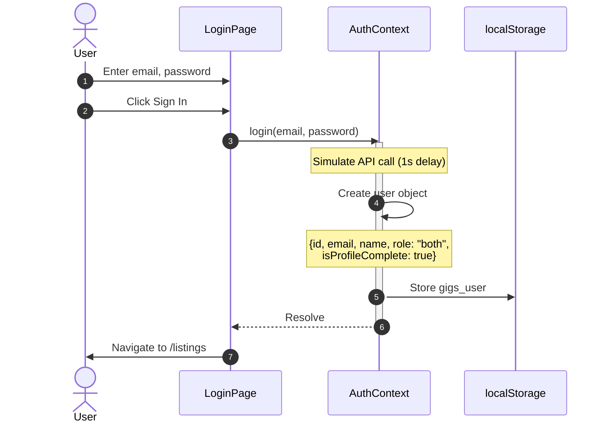
```mermaid
sequenceDiagram
    autonumber
    actor U as User
    participant P as LoginPage
    participant C as AuthContext
    participant LS as localStorage
    
    U->>P: Enter email, password
    U->>P: Click Sign In
    P->>C: login(email, password)
    
    activate C
    Note over C: Simulate API call (1s delay)
    C->>C: Create user object
    Note over C: {id, email, name, role: "both",<br/>isProfileComplete: true}
    C->>LS: Store gigs_user
    C-->>P: Resolve
    deactivate C
    
    P->>U: Navigate to /listings
```

### 2.4 Data Transformations

#### User Object Structure

```typescript
// Pending Registration (temporary)
interface PendingSignup {
  email: string;
  name: string;
  method: "email" | "google";
}

// Active User (stored in localStorage)
interface User {
  id: string;           // "user_" + timestamp
  email: string;
  name: string;
  phone?: string;       // Added during onboarding
  role: "lister" | "renter" | "both";
  avatar?: string;
  isProfileComplete: boolean;
}
```

---

## 3. Listing Creation Flow

### 3.1 Dynamic Step Engine

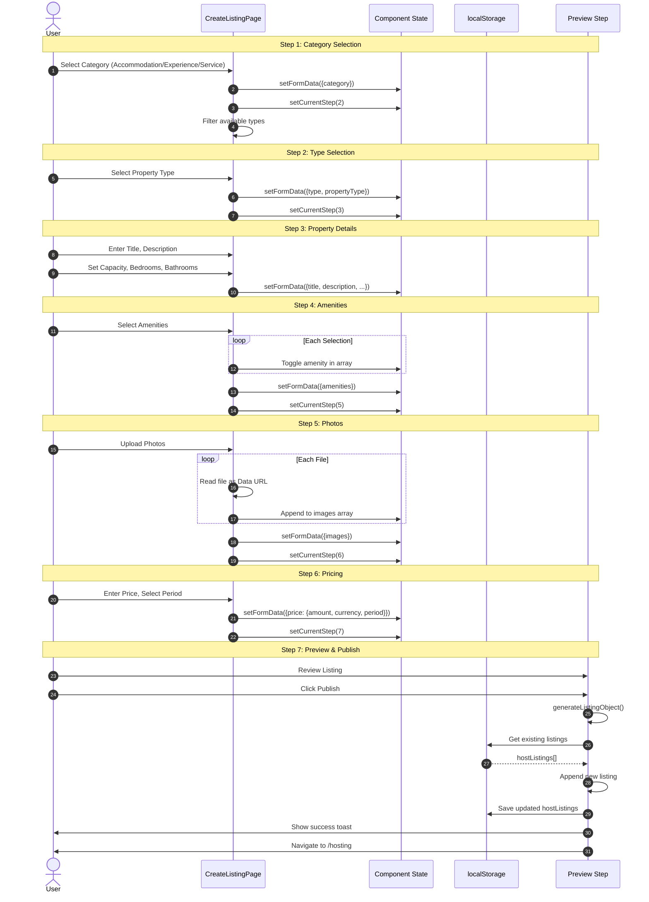
```mermaid
sequenceDiagram
    autonumber
    actor U as User
    participant P as CreateListingPage
    participant S as Component State
    participant LS as localStorage
    participant PREV as Preview Step
    
    Note over U,PREV: Step 1: Category Selection
    U->>P: Select Category (Accommodation/Experience/Service)
    P->>S: setFormData({category})
    P->>S: setCurrentStep(2)
    P->>P: Filter available types
    
    Note over U,PREV: Step 2: Type Selection
    U->>P: Select Property Type
    P->>S: setFormData({type, propertyType})
    P->>S: setCurrentStep(3)
    
    Note over U,PREV: Step 3: Property Details
    U->>P: Enter Title, Description
    U->>P: Set Capacity, Bedrooms, Bathrooms
    P->>S: setFormData({title, description, ...})
    
    Note over U,PREV: Step 4: Amenities
    U->>P: Select Amenities
    loop Each Selection
        P->>S: Toggle amenity in array
    end
    P->>S: setFormData({amenities})
    P->>S: setCurrentStep(5)
    
    Note over U,PREV: Step 5: Photos
    U->>P: Upload Photos
    loop Each File
        P->>P: Read file as Data URL
        P->>S: Append to images array
    end
    P->>S: setFormData({images})
    P->>S: setCurrentStep(6)
    
    Note over U,PREV: Step 6: Pricing
    U->>P: Enter Price, Select Period
    P->>S: setFormData({price: {amount, currency, period}})
    P->>S: setCurrentStep(7)
    
    Note over U,PREV: Step 7: Preview & Publish
    U->>PREV: Review Listing
    U->>PREV: Click Publish
    PREV->>PREV: generateListingObject()
    
    PREV->>LS: Get existing listings
    LS-->>PREV: hostListings[]
    PREV->>PREV: Append new listing
    PREV->>LS: Save updated hostListings
    PREV->>U: Show success toast
    PREV->>U: Navigate to /hosting
```

### 3.2 Listing Object Structure

```typescript
interface Listing {
  id: string;                    // "listing_" + timestamp
  title: string;
  description: string;
  category: "accommodation" | "experience" | "service";
  type: string;                  // hostel, apartment, tour, cleaning, etc.
  
  // Property Details
  capacity?: number;
  bedrooms?: number;
  bathrooms?: number;
  
  // Location
  location: {
    address: string;
    city: string;
    coordinates?: [number, number];
  };
  
  // Pricing
  price: {
    amount: number;
    currency: string;           // "USD", "NGN", etc.
    period: "night" | "month" | "session";
  };
  
  // Features
  amenities: string[];          // ["wifi", "ac", "parking"]
  images: string[];             // Base64 data URLs
  
  // Metadata
  hostId: string;
  hostName: string;
  status: "draft" | "pending" | "published" | "rejected";
  createdAt: number;            // timestamp
  updatedAt: number;            // timestamp
  
  // Stats
  views?: number;
  inquiries?: number;
}
```

### 3.3 Category-Specific Flows

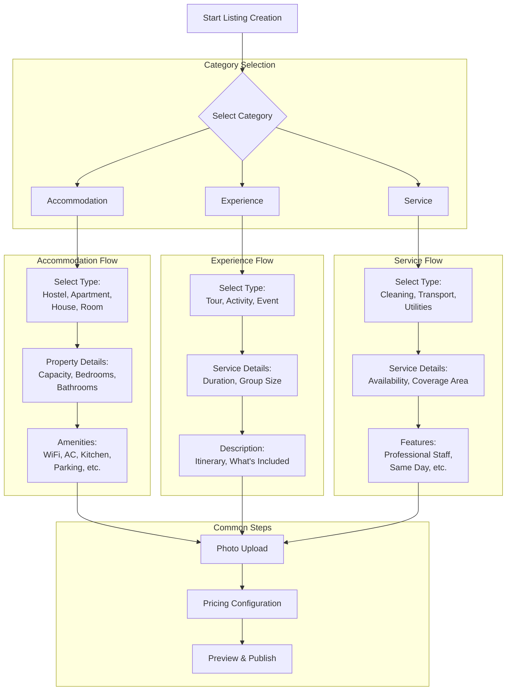
```mermaid
flowchart TD
    START[Start Listing Creation]
    
    subgraph "Category Selection"
        CAT{Select Category}
        ACC[Accommodation]
        EXP[Experience]
        SRV[Service]
    end
    
    subgraph "Accommodation Flow"
        A_TYPE[Select Type:<br/>Hostel, Apartment,<br/>House, Room]
        A_DETAILS[Property Details:<br/>Capacity, Bedrooms,<br/>Bathrooms]
        A_AMEN[Amenities:<br/>WiFi, AC, Kitchen,<br/>Parking, etc.]
    end
    
    subgraph "Experience Flow"
        E_TYPE[Select Type:<br/>Tour, Activity, Event]
        E_DETAILS[Service Details:<br/>Duration, Group Size]
        E_DESC[Description:<br/>Itinerary, What's Included]
    end
    
    subgraph "Service Flow"
        S_TYPE[Select Type:<br/>Cleaning, Transport,<br/>Utilities]
        S_DETAILS[Service Details:<br/>Availability, Coverage Area]
        S_AMEN[Features:<br/>Professional Staff,<br/>Same Day, etc.]
    end
    
    subgraph "Common Steps"
        PHOTOS[Photo Upload]
        PRICE[Pricing Configuration]
        PREVIEW[Preview & Publish]
    end
    
    START --> CAT
    CAT --> ACC
    CAT --> EXP
    CAT --> SRV
    
    ACC --> A_TYPE --> A_DETAILS --> A_AMEN
    EXP --> E_TYPE --> E_DETAILS --> E_DESC
    SRV --> S_TYPE --> S_DETAILS --> S_AMEN
    
    A_AMEN --> PHOTOS
    E_DESC --> PHOTOS
    S_AMEN --> PHOTOS
    
    PHOTOS --> PRICE --> PREVIEW
```

---

## 4. Search and Discovery Flow

### 4.1 Listing Search Flow

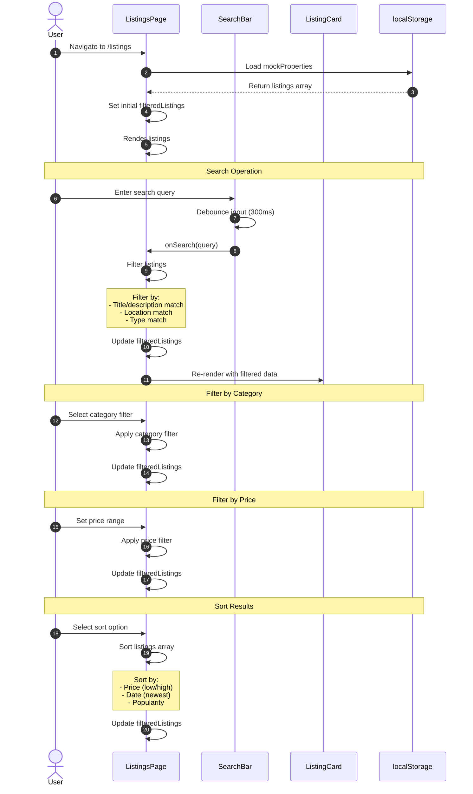
```mermaid
sequenceDiagram
    autonumber
    actor U as User
    participant P as ListingsPage
    participant SB as SearchBar
    participant LC as ListingCard
    participant LS as localStorage
    
    U->>P: Navigate to /listings
    P->>LS: Load mockProperties
    LS-->>P: Return listings array
    P->>P: Set initial filteredListings
    P->>P: Render listings
    
    Note over U,LS: Search Operation
    U->>SB: Enter search query
    SB->>SB: Debounce input (300ms)
    SB->>P: onSearch(query)
    
    P->>P: Filter listings
    Note over P: Filter by:<br/>- Title/description match<br/>- Location match<br/>- Type match
    P->>P: Update filteredListings
    P->>LC: Re-render with filtered data
    
    Note over U,LS: Filter by Category
    U->>P: Select category filter
    P->>P: Apply category filter
    P->>P: Update filteredListings
    
    Note over U,LS: Filter by Price
    U->>P: Set price range
    P->>P: Apply price filter
    P->>P: Update filteredListings
    
    Note over U,LS: Sort Results
    U->>P: Select sort option
    P->>P: Sort listings array
    Note over P: Sort by:<br/>- Price (low/high)<br/>- Date (newest)<br/>- Popularity
    P->>P: Update filteredListings
```

### 4.2 Filter Logic

```typescript
// Filter Pipeline
interface FilterCriteria {
  query?: string;
  category?: string;
  type?: string;
  minPrice?: number;
  maxPrice?: number;
  amenities?: string[];
  location?: string;
}

// Filter Application Order
const applyFilters = (listings: Listing[], criteria: FilterCriteria) => {
  return listings
    .filter(l => !criteria.category || l.category === criteria.category)
    .filter(l => !criteria.type || l.type === criteria.type)
    .filter(l => !criteria.minPrice || l.price.amount >= criteria.minPrice)
    .filter(l => !criteria.maxPrice || l.price.amount <= criteria.maxPrice)
    .filter(l => !criteria.amenities?.length || 
      criteria.amenities.every(a => l.amenities.includes(a)))
    .filter(l => !criteria.query || 
      l.title.toLowerCase().includes(criteria.query.toLowerCase()) ||
      l.description.toLowerCase().includes(criteria.query.toLowerCase()));
};
```

### 4.3 Saved Listings Flow

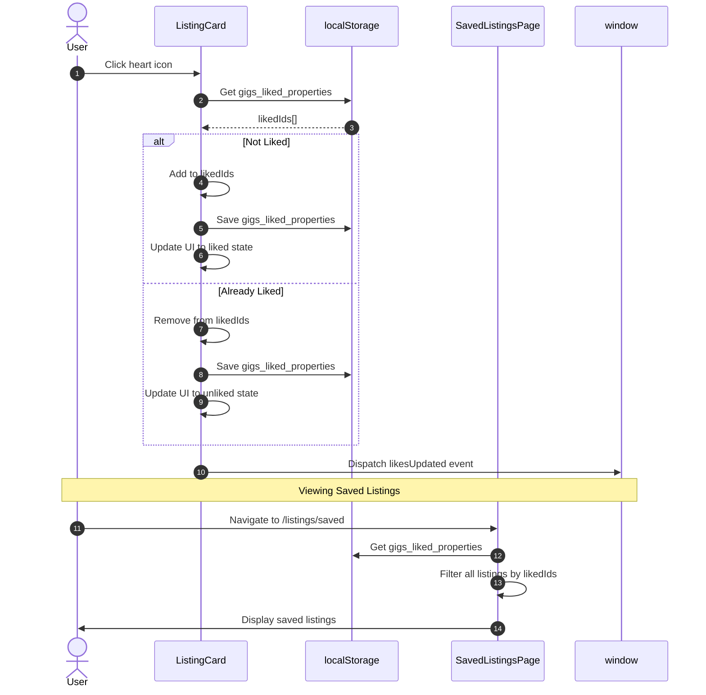
```mermaid
sequenceDiagram
    autonumber
    actor U as User
    participant CARD as ListingCard
    participant LS as localStorage
    participant SAVED as SavedListingsPage
    
    U->>CARD: Click heart icon
    CARD->>LS: Get gigs_liked_properties
    LS-->>CARD: likedIds[]
    
    alt Not Liked
        CARD->>CARD: Add to likedIds
        CARD->>LS: Save gigs_liked_properties
        CARD->>CARD: Update UI to liked state
    else Already Liked
        CARD->>CARD: Remove from likedIds
        CARD->>LS: Save gigs_liked_properties
        CARD->>CARD: Update UI to unliked state
    end
    
    CARD->>window: Dispatch likesUpdated event
    
    Note over U,window: Viewing Saved Listings
    U->>SAVED: Navigate to /listings/saved
    SAVED->>LS: Get gigs_liked_properties
    SAVED->>SAVED: Filter all listings by likedIds
    SAVED->>U: Display saved listings
```

---

## 5. Messaging Flow

### 5.1 Conversation Creation

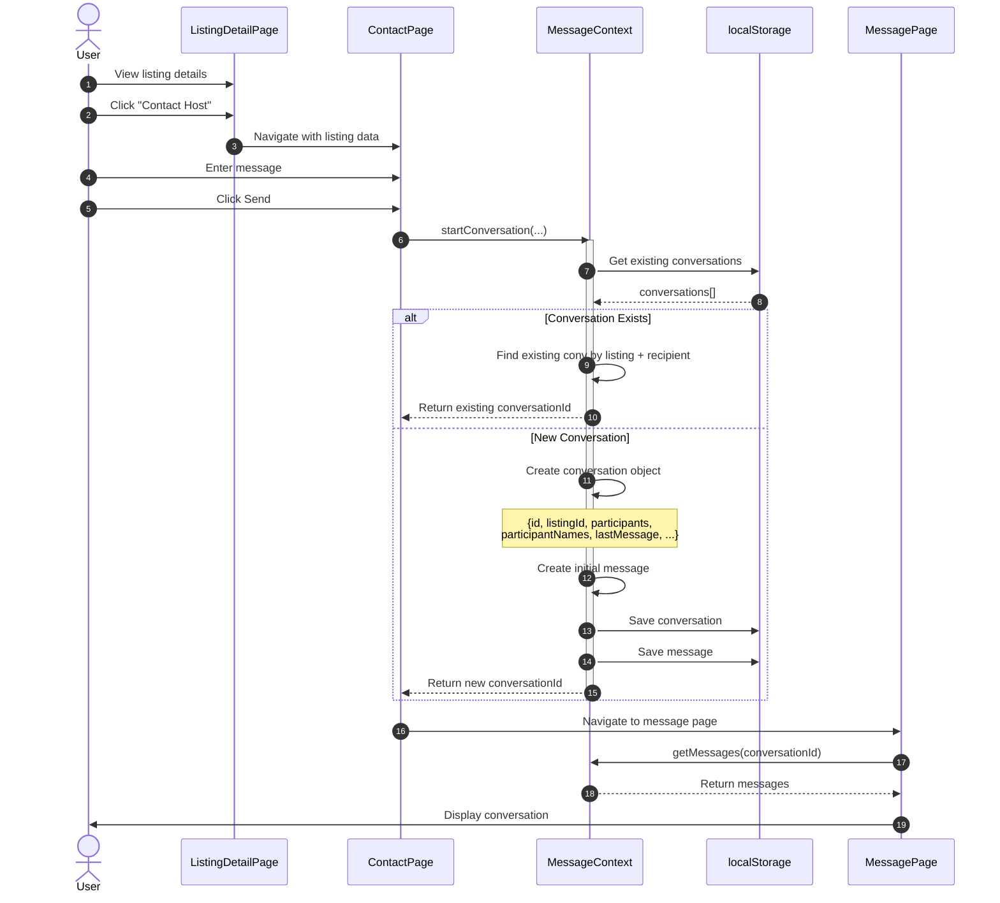
```mermaid
sequenceDiagram
    autonumber
    actor U as User
    participant D as ListingDetailPage
    participant C as ContactPage
    participant MSG as MessageContext
    participant LS as localStorage
    participant MP as MessagePage
    
    U->>D: View listing details
    U->>D: Click "Contact Host"
    D->>C: Navigate with listing data
    
    U->>C: Enter message
    U->>C: Click Send
    C->>MSG: startConversation(...)
    
    activate MSG
    MSG->>LS: Get existing conversations
    LS-->>MSG: conversations[]
    
    alt Conversation Exists
        MSG->>MSG: Find existing conv by listing + recipient
        MSG-->>C: Return existing conversationId
    else New Conversation
        MSG->>MSG: Create conversation object
        Note over MSG: {id, listingId, participants,<br/>participantNames, lastMessage, ...}
        MSG->>MSG: Create initial message
        MSG->>LS: Save conversation
        MSG->>LS: Save message
        MSG-->>C: Return new conversationId
    end
    deactivate MSG
    
    C->>MP: Navigate to message page
    MP->>MSG: getMessages(conversationId)
    MSG-->>MP: Return messages
    MP->>U: Display conversation
```

### 5.2 Message Exchange

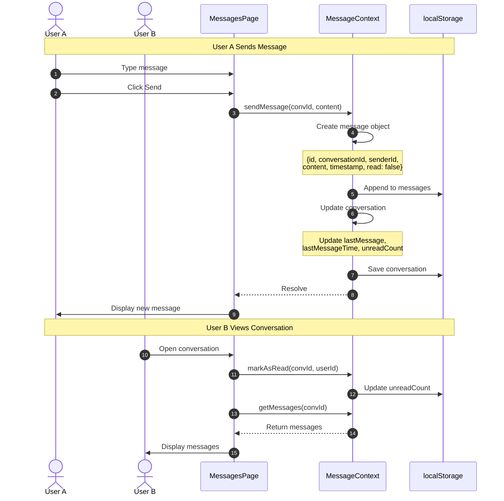
```mermaid
sequenceDiagram
    autonumber
    actor U1 as User A
    actor U2 as User B
    participant P as MessagesPage
    participant MSG as MessageContext
    participant LS as localStorage
    
    Note over U1,LS: User A Sends Message
    U1->>P: Type message
    U1->>P: Click Send
    P->>MSG: sendMessage(convId, content)
    
    MSG->>MSG: Create message object
    Note over MSG: {id, conversationId, senderId,<br/>content, timestamp, read: false}
    MSG->>LS: Append to messages
    
    MSG->>MSG: Update conversation
    Note over MSG: Update lastMessage,<br/>lastMessageTime, unreadCount
    MSG->>LS: Save conversation
    
    MSG-->>P: Resolve
    P->>U1: Display new message
    
    Note over U1,LS: User B Views Conversation
    U2->>P: Open conversation
    P->>MSG: markAsRead(convId, userId)
    MSG->>LS: Update unreadCount
    P->>MSG: getMessages(convId)
    MSG-->>P: Return messages
    P->>U2: Display messages
```

### 5.3 Message Data Structures

```typescript
// Conversation
interface Conversation {
  id: string;                    // "conv_" + timestamp
  listingId: string;
  listingTitle: string;
  listingImage: string;
  participants: string[];        // User IDs
  participantNames: Record<string, string>;
  lastMessage: string;
  lastMessageTime: number;       // timestamp
  unreadCount: number;
}

// Message
interface Message {
  id: string;                    // "msg_" + timestamp + random
  conversationId: string;
  senderId: string;
  content: string;
  timestamp: number;
  read: boolean;
}

// Storage Keys
const CONVERSATIONS_KEY = "gigs_conversations";
const MESSAGES_KEY = "gigs_messages";
```

---

## 6. Host Dashboard Flow

### 6.1 Dashboard Data Loading

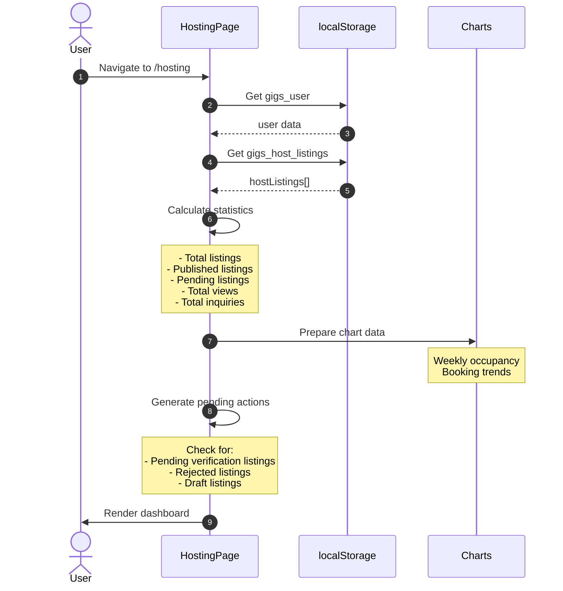
```mermaid
sequenceDiagram
    autonumber
    actor U as User
    participant P as HostingPage
    participant LS as localStorage
    participant C as Charts
    
    U->>P: Navigate to /hosting
    P->>LS: Get gigs_user
    LS-->>P: user data
    
    P->>LS: Get gigs_host_listings
    LS-->>P: hostListings[]
    
    P->>P: Calculate statistics
    Note over P: - Total listings<br/>- Published listings<br/>- Pending listings<br/>- Total views<br/>- Total inquiries
    
    P->>C: Prepare chart data
    Note over C: Weekly occupancy<br/>Booking trends
    
    P->>P: Generate pending actions
    Note over P: Check for:<br/>- Pending verification listings<br/>- Rejected listings<br/>- Draft listings
    
    P->>U: Render dashboard
```

### 6.2 Listing Management Flow

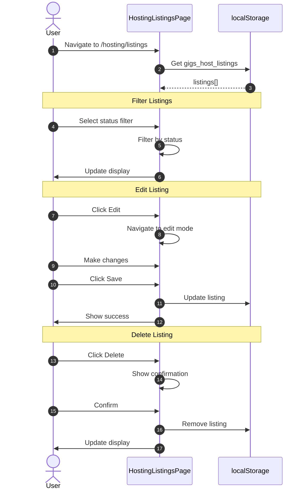
```mermaid
sequenceDiagram
    autonumber
    actor U as User
    participant P as HostingListingsPage
    participant LS as localStorage
    
    U->>P: Navigate to /hosting/listings
    P->>LS: Get gigs_host_listings
    LS-->>P: listings[]
    
    Note over U,LS: Filter Listings
    U->>P: Select status filter
    P->>P: Filter by status
    P->>U: Update display
    
    Note over U,LS: Edit Listing
    U->>P: Click Edit
    P->>P: Navigate to edit mode
    U->>P: Make changes
    U->>P: Click Save
    P->>LS: Update listing
    P->>U: Show success
    
    Note over U,LS: Delete Listing
    U->>P: Click Delete
    P->>P: Show confirmation
    U->>P: Confirm
    P->>LS: Remove listing
    P->>U: Update display
```

### 6.3 Earnings Tracking

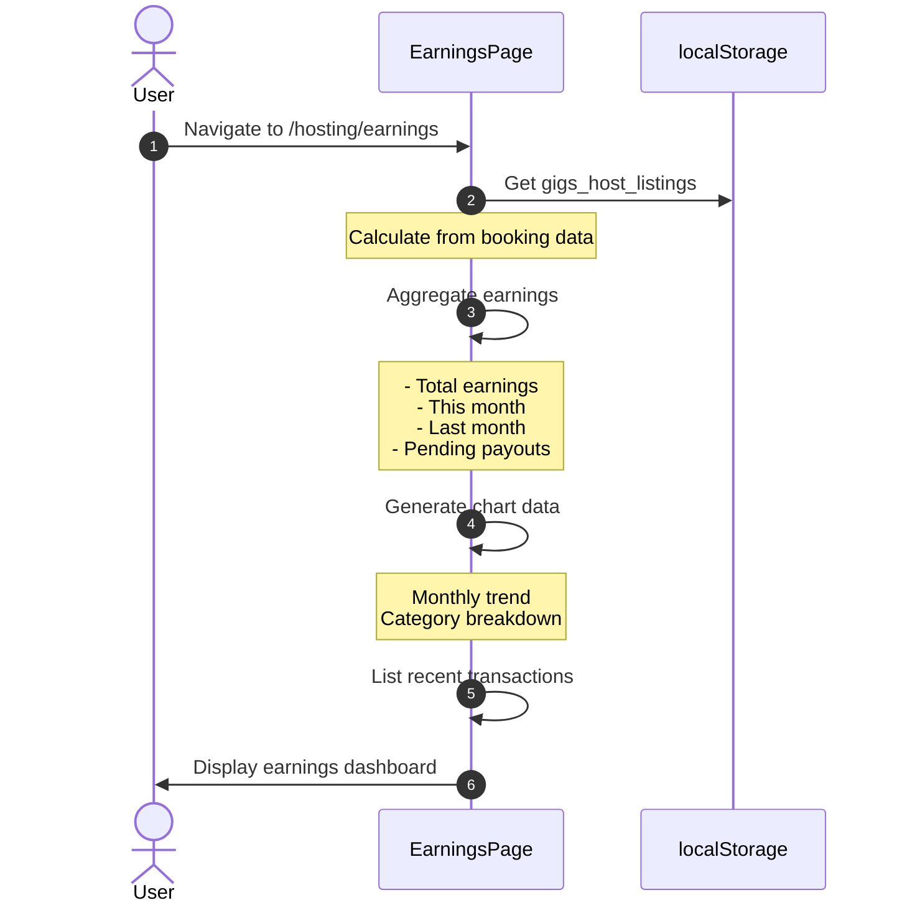
```mermaid
sequenceDiagram
    autonumber
    actor U as User
    participant P as EarningsPage
    participant LS as localStorage
    
    U->>P: Navigate to /hosting/earnings
    P->>LS: Get gigs_host_listings
    
    Note over P: Calculate from booking data
    P->>P: Aggregate earnings
    Note over P: - Total earnings<br/>- This month<br/>- Last month<br/>- Pending payouts
    
    P->>P: Generate chart data
    Note over P: Monthly trend<br/>Category breakdown
    
    P->>P: List recent transactions
    P->>U: Display earnings dashboard
```

---

## 7. Roommate Matching Flow

### 7.1 Matching Algorithm

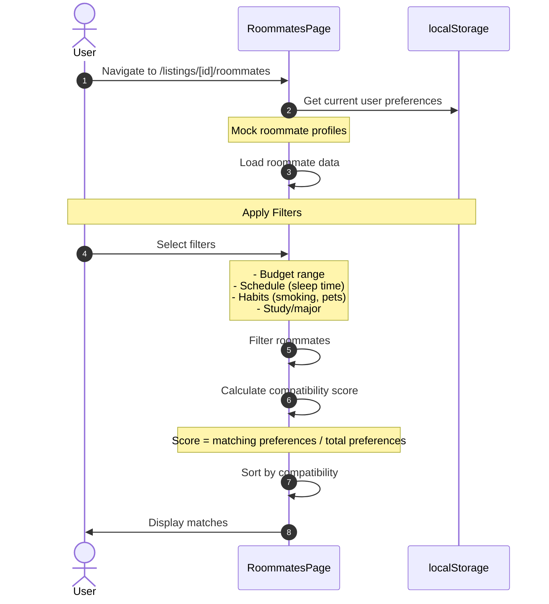
```mermaid
sequenceDiagram
    autonumber
    actor U as User
    participant P as RoommatesPage
    participant LS as localStorage
    
    U->>P: Navigate to /listings/[id]/roommates
    P->>LS: Get current user preferences
    
    Note over P: Mock roommate profiles
    P->>P: Load roommate data
    
    Note over U,LS: Apply Filters
    U->>P: Select filters
    Note over P: - Budget range<br/>- Schedule (sleep time)<br/>- Habits (smoking, pets)<br/>- Study/major
    
    P->>P: Filter roommates
    P->>P: Calculate compatibility score
    Note over P: Score = matching preferences / total preferences
    
    P->>P: Sort by compatibility
    P->>U: Display matches
```

### 7.2 Roommate Profile Structure

```typescript
interface RoommateProfile {
  id: string;
  name: string;
  avatar: string;
  age: number;
  gender: "male" | "female" | "other";
  occupation: string;           // Student, Professional
  major?: string;               // For students
  
  // Preferences
  budget: {
    min: number;
    max: number;
    currency: string;
  };
  
  // Lifestyle
  schedule: {
    sleepTime: string;          // "22:00", "00:00", etc.
    wakeTime: string;
    studyHabits: "quiet" | "moderate" | "flexible";
  };
  
  habits: {
    smoking: boolean;
    drinking: boolean;
    pets: boolean;
    partying: "often" | "sometimes" | "rarely" | "never";
  };
  
  // Compatibility Score (computed)
  compatibilityScore?: number;
}
```

---

## 8. Bill Splitting Flow

### 8.1 Bill Group Management

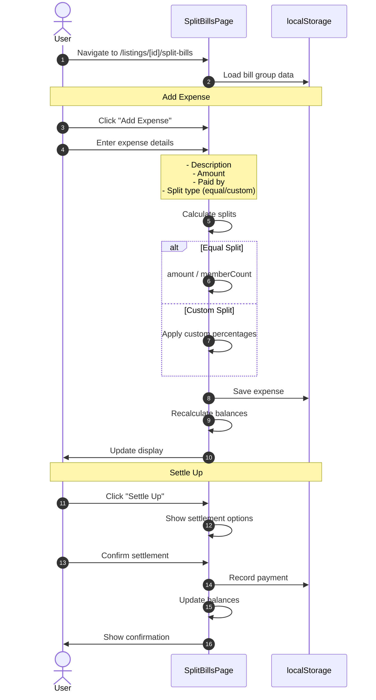
```mermaid
sequenceDiagram
    autonumber
    actor U as User
    participant P as SplitBillsPage
    participant LS as localStorage
    
    U->>P: Navigate to /listings/[id]/split-bills
    P->>LS: Load bill group data
    
    Note over U,LS: Add Expense
    U->>P: Click "Add Expense"
    U->>P: Enter expense details
    Note over P: - Description<br/>- Amount<br/>- Paid by<br/>- Split type (equal/custom)
    
    P->>P: Calculate splits
    alt Equal Split
        P->>P: amount / memberCount
    else Custom Split
        P->>P: Apply custom percentages
    end
    
    P->>LS: Save expense
    P->>P: Recalculate balances
    P->>U: Update display
    
    Note over U,LS: Settle Up
    U->>P: Click "Settle Up"
    P->>P: Show settlement options
    U->>P: Confirm settlement
    P->>LS: Record payment
    P->>P: Update balances
    P->>U: Show confirmation
```

### 8.2 Bill Splitting Data Model

```typescript
interface BillGroup {
  id: string;
  listingId: string;
  name: string;
  members: BillMember[];
  expenses: Expense[];
  createdAt: number;
}

interface BillMember {
  id: string;
  name: string;
  avatar?: string;
  balance: number;              // Positive = owed, Negative = owes
}

interface Expense {
  id: string;
  description: string;
  amount: number;
  paidBy: string;               // Member ID
  splitType: "equal" | "custom" | "percentage";
  splits: Split[];
  category: string;
  date: number;
  receipt?: string;             // Image URL
}

interface Split {
  memberId: string;
  amount: number;
  percentage?: number;
}
```

---

## 9. Data Storage Patterns

### 9.1 localStorage Schema

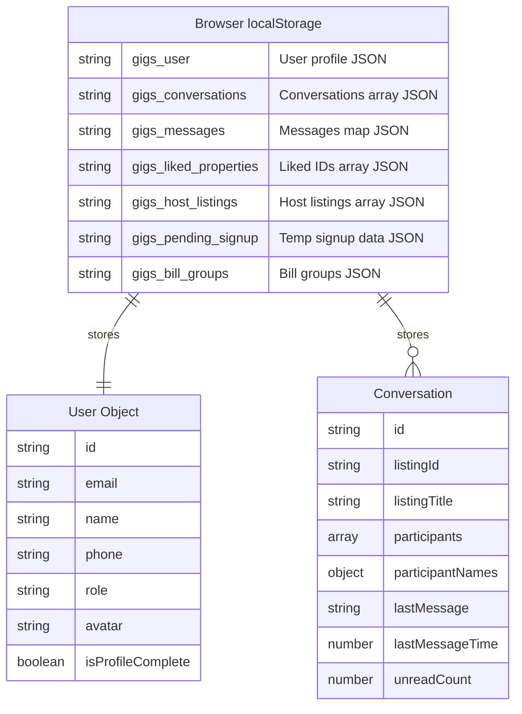
```mermaid
erDiagram
    STORAGE["Browser localStorage"] {
        string gigs_user "User profile JSON"
        string gigs_conversations "Conversations array JSON"
        string gigs_messages "Messages map JSON"
        string gigs_liked_properties "Liked IDs array JSON"
        string gigs_host_listings "Host listings array JSON"
        string gigs_pending_signup "Temp signup data JSON"
        string gigs_bill_groups "Bill groups JSON"
    }
    
    USER["User Object"] {
        string id
        string email
        string name
        string phone
        string role
        string avatar
        boolean isProfileComplete
    }
    
    CONV["Conversation"] {
        string id
        string listingId
        string listingTitle
        array participants
        object participantNames
        string lastMessage
        number lastMessageTime
        number unreadCount
    }
    
    STORAGE ||--|| USER : "stores"
    STORAGE ||--o{ CONV : "stores"
```

### 9.2 Data Access Patterns

| Operation | Storage | Frequency | Notes |
|-----------|---------|-----------|-------|
| User Auth | localStorage | Every page load | Check gigs_user |
| Listing Read | localStorage | High | Load mockProperties |
| Listing Write | localStorage | Medium | Save to host_listings |
| Message Read | localStorage | High | Load conversations |
| Message Write | localStorage | Medium | Append messages |
| Like Toggle | localStorage | Medium | Update liked_properties |

### 9.3 Future Database Schema

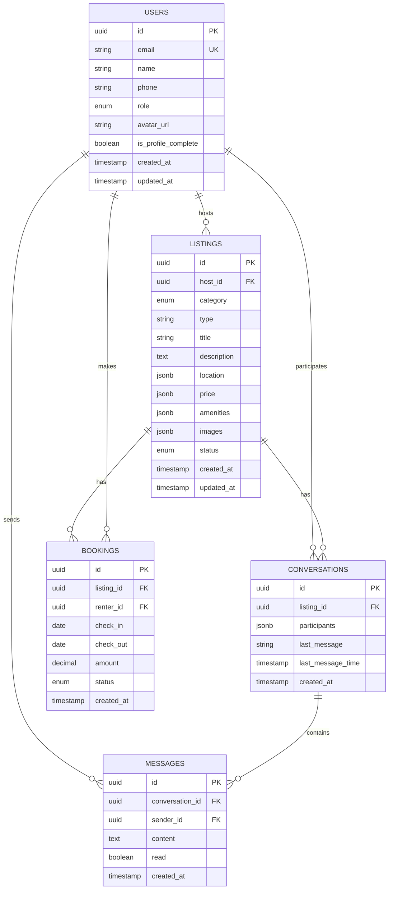
```mermaid
erDiagram
    USERS {
        uuid id PK
        string email UK
        string name
        string phone
        enum role
        string avatar_url
        boolean is_profile_complete
        timestamp created_at
        timestamp updated_at
    }
    
    LISTINGS {
        uuid id PK
        uuid host_id FK
        enum category
        string type
        string title
        text description
        jsonb location
        jsonb price
        jsonb amenities
        jsonb images
        enum status
        timestamp created_at
        timestamp updated_at
    }
    
    CONVERSATIONS {
        uuid id PK
        uuid listing_id FK
        jsonb participants
        string last_message
        timestamp last_message_time
        timestamp created_at
    }
    
    MESSAGES {
        uuid id PK
        uuid conversation_id FK
        uuid sender_id FK
        text content
        boolean read
        timestamp created_at
    }
    
    BOOKINGS {
        uuid id PK
        uuid listing_id FK
        uuid renter_id FK
        date check_in
        date check_out
        decimal amount
        enum status
        timestamp created_at
    }
    
    USERS ||--o{ LISTINGS : "hosts"
    USERS ||--o{ CONVERSATIONS : "participates"
    USERS ||--o{ MESSAGES : "sends"
    LISTINGS ||--o{ CONVERSATIONS : "has"
    CONVERSATIONS ||--o{ MESSAGES : "contains"
    LISTINGS ||--o{ BOOKINGS : "has"
    USERS ||--o{ BOOKINGS : "makes"
```

---

**Document Control**

| Version | Date | Author | Changes |
|---------|------|--------|---------|
| 1.0 | 2026-03-24 | Technical Team | Initial data flow documentation |

---

*End of Data Flow Documentation*