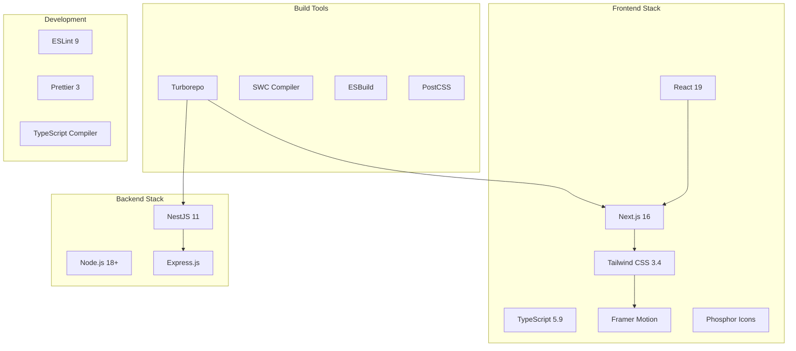
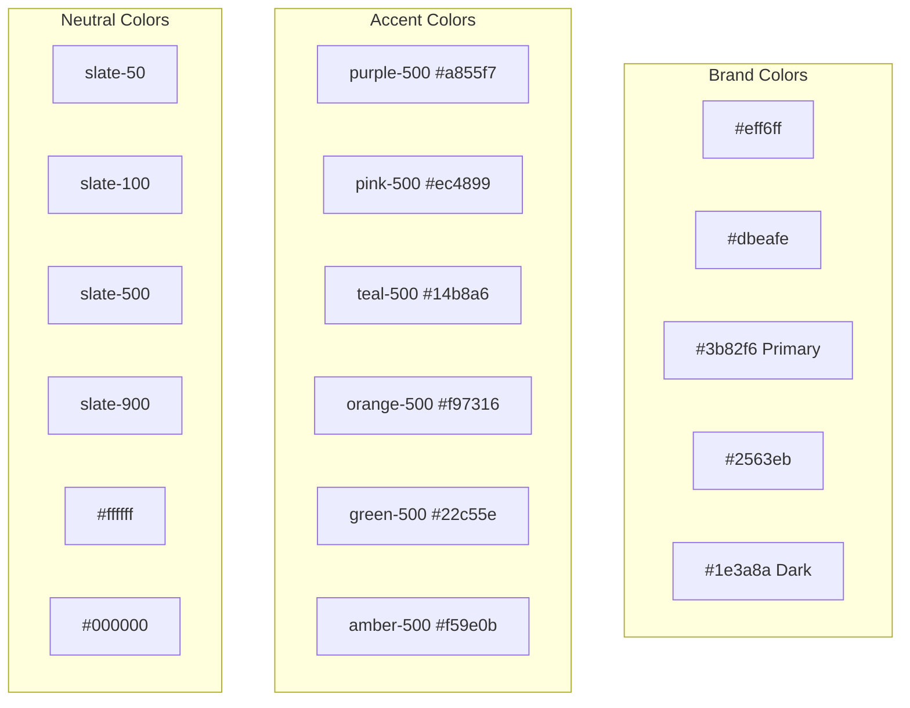

# Technology Stack Documentation

## GIGS-Rental Platform

**Version:** 1.0  
**Date:** March 24, 2026  
**Status:** Current Stack

---

## Table of Contents

1. [Overview](#1-overview)
2. [Frontend Technologies](#2-frontend-technologies)
3. [Backend Technologies](#3-backend-technologies)
4. [Shared Packages](#4-shared-packages)
5. [Development Tools](#5-development-tools)
6. [Styling and Design](#6-styling-and-design)
7. [External Services](#7-external-services)
8. [Version Compatibility Matrix](#8-version-compatibility-matrix)

---

## 1. Overview



---

## 2. Frontend Technologies

### 2.1 Core Framework

#### React 19.2.0
- **Purpose:** UI component library
- **Usage:** Component development, hooks, context
- **Key Features Used:**
  - Server Components (Next.js integration)
  - Client Components ("use client" directive)
  - React Hooks (useState, useEffect, useContext, useMemo, useCallback)
  - Context API for state management

#### Next.js 16.1.5
- **Purpose:** React framework with App Router
- **Usage:** Application routing, SSR, SSG
- **Key Features Used:**
  - App Router (app/ directory structure)
  - Server Components by default
  - Client Components with "use client"
  - Dynamic routing ([id]/ segments)
  - Layout components
  - Image optimization (next/image)

### 2.2 Language and Type Safety

#### TypeScript 5.9.3
- **Purpose:** Static type checking
- **Usage:** All source files (.tsx, .ts)
- **Configuration:**
  - Strict mode enabled
  - Path mapping for imports (@/components, etc.)
  - Type definitions for all dependencies

**Key Type Patterns:**
```typescript
// Component Props
interface ComponentProps {
  variant?: 'primary' | 'secondary' | 'ghost';
  size?: 'sm' | 'md' | 'lg';
  children: React.ReactNode;
  onClick?: () => void;
}

// Context Types
interface ContextType {
  state: State;
  dispatch: Dispatch<Action>;
}

// API Response Types
interface ApiResponse<T> {
  data: T;
  error?: string;
  status: number;
}
```

### 2.3 Animation Library

#### Framer Motion 12.38.0
- **Purpose:** Animation and gestures
- **Usage:** Page transitions, micro-interactions, gestures
- **Key Features Used:**
  - AnimatePresence for exit animations
  - motion components (motion.div, motion.button)
  - Variants for coordinated animations
  - Layout animations
  - Gesture support (whileHover, whileTap)

**Example Usage:**
```typescript
import { motion, AnimatePresence, Variants } from "framer-motion";

const fadeIn: Variants = {
  hidden: { opacity: 0, y: 20 },
  show: { opacity: 1, y: 0, transition: { duration: 0.5 } }
};

<motion.div variants={fadeIn} initial="hidden" animate="show">
  Content
</motion.div>
```

### 2.4 Icons

#### Phosphor Icons (@phosphor-icons/react)
- **Purpose:** Icon library
- **Usage:** UI icons throughout applications
- **Implementation:** CSS-based icons via CDN
- **Icon Font Include:**
```html
<script src="https://unpkg.com/@phosphor-icons/web@2.1.1"></script>
```

**Usage Pattern:**
```tsx
<i className="ph-bold ph-house"></i>
<i className="ph-fill ph-heart text-red-500"></i>
```

### 2.5 Specialized Libraries

| Library | Version | Purpose | Usage Location |
|---------|---------|---------|----------------|
| react-type-animation | ^3.2.0 | Typing animation | web landing page |

---

## 3. Backend Technologies

### 3.1 Core Framework

#### NestJS 11.0.1
- **Purpose:** Progressive Node.js framework
- **Usage:** API development, dependency injection
- **Key Features:**
  - Modular architecture
  - Decorator-based routing
  - Dependency injection
  - TypeScript-first

**Project Structure:**
```
apps/backend/src/
├── main.ts              # Application entry point
├── app.module.ts        # Root module
├── app.controller.ts    # Base controller
└── app.service.ts       # Base service
```

### 3.2 HTTP Server

#### Express.js (via @nestjs/platform-express)
- **Purpose:** HTTP server framework
- **Usage:** Request handling, middleware
- **Integration:** Default platform for NestJS

### 3.3 Reactive Programming

#### RxJS 7.8.1
- **Purpose:** Reactive extensions for JavaScript
- **Usage:** Observables, async operations
- **Integration:** Used by NestJS for HTTP handling

---

## 4. Shared Packages

### 4.1 Monorepo Structure

```mermaid
flowchart TB
    subgraph "Shared Packages"
        UI[@repo/ui]
        AUTH[@repo/auth]
        CONFIG[@repo/config]
        ESLINT[@repo/eslint-config]
        TSCONFIG[@repo/typescript-config]
    end
    
    subgraph "Applications"
        WEB[web]
        DASH[dashboard]
        API[backend]
    end
    
    UI --> WEB
    UI --> DASH
    AUTH --> WEB
    AUTH --> DASH
    AUTH --> API
    CONFIG --> WEB
    CONFIG --> DASH
```

### 4.2 @repo/ui - UI Components

**Components Provided:**
| Component | File | Purpose |
|-----------|------|---------|
| Button | button.tsx | Action buttons with variants |
| Card | card.tsx | Content containers |
| Code | code.tsx | Code display blocks |
| FileUpload | file-upload.tsx | Drag & drop file upload |
| Loader | loader.tsx | Loading indicators |
| Modal | modal.tsx | Dialog overlays |
| OTPInput | otp-input.tsx | 6-digit code input |
| Select | select.tsx | Dropdown selections |
| Table | table.tsx | Data tables |
| Tabs | tabs.tsx | Tabbed interfaces |
| Textarea | textarea.tsx | Multi-line text input |
| Toast | toast.tsx | Notification system |

**Package Configuration:**
```json
{
  "name": "@repo/ui",
  "dependencies": {
    "react": "^19.2.0",
    "react-dom": "^19.2.0"
  },
  "devDependencies": {
    "@repo/eslint-config": "*",
    "@repo/typescript-config": "*",
    "typescript": "^5"
  }
}
```

### 4.3 @repo/auth - Authentication

**Structure:**
```
packages/auth/src/
├── index.ts                      # Public exports
├── libauth.d.ts                  # Type definitions
├── config/
│   ├── admin-auth-config.ts      # Admin role config
│   ├── base-auth-config.ts       # Base configuration
│   ├── owner-auth-config.ts      # Owner role config
│   └── user-auth-configs.ts      # User configurations
├── hooks/
│   └── use-auth.ts               # Auth hook
├── middleware/
│   └── auth-middleware.ts        # Auth middleware
└── providers/
    ├── credentials-provider.ts   # Email/password auth
    └── oauth-providers.ts        # OAuth integrations
```

### 4.4 @repo/config - Shared Configuration

**Purpose:** Shared Tailwind CSS configuration

**Files:**
- `tailwind.config.js` - Extended Tailwind configuration
- `package.json` - Package definition

### 4.5 @repo/eslint-config - Linting Rules

**Configurations:**
| File | Purpose |
|------|---------|
| base.js | Base ESLint rules |
| next.js | Next.js specific rules |
| react-internal.js | React component rules |

### 4.6 @repo/typescript-config - TypeScript Configs

**Configurations:**
| File | Purpose |
|------|---------|
| base.json | Base TypeScript settings |
| nextjs.json | Next.js app configuration |
| react-library.json | React library configuration |

---

## 5. Development Tools

### 5.1 Build System

#### Turborepo 2.8.10
- **Purpose:** Monorepo task runner
- **Usage:** Build orchestration, caching
- **Configuration:** `turbo.json`

**Pipeline Configuration:**
```json
{
  "tasks": {
    "build": {
      "dependsOn": ["^build"],
      "inputs": ["$TURBO_DEFAULT$", ".env*"],
      "outputs": [".next/**", "!.next/cache/**"]
    },
    "lint": {
      "dependsOn": ["^lint"]
    },
    "dev": {
      "cache": false,
      "persistent": true
    }
  }
}
```

**Scripts:**
| Command | Description |
|---------|-------------|
| `turbo run dev` | Start all apps in development |
| `turbo run build` | Build all applications |
| `turbo run lint` | Lint all packages |
| `turbo run check-types` | Type check all packages |

### 5.2 Code Quality

#### ESLint 9.39.1
- **Purpose:** Code linting
- **Configuration:** `@repo/eslint-config`
- **Usage:** Error prevention, style consistency

#### Prettier 3.8.1
- **Purpose:** Code formatting
- **Configuration:** `.prettierrc`
- **Integration:** Pre-commit formatting

### 5.3 Compilers and Bundlers

#### SWC Compiler
- **Purpose:** Rust-based JavaScript/TypeScript compiler
- **Usage:** Fast compilation for Next.js apps
- **Integration:** Built into Next.js

#### ESBuild
- **Purpose:** JavaScript bundler
- **Usage:** Backend bundling
- **Integration:** NestJS build process

### 5.4 CSS Processing

#### PostCSS 8.5.6
- **Purpose:** CSS transformation
- **Plugins:**
  - tailwindcss
  - autoprefixer

**Configuration:**
```javascript
// postcss.config.mjs
export default {
  plugins: {
    "@tailwindcss/postcss": {},
    autoprefixer: {},
  },
};
```

---

## 6. Styling and Design

### 6.1 Tailwind CSS 3.4.19

**Purpose:** Utility-first CSS framework

**Configuration:**
```javascript
// tailwind.config.js
module.exports = {
  content: [
    "./app/**/*.{js,ts,jsx,tsx,mdx}",
    "./src/**/*.{js,ts,jsx,tsx,mdx}",
  ],
  theme: {
    extend: {
      colors: {
        brand: {
          50: '#eff6ff',
          100: '#dbeafe',
          500: '#3b82f6',
          600: '#2563eb',
          dark: '#1e3a8a',
        },
      },
      fontFamily: {
        display: ['var(--font-display)', 'system-ui', 'sans-serif'],
        sans: ['var(--font-sans)', 'system-ui', 'sans-serif'],
      },
      boxShadow: {
        'brutal-sm': '2px 2px 0 0 rgb(0 0 0)',
        'brutal': '4px 4px 0 0 rgb(0 0 0)',
        'brutal-lg': '8px 8px 0 0 rgb(0 0 0)',
      },
    },
  },
};
```

### 6.2 Design System - Neubrutalism

**Key Characteristics:**
| Element | Implementation |
|---------|----------------|
| Borders | Thick (2px), solid black |
| Shadows | Hard offsets (no blur) |
| Colors | Bold, high contrast |
| Typography | Bold headings, clean body |
| Corners | Slight rounding (rounded-lg) |

**Shadow Variants:**
```css
.shadow-brutal-sm { box-shadow: 2px 2px 0 0 rgb(0 0 0); }
.shadow-brutal    { box-shadow: 4px 4px 0 0 rgb(0 0 0); }
.shadow-brutal-lg { box-shadow: 8px 8px 0 0 rgb(0 0 0); }
```

### 6.3 Color Palette



---

## 7. External Services

### 7.1 CDN Resources

| Service | URL | Purpose |
|---------|-----|---------|
| Phosphor Icons | `https://unpkg.com/@phosphor-icons/web@2.1.1` | Icon font |
| Unsplash | `https://images.unsplash.com` | Stock images |
| Google Fonts | (via next/font) | Typography |

### 7.2 Future Integrations

| Service | Purpose | Status |
|---------|---------|--------|
| Google OAuth | Authentication | Partially implemented |
| PostgreSQL | Primary database | Planned |
| Redis | Session/cache | Planned |
| AWS S3 | Image storage | Planned |
| Stripe | Payment processing | Future |
| SendGrid | Email service | Future |

---

## 8. Version Compatibility Matrix

### 8.1 Current Versions

| Package | Version | Purpose | Compatibility |
|---------|---------|---------|---------------|
| react | 19.2.0 | UI framework | Next.js 16 compatible |
| react-dom | 19.2.0 | DOM rendering | Matches React |
| next | 16.1.5 | Framework | React 19 compatible |
| typescript | 5.9.3 | Type checking | All packages |
| tailwindcss | 3.4.19 | Styling | PostCSS 8+ |
| framer-motion | 12.38.0 | Animation | React 18+ |
| @nestjs/common | 11.0.1 | Backend framework | Node 18+ |
| @nestjs/core | 11.0.1 | Core framework | Matches common |
| turbo | 2.8.10 | Build system | Node 18+ |
| eslint | 9.39.1 | Linting | All packages |
| prettier | 3.8.1 | Formatting | All packages |

### 8.2 Node.js Requirements

| Requirement | Version |
|-------------|---------|
| Minimum | Node.js 18.0.0 |
| Recommended | Node.js 20.x LTS |
| Package Manager | npm 11.10.1 |

### 8.3 Browser Support

| Browser | Minimum Version |
|---------|-----------------|
| Chrome | Last 2 versions |
| Firefox | Last 2 versions |
| Safari | Last 2 versions |
| Edge | Last 2 versions |
| Mobile Safari | iOS 15+ |
| Chrome Android | Last 2 versions |

---

## 9. Package Scripts Reference

### 9.1 Root Package Scripts

```json
{
  "scripts": {
    "dev": "turbo run dev --parallel",
    "dev:all": "turbo run dev --parallel",
    "dev:backend": "turbo run dev --filter=backend",
    "dev:web": "turbo run dev --filter=web",
    "dev:dashboard": "turbo run dev --filter=dashboard",
    "start": "npm run dev",
    "build": "turbo run build",
    "lint": "turbo run lint",
    "typecheck": "turbo run typecheck"
  }
}
```

### 9.2 Application Scripts

#### Dashboard (apps/dashboard)
```json
{
  "scripts": {
    "dev": "next dev --port 3001",
    "build": "next build",
    "start": "next start",
    "lint": "eslint --max-warnings 0",
    "check-types": "next typegen && tsc --noEmit"
  }
}
```

#### Web (apps/web)
```json
{
  "scripts": {
    "dev": "next dev --port 8888",
    "build": "next build",
    "start": "next start",
    "lint": "eslint --max-warnings 0",
    "check-types": "next typegen && tsc --noEmit"
  }
}
```

#### Backend (apps/backend)
```json
{
  "scripts": {
    "build": "nest build",
    "start": "nest start",
    "start:dev": "nest start --watch",
    "start:prod": "node dist/main",
    "lint": "eslint \"{src,apps,libs,test}/**/*.ts\" --fix",
    "test": "jest"
  }
}
```

---

**Document Control**

| Version | Date | Author | Changes |
|---------|------|--------|---------|
| 1.0 | 2026-03-24 | Technical Team | Initial technology stack documentation |

---

*End of Technology Stack Documentation*