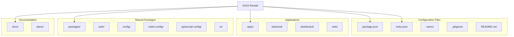

# Codebase Structure Documentation

## GIGS-Rental Platform

**Version:** 1.0  
**Date:** March 24, 2026  
**Status:** Current Structure

---

## Table of Contents

1. [Monorepo Overview](#1-monorepo-overview)
2. [Root Configuration](#2-root-configuration)
3. [Apps Structure](#3-apps-structure)
4. [Packages Structure](#4-packages-structure)
5. [File Naming Conventions](#5-file-naming-conventions)
6. [Import Patterns](#6-import-patterns)
7. [Directory Tree](#7-directory-tree)

---

## 1. Monorepo Overview



---

## 2. Root Configuration

### 2.1 Configuration Files

| File | Purpose | Key Settings |
|------|---------|--------------|
| `package.json` | Root package definition | Workspaces, scripts, devDependencies |
| `turbo.json` | Turborepo pipeline | Build, lint, dev tasks |
| `.npmrc` | npm configuration | Package registry settings |
| `.gitignore` | Git exclusions | node_modules, build outputs |
| `README.md` | Project documentation | Setup instructions |

### 2.2 Workspace Configuration

```json
// package.json
{
  "name": "GIGS-Rental",
  "private": true,
  "workspaces": [
    "apps/*",
    "packages/*"
  ],
  "devDependencies": {
    "@nestjs/cli": "^7.6.0",
    "@tailwindcss/postcss": "^4.2.0",
    "prettier": "^3.8.1",
    "turbo": "^2.8.10",
    "typescript": "5.9.3"
  },
  "engines": {
    "node": ">=18"
  },
  "packageManager": "npm@11.10.1"
}
```

### 2.3 Turborepo Pipeline

```json
// turbo.json
{
  "$schema": "https://turborepo.dev/schema.json",
  "ui": "tui",
  "tasks": {
    "build": {
      "dependsOn": ["^build"],
      "inputs": ["$TURBO_DEFAULT$", ".env*"],
      "outputs": [".next/**", "!.next/cache/**"]
    },
    "lint": {
      "dependsOn": ["^lint"]
    },
    "check-types": {
      "dependsOn": ["^check-types"]
    },
    "dev": {
      "cache": false,
      "persistent": true
    }
  }
}
```

---

## 3. Apps Structure

### 3.1 Backend (apps/backend)

```
apps/backend/
├── .prettierrc                 # Prettier configuration
├── eslint.config.mjs           # ESLint configuration
├── nest-cli.json              # NestJS CLI configuration
├── package.json               # Package dependencies
├── README.md                  # Backend documentation
├── tsconfig.build.json        # TypeScript build config
├── tsconfig.json              # TypeScript configuration
├── src/
│   ├── main.ts               # Application entry point
│   ├── app.module.ts         # Root module
│   ├── app.controller.ts     # Base controller
│   ├── app.controller.spec.ts # Controller tests
│   └── app.service.ts        # Base service
└── test/
    ├── app.e2e-spec.ts       # End-to-end tests
    └── jest-e2e.json         # Jest configuration
```

**Key Files:**

| File | Purpose | Exports |
|------|---------|---------|
| `main.ts` | Bootstrap application | `bootstrap()` function |
| `app.module.ts` | Root NestJS module | `AppModule` class |
| `app.controller.ts` | HTTP route handlers | `AppController` class |
| `app.service.ts` | Business logic | `AppService` class |

### 3.2 Dashboard (apps/dashboard)

```
apps/dashboard/
├── .gitignore                 # Git exclusions
├── eslint.config.js          # ESLint configuration
├── next.config.js            # Next.js configuration
├── package.json              # Package dependencies
├── postcss.config.mjs        # PostCSS configuration
├── README.md                 # App documentation
├── tailwind.config.js        # Tailwind configuration
├── tsconfig.json             # TypeScript configuration
├── app/                      # Next.js App Router
│   ├── globals.css          # Global styles
│   ├── layout.tsx           # Root layout
│   ├── page.tsx             # Landing page
│   ├── auth/                # Authentication routes
│   │   ├── forgot-password/
│   │   │   ├── ForgotPasswordClient.tsx
│   │   │   └── page.tsx
│   │   ├── login/
│   │   │   ├── LoginClient.tsx
│   │   │   └── page.tsx
│   │   ├── onboarding/
│   │   │   ├── OnboardingClient.tsx
│   │   │   └── page.tsx
│   │   ├── reset-password/
│   │   │   ├── ResetPasswordClient.tsx
│   │   │   └── page.tsx
│   │   ├── signup/
│   │   │   ├── SignupClient.tsx
│   │   │   └── page.tsx
│   │   └── verify-otp/
│   │       ├── VerifyOtpClient.tsx
│   │       └── page.tsx
│   ├── hosting/              # Host dashboard routes
│   │   ├── layout.tsx
│   │   ├── page.tsx
│   │   ├── calendar/
│   │   │   └── page.tsx
│   │   ├── earnings/
│   │   │   └── page.tsx
│   │   ├── listings/
│   │   │   └── page.tsx
│   │   ├── messages/
│   │   │   └── page.tsx
│   │   ├── reviews/
│   │   │   └── page.tsx
│   │   └── settings/
│   │       └── page.tsx
│   ├── listings/             # Listing routes
│   │   ├── data.ts          # Mock data
│   │   ├── page.tsx         # Browse listings
│   │   ├── create/
│   │   │   └── page.tsx     # Create listing
│   │   ├── saved/
│   │   │   └── page.tsx     # Saved listings
│   │   └── [id]/            # Dynamic listing routes
│   │       ├── page.tsx
│   │       ├── contact/
│   │       │   └── page.tsx
│   │       ├── message/
│   │       │   └── page.tsx
│   │       ├── roommates/
│   │       │   └── page.tsx
│   │       └── split-bills/
│   │           └── page.tsx
│   └── profile/
│       └── page.tsx
├── public/                   # Static assets
│   ├── file-text.svg
│   ├── globe.svg
│   ├── next.svg
│   ├── turborepo-dark.svg
│   ├── turborepo-light.svg
│   ├── vercel.svg
│   └── window.svg
└── src/
    ├── app/
    │   └── listings/
    │       ├── data.ts
    │       └── page.tsx
    ├── components/
    │   ├── auth/
    │   │   ├── AuthInput.tsx
    │   │   ├── AuthLayout.tsx
    │   │   ├── index.ts
    │   │   └── OAuthButtons.tsx
    │   ├── layout/
    │   │   ├── Header.tsx
    │   │   └── index.ts
    │   ├── listings/
    │   │   ├── index.ts
    │   │   ├── ListingCard.tsx
    │   │   ├── ListingDetailActions.tsx
    │   │   └── SearchBar.tsx
    │   └── mobile/
    │       ├── index.ts
    │       ├── MobileBottomNav.tsx
    │       ├── MobileMenuDrawer.tsx
    │       └── NotificationDropdown.tsx
    └── context/
        ├── AuthContext.tsx
        └── MessageContext.tsx
```

### 3.3 Web (apps/web)

```
apps/web/
├── .gitignore
├── eslint.config.js
├── next.config.js
├── package.json
├── postcss.config.mjs
├── README.md
├── tailwind.config.js
├── tsconfig.json
├── app/                      # Marketing site routes
│   ├── globals.css
│   ├── layout.tsx
│   ├── page.tsx
│   ├── about-us/
│   │   └── page.tsx
│   ├── blog/
│   │   └── page.tsx
│   ├── careers/
│   │   └── page.tsx
│   ├── contact/
│   │   └── page.tsx
│   ├── cookies/
│   │   └── page.tsx
│   ├── for-landlords/
│   │   └── page.tsx
│   ├── help-center/
│   │   └── page.tsx
│   ├── pricing/
│   │   └── page.tsx
│   ├── privacy/
│   │   └── page.tsx
│   ├── roommate-match/
│   │   └── page.tsx
│   ├── safety-guidelines/
│   │   └── page.tsx
│   └── terms/
│       └── page.tsx
├── public/
└── src/
    ├── components/
    │   ├── auth/
    │   │   ├── AuthInput.tsx
    │   │   ├── AuthLayout.tsx
    │   │   ├── index.ts
    │   │   └── OAuthButtons.tsx
    │   ├── CustomCursor.tsx
    │   ├── Layout/
    │   │   ├── Footer.tsx
    │   │   ├── Header.tsx
    │   │   └── index.ts
    │   ├── Providers/
    │   └── sections/
    │       ├── About/
    │       │   ├── CTA.tsx
    │       │   ├── Hero.tsx
    │       │   ├── index.ts
    │       │   ├── Mission.tsx
    │       │   ├── Team.tsx
    │       │   └── Values.tsx
    │       ├── Contact/
    │       │   ├── ContactForm.tsx
    │       │   ├── ContactInfo.tsx
    │       │   ├── CTA.tsx
    │       │   ├── Hero.tsx
    │       │   └── index.ts
    │       ├── Home/
    │       │   ├── FAQ.tsx
    │       │   ├── FeaturesGrid.tsx
    │       │   ├── Hero.tsx
    │       │   └── index.ts
    │       └── Pricing/
    │           └── index.ts
    └── app/                    # Additional app routes
        └── listings/
            ├── data.ts
            └── page.tsx
```

---

## 4. Packages Structure

### 4.1 Auth Package (packages/auth)

```
packages/auth/
├── package.json
├── tsconfig.json
└── src/
    ├── index.ts                    # Public exports
    ├── libauth.d.ts               # Type definitions
    ├── config/
    │   ├── admin-auth-config.ts   # Admin authentication
    │   ├── base-auth-config.ts    # Base configuration
    │   ├── owner-auth-config.ts   # Owner authentication
    │   └── user-auth-configs.ts   # User configurations
    ├── hooks/
    │   ├── index.ts
    │   └── use-auth.ts            # useAuth hook
    ├── middleware/
    │   └── auth-middleware.ts     # Express middleware
    └── providers/
        ├── credentials-provider.ts # Email/password
        └── oauth-providers.ts      # OAuth integrations
```

### 4.2 Config Package (packages/config)

```
packages/config/
├── package.json
└── tailwind.config.js            # Shared Tailwind config
```

### 4.3 ESLint Config (packages/eslint-config)

```
packages/eslint-config/
├── base.js                       # Base ESLint rules
├── next.js                       # Next.js specific rules
├── package.json
├── react-internal.js             # React component rules
└── README.md
```

### 4.4 TypeScript Config (packages/typescript-config)

```
packages/typescript-config/
├── base.json                     # Base TypeScript settings
├── nextjs.json                   # Next.js app configuration
├── package.json
└── react-library.json            # React library configuration
```

### 4.5 UI Package (packages/ui)

```
packages/ui/
├── eslint.config.mjs
├── package.json
├── tsconfig.json
└── src/
    ├── button.tsx               # Button component
    ├── card.tsx                 # Card component
    ├── code.tsx                 # Code display
    ├── file-upload.tsx          # File upload component
    ├── loader.tsx               # Loading indicators
    ├── modal.tsx                # Modal dialog
    ├── otp-input.tsx            # OTP input field
    ├── select.tsx               # Select dropdown
    ├── table.tsx                # Data table
    ├── tabs.tsx                 # Tab component
    ├── textarea.tsx             # Text area input
    └── toast.tsx                # Toast notifications
```

---

## 5. File Naming Conventions

### 5.1 Naming Patterns

| Pattern | Usage | Example |
|---------|-------|---------|
| `PascalCase.tsx` | React components | `ListingCard.tsx`, `AuthLayout.tsx` |
| `camelCase.ts` | Utilities, hooks, configs | `useAuth.ts`, `data.ts` |
| `kebab-case/` | Directory names | `forgot-password/`, `split-bills/` |
| `UPPER_SNAKE_CASE` | Constants | `API_ENDPOINT`, `MAX_RETRIES` |
| `page.tsx` | Next.js route pages | `app/listings/page.tsx` |
| `layout.tsx` | Next.js layouts | `app/layout.tsx` |
| `index.ts` | Directory exports | `components/auth/index.ts` |

### 5.2 Component File Structure

```typescript
// ComponentName.tsx
"use client"; // If client component

import { useState, useEffect } from "react";

// Types
interface ComponentNameProps {
  // Props definition
}

// Component
export const ComponentName = ({ prop1, prop2 }: ComponentNameProps) => {
  // Component logic
  
  return (
    // JSX
  );
};
```

### 5.3 Page File Structure

```typescript
// page.tsx
import { Metadata } from "next";

export const metadata: Metadata = {
  title: "Page Title",
  description: "Page description",
};

export default function PageName() {
  return (
    // Page content
  );
}
```

### 5.4 Client Component Pages

```typescript
// PageClient.tsx (for client-side pages)
"use client";

import { useState } from "react";

export const PageClient = () => {
  // Client-side logic
  
  return (
    // JSX
  );
};

// page.tsx (server component wrapper)
import { PageClient } from "./PageClient";

export default function Page() {
  return <PageClient />;
}
```

---

## 6. Import Patterns

### 6.1 Path Aliases

| Alias | Target | Usage |
|-------|--------|-------|
| `@/components/*` | `src/components/*` | `import { Button } from "@/components/ui"` |
| `@/context/*` | `src/context/*` | `import { useAuth } from "@/context/AuthContext"` |
| `@/app/*` | `src/app/*` | `import { data } from "@/app/listings/data"` |
| `@repo/ui` | `packages/ui` | `import { Button } from "@repo/ui"` |
| `@repo/auth` | `packages/auth` | `import { useAuth } from "@repo/auth"` |

### 6.2 Import Order Convention

```typescript
// 1. React/Next.js imports
import { useState, useEffect } from "react";
import { useRouter } from "next/navigation";
import Link from "next/link";

// 2. Third-party libraries
import { motion, AnimatePresence } from "framer-motion";

// 3. Absolute imports (@/)
import { useAuth } from "@/context/AuthContext";
import { Header } from "@/components/layout/Header";

// 4. Relative imports (./, ../)
import { LoginForm } from "./LoginForm";
import styles from "./styles.module.css";
```

### 6.3 Package Imports

```typescript
// From @repo/ui
import { Button, Card, Modal } from "@repo/ui";

// From @repo/auth
import { useAuth } from "@repo/auth";

// From @repo/config
import tailwindConfig from "@repo/config/tailwind.config";
```

---

## 7. Directory Tree

### 7.1 Complete Project Tree

```
GIGS-Rental/
├── .gitignore
├── .npmrc
├── package.json
├── package-lock.json
├── README.md
├── turbo.json
│
├── apps/
│   ├── backend/
│   │   ├── .prettierrc
│   │   ├── eslint.config.mjs
│   │   ├── nest-cli.json
│   │   ├── package.json
│   │   ├── README.md
│   │   ├── tsconfig.build.json
│   │   ├── tsconfig.json
│   │   ├── src/
│   │   │   ├── app.controller.spec.ts
│   │   │   ├── app.controller.ts
│   │   │   ├── app.module.ts
│   │   │   ├── app.service.ts
│   │   │   └── main.ts
│   │   └── test/
│   │       ├── app.e2e-spec.ts
│   │       └── jest-e2e.json
│   │
│   ├── dashboard/
│   │   ├── .gitignore
│   │   ├── eslint.config.js
│   │   ├── next.config.js
│   │   ├── package.json
│   │   ├── postcss.config.mjs
│   │   ├── README.md
│   │   ├── tailwind.config.js
│   │   ├── tsconfig.json
│   │   ├── app/
│   │   │   ├── globals.css
│   │   │   ├── layout.tsx
│   │   │   ├── page.tsx
│   │   │   ├── auth/
│   │   │   │   ├── forgot-password/
│   │   │   │   │   ├── ForgotPasswordClient.tsx
│   │   │   │   │   └── page.tsx
│   │   │   │   ├── login/
│   │   │   │   │   ├── LoginClient.tsx
│   │   │   │   │   └── page.tsx
│   │   │   │   ├── onboarding/
│   │   │   │   │   ├── OnboardingClient.tsx
│   │   │   │   │   └── page.tsx
│   │   │   │   ├── reset-password/
│   │   │   │   │   ├── ResetPasswordClient.tsx
│   │   │   │   │   └── page.tsx
│   │   │   │   ├── signup/
│   │   │   │   │   ├── SignupClient.tsx
│   │   │   │   │   └── page.tsx
│   │   │   │   └── verify-otp/
│   │   │   │       ├── VerifyOtpClient.tsx
│   │   │   │       └── page.tsx
│   │   │   ├── hosting/
│   │   │   │   ├── layout.tsx
│   │   │   │   ├── page.tsx
│   │   │   │   ├── calendar/
│   │   │   │   │   └── page.tsx
│   │   │   │   ├── earnings/
│   │   │   │   │   └── page.tsx
│   │   │   │   ├── listings/
│   │   │   │   │   └── page.tsx
│   │   │   │   ├── messages/
│   │   │   │   │   └── page.tsx
│   │   │   │   ├── reviews/
│   │   │   │   │   └── page.tsx
│   │   │   │   └── settings/
│   │   │   │       └── page.tsx
│   │   │   ├── listings/
│   │   │   │   ├── data.ts
│   │   │   │   ├── page.tsx
│   │   │   │   ├── create/
│   │   │   │   │   └── page.tsx
│   │   │   │   ├── saved/
│   │   │   │   │   └── page.tsx
│   │   │   │   └── [id]/
│   │   │   │       ├── page.tsx
│   │   │   │       ├── contact/
│   │   │   │       │   └── page.tsx
│   │   │   │       ├── message/
│   │   │   │       │   └── page.tsx
│   │   │   │       ├── roommates/
│   │   │   │       │   └── page.tsx
│   │   │   │       └── split-bills/
│   │   │   │           └── page.tsx
│   │   │   └── profile/
│   │   │       └── page.tsx
│   │   ├── public/
│   │   │   └── ...
│   │   └── src/
│   │       ├── app/
│   │       │   └── listings/
│   │       │       ├── data.ts
│   │       │       └── page.tsx
│   │       ├── components/
│   │       │   ├── auth/
│   │       │   │   ├── AuthInput.tsx
│   │       │   │   ├── AuthLayout.tsx
│   │       │   │   ├── index.ts
│   │       │   │   └── OAuthButtons.tsx
│   │       │   ├── layout/
│   │       │   │   ├── Header.tsx
│   │       │   │   └── index.ts
│   │       │   ├── listings/
│   │       │   │   ├── index.ts
│   │       │   │   ├── ListingCard.tsx
│   │       │   │   ├── ListingDetailActions.tsx
│   │       │   │   └── SearchBar.tsx
│   │       │   └── mobile/
│   │       │       ├── index.ts
│   │       │       ├── MobileBottomNav.tsx
│   │       │       ├── MobileMenuDrawer.tsx
│   │       │       └── NotificationDropdown.tsx
│   │       └── context/
│   │           ├── AuthContext.tsx
│   │           └── MessageContext.tsx
│   │
│   └── web/
│       ├── .gitignore
│       ├── eslint.config.js
│       ├── next.config.js
│       ├── package.json
│       ├── postcss.config.mjs
│       ├── README.md
│       ├── tailwind.config.js
│       ├── tsconfig.json
│       ├── app/
│       │   ├── globals.css
│       │   ├── layout.tsx
│       │   ├── page.tsx
│       │   ├── about-us/
│       │   │   └── page.tsx
│       │   ├── blog/
│       │   │   └── page.tsx
│       │   ├── careers/
│       │   │   └── page.tsx
│       │   ├── contact/
│       │   │   └── page.tsx
│       │   ├── cookies/
│       │   │   └── page.tsx
│       │   ├── for-landlords/
│       │   │   └── page.tsx
│       │   ├── help-center/
│       │   │   └── page.tsx
│       │   ├── pricing/
│       │   │   └── page.tsx
│       │   ├── privacy/
│       │   │   └── page.tsx
│       │   ├── roommate-match/
│       │   │   └── page.tsx
│       │   ├── safety-guidelines/
│       │   │   └── page.tsx
│       │   └── terms/
│       │       └── page.tsx
│       ├── public/
│       │   └── ...
│       └── src/
│           ├── components/
│           │   ├── auth/
│           │   │   ├── AuthInput.tsx
│           │   │   ├── AuthLayout.tsx
│           │   │   ├── index.ts
│           │   │   └── OAuthButtons.tsx
│           │   ├── CustomCursor.tsx
│           │   ├── Layout/
│           │   │   ├── Footer.tsx
│           │   │   ├── Header.tsx
│           │   │   └── index.ts
│           │   ├── Providers/
│           │   └── sections/
│           │       ├── About/
│           │       │   ├── CTA.tsx
│           │       │   ├── Hero.tsx
│           │       │   ├── index.ts
│           │       │   ├── Mission.tsx
│           │       │   ├── Team.tsx
│           │       │   └── Values.tsx
│           │       ├── Contact/
│           │       │   ├── ContactForm.tsx
│           │       │   ├── ContactInfo.tsx
│           │       │   ├── CTA.tsx
│           │       │   ├── Hero.tsx
│           │       │   └── index.ts
│           │       ├── Home/
│           │       │   ├── FAQ.tsx
│           │       │   ├── FeaturesGrid.tsx
│           │       │   ├── Hero.tsx
│           │       │   └── index.ts
│           │       └── Pricing/
│           │           └── index.ts
│           └── app/
│               └── listings/
│                   ├── data.ts
│                   └── page.tsx
│
├── packages/
│   ├── auth/
│   │   ├── package.json
│   │   ├── tsconfig.json
│   │   └── src/
│   │       ├── index.ts
│   │       ├── libauth.d.ts
│   │       ├── config/
│   │       │   ├── admin-auth-config.ts
│   │       │   ├── base-auth-config.ts
│   │       │   ├── owner-auth-config.ts
│   │       │   └── user-auth-configs.ts
│   │       ├── hooks/
│   │       │   ├── index.ts
│   │       │   └── use-auth.ts
│   │       ├── middleware/
│   │       │   └── auth-middleware.ts
│   │       └── providers/
│   │           ├── credentials-provider.ts
│   │           └── oauth-providers.ts
│   │
│   ├── config/
│   │   ├── package.json
│   │   └── tailwind.config.js
│   │
│   ├── eslint-config/
│   │   ├── base.js
│   │   ├── next.js
│   │   ├── package.json
│   │   ├── react-internal.js
│   │   └── README.md
│   │
│   ├── typescript-config/
│   │   ├── base.json
│   │   ├── nextjs.json
│   │   ├── package.json
│   │   └── react-library.json
│   │
│   └── ui/
│       ├── eslint.config.mjs
│       ├── package.json
│       ├── tsconfig.json
│       └── src/
│           ├── button.tsx
│           ├── card.tsx
│           ├── code.tsx
│           ├── file-upload.tsx
│           ├── loader.tsx
│           ├── modal.tsx
│           ├── otp-input.tsx
│           ├── select.tsx
│           ├── table.tsx
│           ├── tabs.tsx
│           ├── textarea.tsx
│           └── toast.tsx
│
├── docs/
│   ├── 01-project-charter.md
│   ├── 02-software-requirements-specification.md
│   ├── 03-system-architecture.md
│   ├── 04-data-flow-documentation.md
│   ├── 05-technology-stack.md
│   ├── 06-codebase-structure.md
│   └── ...
│
└── plans/
    └── dynamic-listing-flow.md
```

---

**Document Control**

| Version | Date | Author | Changes |
|---------|------|--------|---------|
| 1.0 | 2026-03-24 | Technical Team | Initial codebase structure documentation |

---

*End of Codebase Structure Documentation*