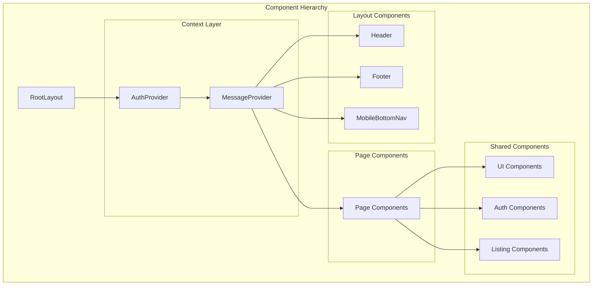
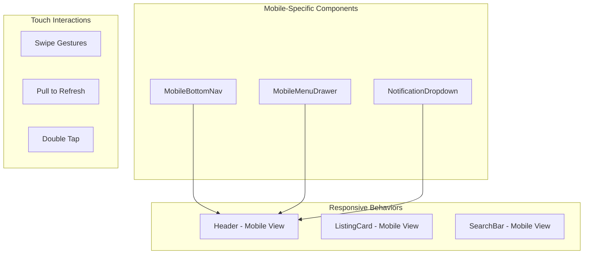

# Frontend Components Documentation

## GIGS-Rental Platform

**Version:** 1.0  
**Date:** March 24, 2026  
**Status:** Current Implementation

---

## Table of Contents

1. [Component Architecture Overview](#1-component-architecture-overview)
2. [Shared UI Components](#2-shared-ui-components)
3. [Layout Components](#3-layout-components)
4. [Authentication Components](#4-authentication-components)
5. [Listing Components](#5-listing-components)
6. [Mobile Components](#6-mobile-components)
7. [Context Providers](#7-context-providers)
8. [Component Usage Guide](#8-component-usage-guide)

---

## 1. Component Architecture Overview



---

## 2. Shared UI Components (@repo/ui)

### 2.1 Button Component

**File:** `packages/ui/src/button.tsx`

**Props Interface:**
```typescript
interface ButtonProps {
  variant?: 'primary' | 'secondary' | 'ghost' | 'danger';
  size?: 'sm' | 'md' | 'lg';
  isLoading?: boolean;
  disabled?: boolean;
  onClick?: () => void;
  children: React.ReactNode;
  className?: string;
  type?: 'button' | 'submit' | 'reset';
}
```

**Usage:**
```tsx
import { Button } from "@repo/ui";

<Button variant="primary" size="lg" onClick={handleClick}>
  Get Started
</Button>

<Button variant="secondary" isLoading={loading}>
  Loading...
</Button>
```

### 2.2 Card Component

**File:** `packages/ui/src/card.tsx`

**Props Interface:**
```typescript
interface CardProps {
  children: React.ReactNode;
  className?: string;
  hover?: boolean;
  shadow?: 'sm' | 'md' | 'lg';
}
```

**Usage:**
```tsx
import { Card } from "@repo/ui";

<Card hover shadow="md" className="p-6">
  <h3>Card Title</h3>
  <p>Card content</p>
</Card>
```

### 2.3 Modal Component

**File:** `packages/ui/src/modal.tsx`

**Props Interface:**
```typescript
interface ModalProps {
  isOpen: boolean;
  onClose: () => void;
  title?: string;
  children: React.ReactNode;
  size?: 'sm' | 'md' | 'lg' | 'xl';
  footer?: React.ReactNode;
}
```

**Usage:**
```tsx
import { Modal, Button } from "@repo/ui";

<Modal 
  isOpen={isOpen} 
  onClose={handleClose}
  title="Confirm Action"
  footer={
    <>
      <Button variant="ghost" onClick={handleClose}>Cancel</Button>
      <Button variant="primary" onClick={handleConfirm}>Confirm</Button>
    </>
  }
>
  <p>Modal content here</p>
</Modal>
```

### 2.4 OTP Input Component

**File:** `packages/ui/src/otp-input.tsx`

**Props Interface:**
```typescript
interface OTPInputProps {
  length?: number;
  value: string;
  onChange: (value: string) => void;
  onComplete?: (value: string) => void;
  disabled?: boolean;
  error?: boolean;
}
```

**Usage:**
```tsx
import { OTPInput } from "@repo/ui";

const [otp, setOtp] = useState("");

<OTPInput 
  length={6}
  value={otp}
  onChange={setOtp}
  onComplete={(code) => verifyOTP(code)}
/>
```

### 2.5 File Upload Component

**File:** `packages/ui/src/file-upload.tsx`

**Props Interface:**
```typescript
interface FileUploadProps {
  accept?: string;
  multiple?: boolean;
  maxFiles?: number;
  maxSize?: number; // in bytes
  onUpload: (files: File[]) => void;
  onError?: (error: string) => void;
  preview?: boolean;
}
```

**Usage:**
```tsx
import { FileUpload } from "@repo/ui";

<FileUpload
  accept="image/*"
  multiple
  maxFiles={5}
  maxSize={5 * 1024 * 1024} // 5MB
  onUpload={handleFileUpload}
  preview
/>
```

### 2.6 Select Component

**File:** `packages/ui/src/select.tsx`

**Props Interface:**
```typescript
interface SelectOption {
  value: string;
  label: string;
  disabled?: boolean;
}

interface SelectProps {
  options: SelectOption[];
  value?: string;
  onChange: (value: string) => void;
  placeholder?: string;
  disabled?: boolean;
  error?: string;
  searchable?: boolean;
}
```

### 2.7 Table Component

**File:** `packages/ui/src/table.tsx`

**Props Interface:**
```typescript
interface Column<T> {
  key: keyof T | string;
  header: string;
  width?: string;
  render?: (row: T) => React.ReactNode;
  sortable?: boolean;
}

interface TableProps<T> {
  data: T[];
  columns: Column<T>[];
  sortable?: boolean;
  pagination?: boolean;
  pageSize?: number;
  onRowClick?: (row: T) => void;
  emptyMessage?: string;
}
```

### 2.8 Tabs Component

**File:** `packages/ui/src/tabs.tsx`

**Props Interface:**
```typescript
interface Tab {
  id: string;
  label: string;
  content: React.ReactNode;
  disabled?: boolean;
}

interface TabsProps {
  tabs: Tab[];
  defaultTab?: string;
  onChange?: (tabId: string) => void;
  variant?: 'default' | 'pills' | 'underline';
}
```

### 2.9 Textarea Component

**File:** `packages/ui/src/textarea.tsx`

**Props Interface:**
```typescript
interface TextareaProps {
  value: string;
  onChange: (value: string) => void;
  placeholder?: string;
  rows?: number;
  maxLength?: number;
  autoResize?: boolean;
  disabled?: boolean;
  error?: string;
  label?: string;
}
```

### 2.10 Toast Component

**File:** `packages/ui/src/toast.tsx`

**Usage:**
```tsx
import { ToastContainer, toast } from "@repo/ui";

// In layout
<ToastContainer position="top-right" />

// In component
toast.success("Operation successful!");
toast.error("Something went wrong");
toast.info("Please verify your email");
toast.warning("Session expiring soon");
```

### 2.11 Loader Component

**File:** `packages/ui/src/loader.tsx`

**Variants:**
- Spinner (circular loading indicator)
- Skeleton (content placeholder)
- Dots (pulsing dots)

**Usage:**
```tsx
import { Loader } from "@repo/ui";

<Loader variant="spinner" size="md" />
<Loader variant="skeleton" count={3} />
<Loader variant="dots" />
```

---

## 3. Layout Components

### 3.1 Header Component (Dashboard)

**File:** `apps/dashboard/src/components/layout/Header.tsx`

**Features:**
- Responsive navigation
- User authentication state
- Role-based menu items (Lister/Renter)
- Notification badge
- Mobile menu drawer trigger
- Saved listings count
- Message unread count

**Props Interface:**
```typescript
interface HeaderProps {
  // No props - uses AuthContext and MessageContext
}
```

**Key Functions:**
| Function | Purpose |
|----------|---------|
| `handleSwitchToLister()` | Switch to host mode |
| `handleSwitchToViewer()` | Switch to renter mode |
| `handleListProperty()` | Navigate to listing creation |

### 3.2 Header Component (Web)

**File:** `apps/web/src/components/Layout/Header.tsx`

**Features:**
- Marketing site navigation
- Dashboard link integration
- Authentication-aware CTAs
- Mobile hamburger menu

### 3.3 Footer Component

**File:** `apps/web/src/components/Layout/Footer.tsx`

**Sections:**
- Logo and tagline
- Quick links
- Legal links
- Social links
- Copyright

### 3.4 Mobile Bottom Navigation

**File:** `apps/dashboard/src/components/mobile/MobileBottomNav.tsx`

**Features:**
- Fixed bottom navigation bar
- Context-aware icons
- Active state indicators
- Badge notifications

**Navigation Items:**
| Route | Icon | Label |
|-------|------|-------|
| /listings | ph-magnifying-glass | Explore |
| /hosting | ph-squares-four | Hosting |
| /profile | ph-user | Profile |

### 3.5 Mobile Menu Drawer

**File:** `apps/dashboard/src/components/mobile/MobileMenuDrawer.tsx`

**Features:**
- Slide-out drawer
- User profile summary
- Navigation links
- Logout button

### 3.6 Notification Dropdown

**File:** `apps/dashboard/src/components/mobile/NotificationDropdown.tsx`

**Features:**
- Unread count badge
- Dropdown notification list
- Mark as read functionality

---

## 4. Authentication Components

### 4.1 AuthLayout Component

**Files:**
- `apps/dashboard/src/components/auth/AuthLayout.tsx`
- `apps/web/src/components/auth/AuthLayout.tsx`

**Features:**
- Centered card layout
- Brand logo display
- Decorative background elements
- Responsive padding

**Props Interface:**
```typescript
interface AuthLayoutProps {
  children: React.ReactNode;
  title: string;
  subtitle?: string;
  showLogo?: boolean;
}
```

### 4.2 AuthInput Component

**Files:**
- `apps/dashboard/src/components/auth/AuthInput.tsx`
- `apps/web/src/components/auth/AuthInput.tsx`

**Features:**
- Consistent styling for auth forms
- Icon support (left and right)
- Error state styling
- Password visibility toggle

**Props Interface:**
```typescript
interface AuthInputProps {
  type?: 'text' | 'email' | 'password' | 'tel';
  label: string;
  placeholder?: string;
  value: string;
  onChange: (value: string) => void;
  error?: string;
  leftIcon?: string;
  rightIcon?: string;
  onRightIconClick?: () => void;
  required?: boolean;
}
```

### 4.3 OAuthButtons Component

**Files:**
- `apps/dashboard/src/components/auth/OAuthButtons.tsx`
- `apps/web/src/components/auth/OAuthButtons.tsx`

**Features:**
- Google OAuth button
- Loading states
- Error handling

**Props Interface:**
```typescript
interface OAuthButtonsProps {
  onGoogleClick: () => void;
  isLoading?: boolean;
  disabled?: boolean;
}
```

### 4.4 Authentication Page Components

#### LoginClient
**File:** `apps/dashboard/app/auth/login/LoginClient.tsx`

**State Management:**
| State | Type | Purpose |
|-------|------|---------|
| email | string | User email input |
| password | string | Password input |
| isLoading | boolean | Form submission state |
| error | string | Error message display |

**Flow:**
1. User enters credentials
2. Client-side validation
3. Call `login()` from AuthContext
4. Redirect to listings on success

#### SignupClient
**File:** `apps/dashboard/app/auth/signup/SignupClient.tsx`

**Features:**
- Email registration form
- Google OAuth option
- Terms acceptance
- Password strength indicator

#### OnboardingClient
**File:** `apps/dashboard/app/auth/onboarding/OnboardingClient.tsx`

**Steps:**
1. Personal information (name, phone)
2. Role selection (Lister/Renter/Both)
3. Preferences setup
4. Profile completion

**State:**
```typescript
interface OnboardingData {
  name: string;
  phone: string;
  role: "lister" | "renter" | "both";
  preferences: {
    notifications: boolean;
    newsletter: boolean;
  };
}
```

#### VerifyOtpClient
**File:** `apps/dashboard/app/auth/verify-otp/VerifyOtpClient.tsx`

**Features:**
- 6-digit OTP input
- Resend functionality
- Countdown timer
- Auto-submit on complete

#### ForgotPasswordClient
**File:** `apps/dashboard/app/auth/forgot-password/ForgotPasswordClient.tsx`

**Flow:**
1. Enter email address
2. Submit request
3. Show success message
4. Redirect to login

#### ResetPasswordClient
**File:** `apps/dashboard/app/auth/reset-password/ResetPasswordClient.tsx`

**Features:**
- New password input
- Confirm password
- Password strength indicator
- Token validation

---

## 5. Listing Components

### 5.1 ListingCard Component

**File:** `apps/dashboard/src/components/listings/ListingCard.tsx`

**Features:**
- Image carousel
- Price display
- Location info
- Amenities icons
- Like/save button
- Host info
- Rating display

**Props Interface:**
```typescript
interface ListingCardProps {
  listing: Listing;
  variant?: 'default' | 'compact' | 'horizontal';
  showActions?: boolean;
  onClick?: () => void;
  onLike?: (id: string) => void;
}
```

### 5.2 SearchBar Component

**File:** `apps/dashboard/src/components/listings/SearchBar.tsx`

**Features:**
- Text search input
- Category filter dropdown
- Price range slider
- Location search
- Filter badges
- Clear filters button

**State:**
```typescript
interface SearchState {
  query: string;
  category: string;
  minPrice: number;
  maxPrice: number;
  location: string;
  amenities: string[];
}
```

### 5.3 ListingDetailActions Component

**File:** `apps/dashboard/src/components/listings/ListingDetailActions.tsx`

**Features:**
- Contact host button
- Message host button
- Save listing button
- Share listing button
- Report listing option

### 5.4 Create Listing Page Component

**File:** `apps/dashboard/app/listings/create/page.tsx`

**Step Configuration:**
```typescript
interface StepConfig {
  id: number;
  title: string;
  icon: string;
  component: React.ComponentType;
  validate: () => boolean;
}

const ACCOMMODATION_STEPS: StepConfig[] = [
  { id: 1, title: "Category", icon: "ph-squares-four", ... },
  { id: 2, title: "Property Type", icon: "ph-building", ... },
  { id: 3, title: "Details", icon: "ph-sliders", ... },
  { id: 4, title: "Amenities", icon: "ph-wrench", ... },
  { id: 5, title: "Photos", icon: "ph-camera", ... },
  { id: 6, title: "Pricing", icon: "ph-currency-dollar", ... },
  { id: 7, title: "Preview", icon: "ph-eye", ... },
];
```

---

## 6. Mobile Components

### 6.1 Component Overview



### 6.2 Responsive Breakpoints

| Breakpoint | Width | Usage |
|------------|-------|-------|
| sm | 640px | Mobile landscape |
| md | 768px | Tablet |
| lg | 1024px | Desktop |
| xl | 1280px | Large desktop |
| 2xl | 1536px | Extra large |

### 6.3 Mobile-First Patterns

```tsx
// Responsive grid example
<div className="grid grid-cols-1 sm:grid-cols-2 lg:grid-cols-3 xl:grid-cols-4 gap-4">
  {listings.map(listing => (
    <ListingCard key={listing.id} listing={listing} />
  ))}
</div>

// Responsive padding
<div className="px-4 sm:px-6 lg:px-8 xl:px-12">
  Content
</div>

// Responsive typography
<h1 className="text-2xl sm:text-3xl lg:text-4xl font-bold">
  Title
</h1>
```

---

## 7. Context Providers

### 7.1 AuthContext

**File:** `apps/dashboard/src/context/AuthContext.tsx`

**Interface:**
```typescript
interface AuthContextType {
  user: User | null;
  isAuthenticated: boolean;
  isLoading: boolean;
  login: (email: string, password: string) => Promise<void>;
  signup: (email: string, name: string, method: "google" | "email") => Promise<void>;
  verifyOTP: (otp: string) => Promise<boolean>;
  completeProfile: (data: Partial<User>) => Promise<void>;
  logout: () => void;
  switchRole: (role: "lister" | "renter") => void;
}

interface User {
  id: string;
  email: string;
  name: string;
  phone?: string;
  role: "lister" | "renter" | "both";
  avatar?: string;
  isProfileComplete: boolean;
}
```

**Usage:**
```tsx
import { useAuth } from "@/context/AuthContext";

const MyComponent = () => {
  const { user, isAuthenticated, login, logout } = useAuth();
  
  // Use auth state and functions
};
```

### 7.2 MessageContext

**File:** `apps/dashboard/src/context/MessageContext.tsx`

**Interface:**
```typescript
interface MessageContextType {
  conversations: Conversation[];
  messages: Record<string, Message[]>;
  unreadCount: number;
  startConversation: (listingId: string, listingTitle: string, listingImage: string, 
                     recipientId: string, recipientName: string, 
                     senderId: string, senderName: string) => string;
  sendMessage: (conversationId: string, senderId: string, content: string) => void;
  getConversation: (conversationId: string) => Conversation | undefined;
  getMessages: (conversationId: string) => Message[];
  markAsRead: (conversationId: string, userId: string) => void;
  refreshConversations: () => void;
}

interface Conversation {
  id: string;
  listingId: string;
  listingTitle: string;
  listingImage: string;
  participants: string[];
  participantNames: Record<string, string>;
  lastMessage: string;
  lastMessageTime: number;
  unreadCount: number;
}

interface Message {
  id: string;
  conversationId: string;
  senderId: string;
  content: string;
  timestamp: number;
  read: boolean;
}
```

**Usage:**
```tsx
import { useMessages } from "@/context/MessageContext";

const ChatComponent = () => {
  const { conversations, sendMessage, unreadCount } = useMessages();
  
  // Use messaging functions
};
```

---

## 8. Component Usage Guide

### 8.1 Creating a New Component

**Step 1:** Determine component location
```
- Shared across apps? -> packages/ui/src/
- Dashboard only? -> apps/dashboard/src/components/
- Web only? -> apps/web/src/components/
```

**Step 2:** Create component file
```tsx
"use client"; // If using client-side features

import { useState } from "react";

// Types
interface NewComponentProps {
  title: string;
  onAction: () => void;
}

// Component
export const NewComponent = ({ title, onAction }: NewComponentProps) => {
  const [state, setState] = useState(false);
  
  return (
    <div className="p-4 border-2 border-black rounded-lg">
      <h2 className="font-bold text-lg">{title}</h2>
      <button 
        onClick={onAction}
        className="mt-2 px-4 py-2 bg-blue-500 text-white rounded"
      >
        Action
      </button>
    </div>
  );
};
```

**Step 3:** Export from index.ts
```typescript
// components/my-category/index.ts
export { NewComponent } from "./NewComponent";
```

### 8.2 Component Best Practices

| Practice | Description |
|----------|-------------|
| TypeScript | Always define prop interfaces |
| Default Exports | Use named exports only |
| Composition | Prefer composition over inheritance |
| Hooks | Follow Rules of Hooks |
| Memoization | Use useMemo/useCallback for expensive operations |
| Accessibility | Include ARIA labels and keyboard support |
| Styling | Use Tailwind utility classes |
| Animations | Use Framer Motion for smooth transitions |

### 8.3 Styling Guidelines

**Color Usage:**
```tsx
// Brand colors
<div className="bg-brand-500 text-white">
<div className="bg-brand-100 text-brand-dark">

// Semantic colors
<div className="bg-red-500 text-white">Error</div>
<div className="bg-green-500 text-white">Success</div>
<div className="bg-yellow-500 text-black">Warning</div>
```

**Spacing Scale:**
```tsx
// Consistent spacing
<div className="p-4">16px padding</div>
<div className="m-6">24px margin</div>
<div className="gap-4">16px gap</div>
<div className="space-y-2">8px vertical spacing</div>
```

**Typography:**
```tsx
// Display text
<h1 className="font-display font-bold text-4xl">

// Body text
<p className="font-sans text-base text-slate-600">

// Labels
<span className="text-sm font-medium uppercase tracking-wide">
```

---

**Document Control**

| Version | Date | Author | Changes |
|---------|------|--------|---------|
| 1.0 | 2026-03-24 | Technical Team | Initial frontend components documentation |

---

*End of Frontend Components Documentation*