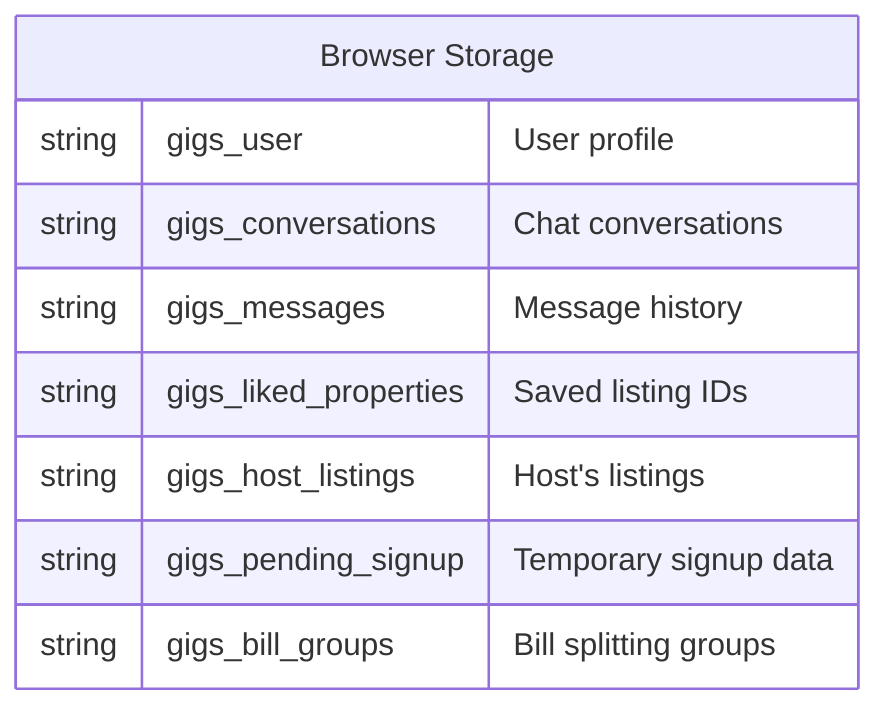
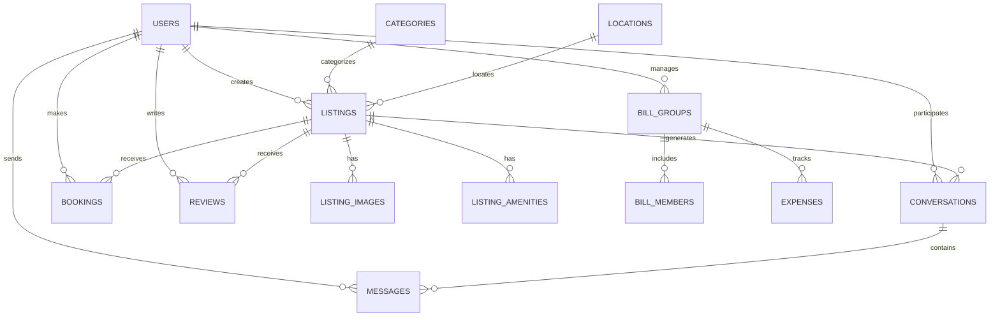
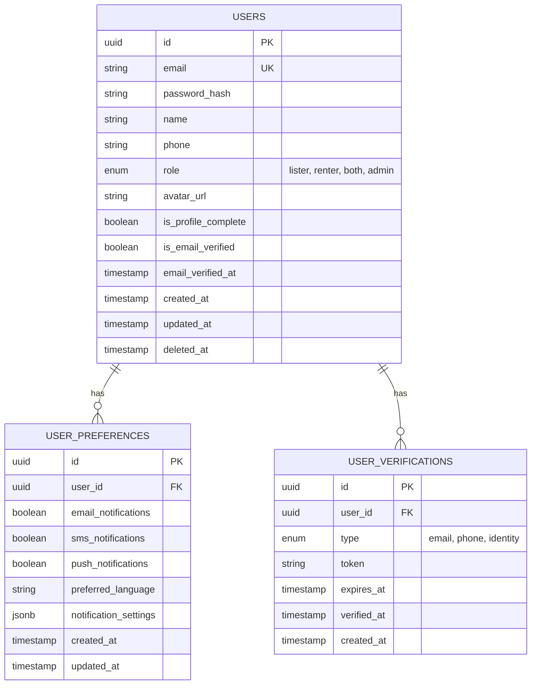
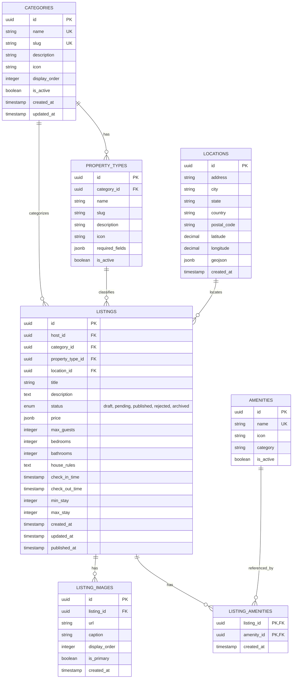
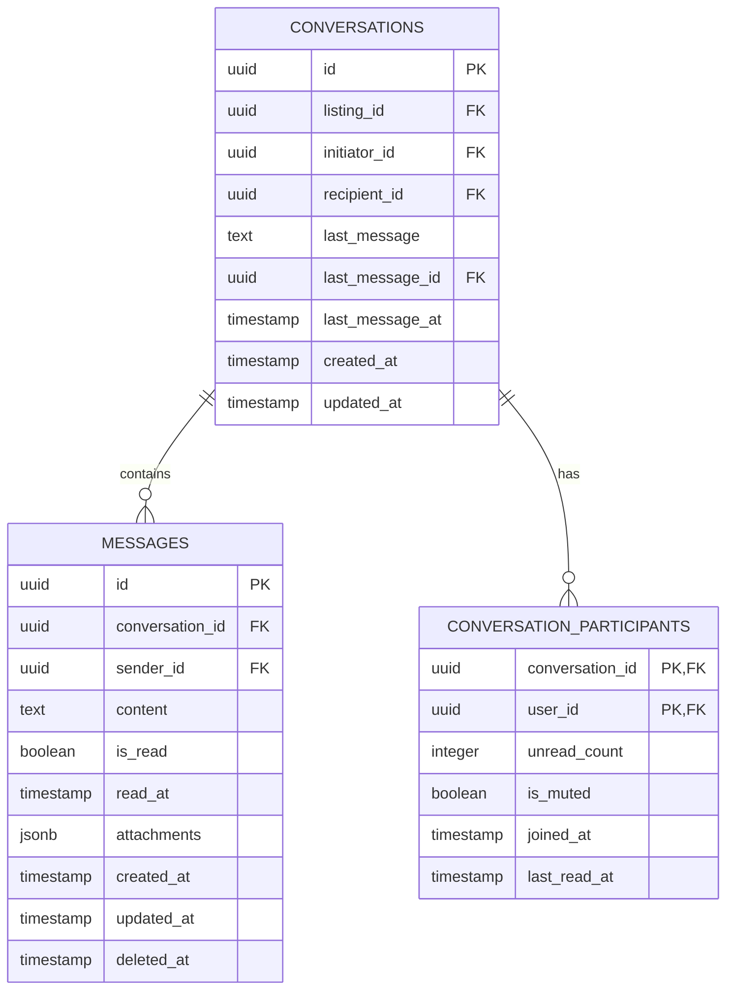
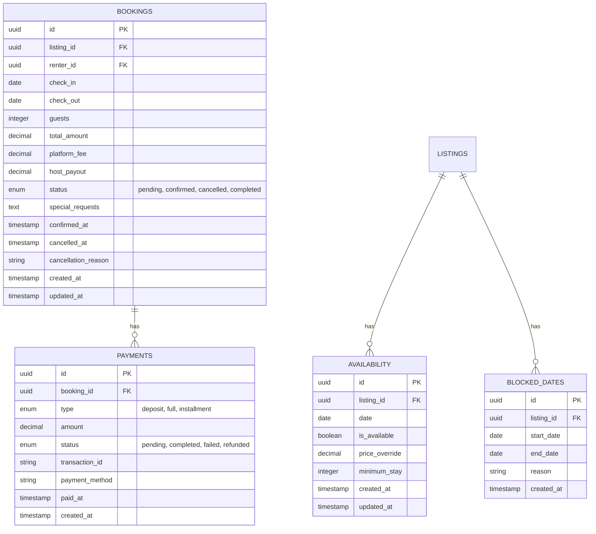
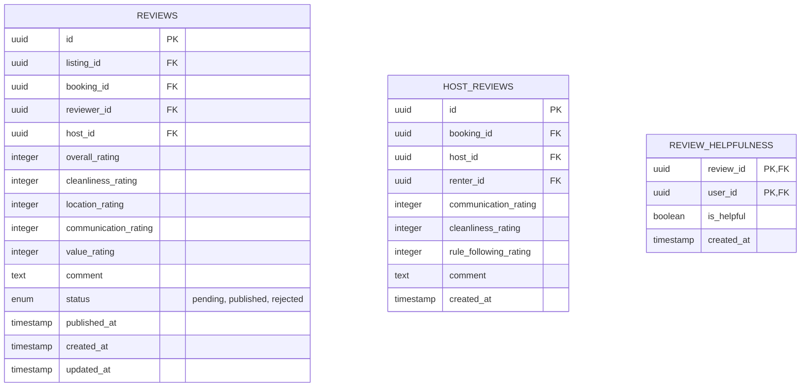
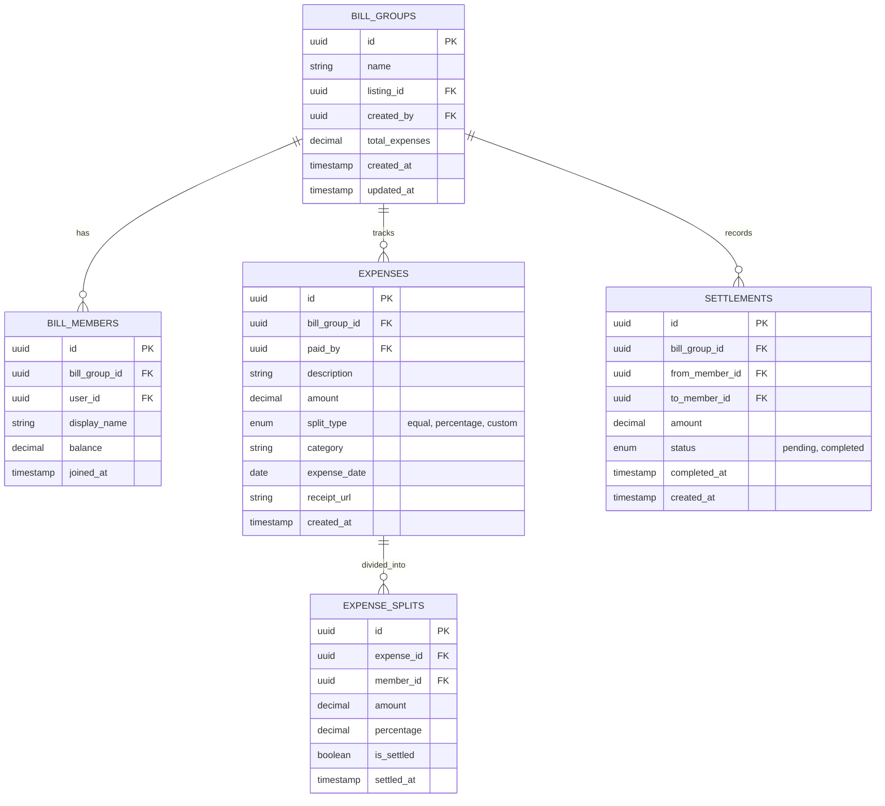
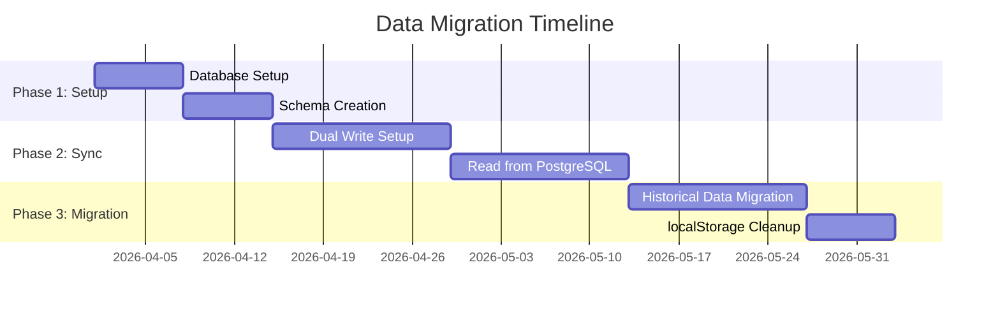

# Database Schema Documentation

## GIGS-Rental Platform

**Version:** 1.0  
**Date:** March 24, 2026  
**Status:** Current (localStorage) + Future (PostgreSQL)

---

## Table of Contents

1. [Current Data Storage](#1-current-data-storage)
2. [Future Database Schema](#2-future-database-schema)
3. [Entity Relationship Diagrams](#3-entity-relationship-diagrams)
4. [Table Specifications](#4-table-specifications)
5. [Indexes and Constraints](#5-indexes-and-constraints)
6. [Data Migration Strategy](#6-data-migration-strategy)

---

## 1. Current Data Storage

### 1.1 localStorage Schema

Currently, the application uses browser localStorage for all data persistence.



### 1.2 Storage Keys and Structures

#### User Data (`gigs_user`)
```typescript
{
  "id": "user_1234567890",
  "email": "user@example.com",
  "name": "John Doe",
  "phone": "+1234567890",
  "role": "both",
  "avatar": "https://...",
  "isProfileComplete": true
}
```

#### Conversations (`gigs_conversations`)
```typescript
[
  {
    "id": "conv_123",
    "listingId": "listing_456",
    "listingTitle": "Cozy Apartment",
    "listingImage": "https://...",
    "participants": ["user_123", "user_789"],
    "participantNames": {
      "user_123": "John",
      "user_789": "Jane"
    },
    "lastMessage": "Is this still available?",
    "lastMessageTime": 1234567890,
    "unreadCount": 2
  }
]
```

#### Messages (`gigs_messages`)
```typescript
{
  "conv_123": [
    {
      "id": "msg_123",
      "conversationId": "conv_123",
      "senderId": "user_123",
      "content": "Hi, I'm interested!",
      "timestamp": 1234567890,
      "read": true
    }
  ]
}
```

#### Liked Properties (`gigs_liked_properties`)
```typescript
["listing_123", "listing_456", "listing_789"]
```

#### Host Listings (`gigs_host_listings`)
```typescript
[
  {
    "id": "listing_123",
    "title": "Modern Apartment",
    "category": "accommodation",
    "type": "apartment",
    "status": "published",
    "hostId": "user_123",
    ...
  }
]
```

---

## 2. Future Database Schema

### 2.1 Overview

When migrating to PostgreSQL, the following schema will be implemented.

### 2.2 Database Selection

| Database | Purpose | Justification |
|----------|---------|---------------|
| PostgreSQL | Primary database | ACID compliance, JSON support, Full-text search |
| Redis | Session & Cache | Fast reads, TTL support, Pub/Sub |

---

## 3. Entity Relationship Diagrams

### 3.1 Core Entities



### 3.2 User Management



### 3.3 Listing Management



### 3.4 Messaging System



### 3.5 Booking System



### 3.6 Review System



### 3.7 Bill Splitting System



---

## 4. Table Specifications

### 4.1 Users Table

| Column | Type | Constraints | Description |
|--------|------|-------------|-------------|
| id | UUID | PRIMARY KEY | Unique identifier |
| email | VARCHAR(255) | UNIQUE, NOT NULL | User email |
| password_hash | VARCHAR(255) | | Bcrypt hashed password |
| name | VARCHAR(255) | NOT NULL | Display name |
| phone | VARCHAR(20) | | Phone number |
| role | ENUM | DEFAULT 'renter' | User role |
| avatar_url | TEXT | | Profile image URL |
| is_profile_complete | BOOLEAN | DEFAULT false | Profile status |
| is_email_verified | BOOLEAN | DEFAULT false | Email verification |
| email_verified_at | TIMESTAMP | | Verification timestamp |
| created_at | TIMESTAMP | DEFAULT NOW() | Creation time |
| updated_at | TIMESTAMP | DEFAULT NOW() | Last update |
| deleted_at | TIMESTAMP | | Soft delete timestamp |

### 4.2 Listings Table

| Column | Type | Constraints | Description |
|--------|------|-------------|-------------|
| id | UUID | PRIMARY KEY | Unique identifier |
| host_id | UUID | FOREIGN KEY | Owner reference |
| category_id | UUID | FOREIGN KEY | Category reference |
| property_type_id | UUID | FOREIGN KEY | Property type |
| location_id | UUID | FOREIGN KEY | Location reference |
| title | VARCHAR(255) | NOT NULL | Listing title |
| description | TEXT | NOT NULL | Detailed description |
| status | ENUM | DEFAULT 'draft' | Publication status |
| price | JSONB | NOT NULL | {amount, currency, period} |
| max_guests | INTEGER | | Maximum occupancy |
| bedrooms | INTEGER | | Number of bedrooms |
| bathrooms | INTEGER | | Number of bathrooms |
| house_rules | TEXT | | Property rules |
| check_in_time | TIME | | Default check-in time |
| check_out_time | TIME | | Default check-out time |
| min_stay | INTEGER | | Minimum nights |
| max_stay | INTEGER | | Maximum nights |
| created_at | TIMESTAMP | DEFAULT NOW() | Creation time |
| updated_at | TIMESTAMP | DEFAULT NOW() | Last update |
| published_at | TIMESTAMP | | Publication time |

### 4.3 Messages Table

| Column | Type | Constraints | Description |
|--------|------|-------------|-------------|
| id | UUID | PRIMARY KEY | Unique identifier |
| conversation_id | UUID | FOREIGN KEY | Parent conversation |
| sender_id | UUID | FOREIGN KEY | Message sender |
| content | TEXT | NOT NULL | Message body |
| is_read | BOOLEAN | DEFAULT false | Read status |
| read_at | TIMESTAMP | | Read timestamp |
| attachments | JSONB | | File attachments |
| created_at | TIMESTAMP | DEFAULT NOW() | Sent time |
| updated_at | TIMESTAMP | | Edit time |
| deleted_at | TIMESTAMP | | Soft delete |

### 4.4 Bookings Table

| Column | Type | Constraints | Description |
|--------|------|-------------|-------------|
| id | UUID | PRIMARY KEY | Unique identifier |
| listing_id | UUID | FOREIGN KEY | Booked property |
| renter_id | UUID | FOREIGN KEY | Booking user |
| check_in | DATE | NOT NULL | Arrival date |
| check_out | DATE | NOT NULL | Departure date |
| guests | INTEGER | NOT NULL | Number of guests |
| total_amount | DECIMAL(10,2) | NOT NULL | Total price |
| platform_fee | DECIMAL(10,2) | | Service fee |
| host_payout | DECIMAL(10,2) | | Host earnings |
| status | ENUM | DEFAULT 'pending' | Booking status |
| special_requests | TEXT | | Guest requests |
| confirmed_at | TIMESTAMP | | Confirmation time |
| cancelled_at | TIMESTAMP | | Cancellation time |
| cancellation_reason | TEXT | | Why cancelled |
| created_at | TIMESTAMP | DEFAULT NOW() | Booking time |
| updated_at | TIMESTAMP | DEFAULT NOW() | Last update |

---

## 5. Indexes and Constraints

### 5.1 Indexes

```sql
-- Users indexes
CREATE INDEX idx_users_email ON users(email);
CREATE INDEX idx_users_role ON users(role);
CREATE INDEX idx_users_created_at ON users(created_at);

-- Listings indexes
CREATE INDEX idx_listings_host_id ON listings(host_id);
CREATE INDEX idx_listings_category_id ON listings(category_id);
CREATE INDEX idx_listings_status ON listings(status);
CREATE INDEX idx_listings_price ON listings((price->>'amount'));
CREATE INDEX idx_listings_created_at ON listings(created_at);
CREATE INDEX idx_listings_location ON listings(location_id);

-- Full-text search indexes
CREATE INDEX idx_listings_search ON listings USING gin(to_tsvector('english', title || ' ' || description));

-- Messages indexes
CREATE INDEX idx_messages_conversation_id ON messages(conversation_id);
CREATE INDEX idx_messages_sender_id ON messages(sender_id);
CREATE INDEX idx_messages_created_at ON messages(created_at);

-- Bookings indexes
CREATE INDEX idx_bookings_listing_id ON bookings(listing_id);
CREATE INDEX idx_bookings_renter_id ON bookings(renter_id);
CREATE INDEX idx_bookings_dates ON bookings(check_in, check_out);
CREATE INDEX idx_bookings_status ON bookings(status);

-- Conversations indexes
CREATE INDEX idx_conversations_participants ON conversations USING gin(participants);
CREATE INDEX idx_conversations_last_message_at ON conversations(last_message_at);
```

### 5.2 Constraints

```sql
-- Check constraints
ALTER TABLE listings ADD CONSTRAINT chk_price_positive CHECK ((price->>'amount')::decimal > 0);
ALTER TABLE bookings ADD CONSTRAINT chk_checkout_after_checkin CHECK (check_out > check_in);
ALTER TABLE bookings ADD CONSTRAINT chk_guests_positive CHECK (guests > 0);
ALTER TABLE reviews ADD CONSTRAINT chk_rating_range CHECK (overall_rating BETWEEN 1 AND 5);

-- Unique constraints
ALTER TABLE users ADD CONSTRAINT uq_users_email UNIQUE (email);
ALTER TABLE categories ADD CONSTRAINT uq_categories_slug UNIQUE (slug);
ALTER TABLE listings ADD CONSTRAINT uq_listing_images_primary UNIQUE (listing_id) WHERE is_primary = true;
```

---

## 6. Data Migration Strategy

### 6.1 Migration Phases



### 6.2 Migration Steps

1. **Phase 1: Database Setup**
   - Create PostgreSQL instance
   - Run schema migrations
   - Set up Redis for sessions

2. **Phase 2: Dual Write**
   - Write to both localStorage and PostgreSQL
   - Implement feature flags
   - Monitor data consistency

3. **Phase 3: Read Migration**
   - Switch reads to PostgreSQL
   - Keep localStorage as fallback
   - Validate data accuracy

4. **Phase 4: Cleanup**
   - Migrate historical data
   - Remove localStorage writes
   - Archive old data

### 6.3 Migration Script Example

```typescript
// migrate-users.ts
async function migrateUsers() {
  const localUsers = JSON.parse(localStorage.getItem('gigs_user') || '[]');
  
  for (const user of localUsers) {
    await db.users.create({
      data: {
        id: user.id,
        email: user.email,
        name: user.name,
        phone: user.phone,
        role: user.role,
        avatar_url: user.avatar,
        is_profile_complete: user.isProfileComplete,
        created_at: new Date(),
        updated_at: new Date()
      }
    });
  }
}
```

---

**Document Control**

| Version | Date | Author | Changes |
|---------|------|--------|---------|
| 1.0 | 2026-03-24 | Technical Team | Initial database schema documentation |

---

*End of Database Schema Documentation*