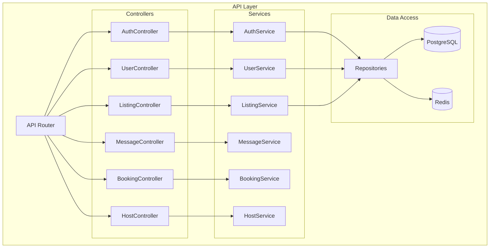
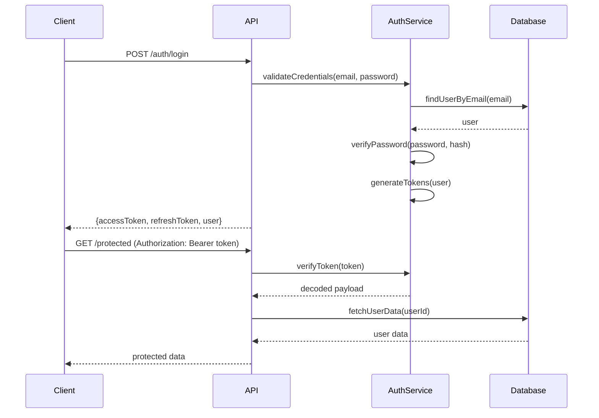

# API Documentation

## GIGS-Rental Platform

**Version:** 1.0  
**Date:** March 24, 2026  
**Status:** Planned / Future Implementation

---

## Table of Contents

1. [API Overview](#1-api-overview)
2. [Authentication](#2-authentication)
3. [User Endpoints](#3-user-endpoints)
4. [Listing Endpoints](#4-listing-endpoints)
5. [Message Endpoints](#5-message-endpoints)
6. [Booking Endpoints](#6-booking-endpoints)
7. [Host Endpoints](#7-host-endpoints)
8. [Error Handling](#8-error-handling)

---

## 1. API Overview

### 1.1 Base URL

| Environment | Base URL |
|-------------|----------|
| Development | `http://localhost:3000/api` |
| Staging | `https://api-staging.gigs-rental.com/api` |
| Production | `https://api.gigs-rental.com/api` |

### 1.2 API Architecture



### 1.3 Request/Response Format

All API requests and responses use JSON format with the following structure:

**Success Response:**
```json
{
  "success": true,
  "data": { ... },
  "message": "Operation successful",
  "timestamp": "2026-03-24T12:00:00Z"
}
```

**Error Response:**
```json
{
  "success": false,
  "error": {
    "code": "VALIDATION_ERROR",
    "message": "Invalid input data",
    "details": [
      { "field": "email", "message": "Email is required" }
    ]
  },
  "timestamp": "2026-03-24T12:00:00Z"
}
```

### 1.4 HTTP Status Codes

| Code | Meaning | Usage |
|------|---------|-------|
| 200 | OK | Successful GET, PUT, PATCH |
| 201 | Created | Successful POST |
| 204 | No Content | Successful DELETE |
| 400 | Bad Request | Validation errors |
| 401 | Unauthorized | Missing/invalid token |
| 403 | Forbidden | Insufficient permissions |
| 404 | Not Found | Resource not found |
| 409 | Conflict | Resource already exists |
| 422 | Unprocessable Entity | Business logic errors |
| 429 | Too Many Requests | Rate limit exceeded |
| 500 | Internal Server Error | Server errors |

---

## 2. Authentication

### 2.1 Authentication Flow



### 2.2 Endpoints

#### POST /auth/register
Register a new user account.

**Request:**
```json
{
  "email": "user@example.com",
  "password": "SecurePass123!",
  "name": "John Doe",
  "role": "renter"
}
```

**Response:**
```json
{
  "success": true,
  "data": {
    "user": {
      "id": "user_123",
      "email": "user@example.com",
      "name": "John Doe",
      "role": "renter",
      "isEmailVerified": false
    },
    "message": "Verification email sent"
  }
}
```

#### POST /auth/login
Authenticate user and receive tokens.

**Request:**
```json
{
  "email": "user@example.com",
  "password": "SecurePass123!"
}
```

**Response:**
```json
{
  "success": true,
  "data": {
    "accessToken": "eyJhbGciOiJIUzI1NiIs...",
    "refreshToken": "eyJhbGciOiJIUzI1NiIs...",
    "expiresIn": 86400,
    "user": {
      "id": "user_123",
      "email": "user@example.com",
      "name": "John Doe",
      "role": "both"
    }
  }
}
```

#### POST /auth/refresh
Refresh access token using refresh token.

**Request:**
```json
{
  "refreshToken": "eyJhbGciOiJIUzI1NiIs..."
}
```

**Response:**
```json
{
  "success": true,
  "data": {
    "accessToken": "eyJhbGciOiJIUzI1NiIs...",
    "expiresIn": 86400
  }
}
```

#### POST /auth/forgot-password
Request password reset email.

**Request:**
```json
{
  "email": "user@example.com"
}
```

#### POST /auth/reset-password
Reset password with token.

**Request:**
```json
{
  "token": "reset_token_here",
  "newPassword": "NewSecurePass123!"
}
```

#### POST /auth/google
Authenticate with Google OAuth.

**Request:**
```json
{
  "idToken": "google_id_token"
}
```

---

## 3. User Endpoints

### 3.1 Endpoints

#### GET /users/me
Get current user profile.

**Headers:**
```
Authorization: Bearer <token>
```

**Response:**
```json
{
  "success": true,
  "data": {
    "id": "user_123",
    "email": "user@example.com",
    "name": "John Doe",
    "phone": "+1234567890",
    "role": "both",
    "avatar": "https://...",
    "isProfileComplete": true,
    "preferences": {
      "emailNotifications": true,
      "smsNotifications": false
    },
    "createdAt": "2026-01-01T00:00:00Z"
  }
}
```

#### PATCH /users/me
Update current user profile.

**Request:**
```json
{
  "name": "John Updated",
  "phone": "+0987654321",
  "preferences": {
    "emailNotifications": true
  }
}
```

#### PATCH /users/me/role
Switch user role (for users with role="both").

**Request:**
```json
{
  "role": "lister"
}
```

#### GET /users/:id
Get public user profile (limited fields).

**Response:**
```json
{
  "success": true,
  "data": {
    "id": "user_123",
    "name": "John Doe",
    "avatar": "https://...",
    "role": "lister",
    "memberSince": "2026-01-01"
  }
}
```

---

## 4. Listing Endpoints

### 4.1 Endpoints

#### GET /listings
Get all listings with filters and pagination.

**Query Parameters:**
| Parameter | Type | Description |
|-----------|------|-------------|
| page | integer | Page number (default: 1) |
| limit | integer | Items per page (default: 20) |
| category | string | Filter by category |
| type | string | Filter by property type |
| minPrice | number | Minimum price |
| maxPrice | number | Maximum price |
| location | string | Location search |
| amenities | string[] | Filter by amenities |
| search | string | Text search |
| sort | string | Sort field and order |

**Response:**
```json
{
  "success": true,
  "data": {
    "listings": [
      {
        "id": "listing_123",
        "title": "Cozy Downtown Apartment",
        "category": "accommodation",
        "type": "apartment",
        "location": {
          "city": "Lagos",
          "country": "Nigeria"
        },
        "price": {
          "amount": 50000,
          "currency": "NGN",
          "period": "month"
        },
        "images": ["https://..."],
        "amenities": ["wifi", "ac", "parking"],
        "host": {
          "id": "user_456",
          "name": "Jane Smith"
        },
        "rating": 4.8,
        "reviewCount": 24
      }
    ],
    "pagination": {
      "page": 1,
      "limit": 20,
      "total": 150,
      "totalPages": 8
    }
  }
}
```

#### GET /listings/:id
Get single listing details.

**Response:**
```json
{
  "success": true,
  "data": {
    "id": "listing_123",
    "title": "Cozy Downtown Apartment",
    "description": "Beautiful apartment in the heart of the city...",
    "category": "accommodation",
    "type": "apartment",
    "location": {
      "address": "123 Main St",
      "city": "Lagos",
      "state": "Lagos",
      "country": "Nigeria",
      "coordinates": [6.5244, 3.3792]
    },
    "price": {
      "amount": 50000,
      "currency": "NGN",
      "period": "month"
    },
    "maxGuests": 2,
    "bedrooms": 1,
    "bathrooms": 1,
    "amenities": ["wifi", "ac", "parking", "kitchen"],
    "images": ["https://..."],
    "houseRules": "No smoking, no pets",
    "host": {
      "id": "user_456",
      "name": "Jane Smith",
      "avatar": "https://...",
      "joinedAt": "2025-06-01"
    },
    "rating": 4.8,
    "reviewCount": 24,
    "createdAt": "2026-01-01T00:00:00Z"
  }
}
```

#### POST /listings
Create a new listing.

**Headers:**
```
Authorization: Bearer <token>
```

**Request:**
```json
{
  "title": "New Apartment",
  "description": "Description here...",
  "category": "accommodation",
  "type": "apartment",
  "location": {
    "address": "123 Main St",
    "city": "Lagos",
    "state": "Lagos",
    "country": "Nigeria"
  },
  "price": {
    "amount": 50000,
    "currency": "NGN",
    "period": "month"
  },
  "maxGuests": 2,
  "bedrooms": 1,
  "bathrooms": 1,
  "amenities": ["wifi", "ac"],
  "images": ["base64_or_url"],
  "houseRules": "No smoking"
}
```

#### PATCH /listings/:id
Update a listing.

#### DELETE /listings/:id
Delete a listing.

#### GET /listings/:id/availability
Get listing availability calendar.

**Response:**
```json
{
  "success": true,
  "data": {
    "listingId": "listing_123",
    "availability": [
      {
        "date": "2026-04-01",
        "isAvailable": true,
        "price": 50000
      },
      {
        "date": "2026-04-02",
        "isAvailable": false
      }
    ]
  }
}
```

---

## 5. Message Endpoints

### 5.1 Endpoints

#### GET /conversations
Get all conversations for current user.

**Headers:**
```
Authorization: Bearer <token>
```

**Response:**
```json
{
  "success": true,
  "data": {
    "conversations": [
      {
        "id": "conv_123",
        "listingId": "listing_456",
        "listingTitle": "Apartment for rent",
        "listingImage": "https://...",
        "participant": {
          "id": "user_789",
          "name": "Mike Johnson",
          "avatar": "https://..."
        },
        "lastMessage": "Is this still available?",
        "lastMessageTime": "2026-03-24T10:00:00Z",
        "unreadCount": 2
      }
    ]
  }
}
```

#### GET /conversations/:id
Get conversation details and messages.

**Response:**
```json
{
  "success": true,
  "data": {
    "conversation": {
      "id": "conv_123",
      "listingId": "listing_456",
      "listingTitle": "Apartment for rent",
      "participants": ["user_123", "user_789"]
    },
    "messages": [
      {
        "id": "msg_1",
        "senderId": "user_123",
        "content": "Hi, is this still available?",
        "timestamp": "2026-03-24T09:00:00Z",
        "read": true
      },
      {
        "id": "msg_2",
        "senderId": "user_789",
        "content": "Yes, it is! When would you like to view it?",
        "timestamp": "2026-03-24T09:30:00Z",
        "read": false
      }
    ]
  }
}
```

#### POST /conversations
Start a new conversation.

**Request:**
```json
{
  "listingId": "listing_456",
  "message": "Hi, I'm interested in this property."
}
```

#### POST /conversations/:id/messages
Send a message in a conversation.

**Request:**
```json
{
  "content": "Can we schedule a viewing for tomorrow?"
}
```

#### POST /conversations/:id/read
Mark conversation as read.

---

## 6. Booking Endpoints

### 6.1 Endpoints

#### POST /bookings
Create a new booking request.

**Request:**
```json
{
  "listingId": "listing_123",
  "checkIn": "2026-04-01",
  "checkOut": "2026-04-30",
  "guests": 1,
  "specialRequests": "I need early check-in if possible"
}
```

**Response:**
```json
{
  "success": true,
  "data": {
    "booking": {
      "id": "booking_123",
      "listingId": "listing_123",
      "status": "pending",
      "checkIn": "2026-04-01",
      "checkOut": "2026-04-30",
      "guests": 1,
      "totalAmount": 50000,
      "platformFee": 2500,
      "hostPayout": 47500
    }
  }
}
```

#### GET /bookings
Get user's bookings.

**Query Parameters:**
| Parameter | Description |
|-----------|-------------|
| role | 'renter' or 'host' |
| status | Filter by status |

**Response:**
```json
{
  "success": true,
  "data": {
    "bookings": [
      {
        "id": "booking_123",
        "listing": {
          "id": "listing_456",
          "title": "Cozy Apartment",
          "image": "https://..."
        },
        "checkIn": "2026-04-01",
        "checkOut": "2026-04-30",
        "status": "confirmed",
        "totalAmount": 50000,
        "host": {
          "name": "Jane Smith"
        }
      }
    ]
  }
}
```

#### GET /bookings/:id
Get booking details.

#### PATCH /bookings/:id
Update booking status (host only).

**Request:**
```json
{
  "status": "confirmed"
}
```

#### DELETE /bookings/:id
Cancel a booking.

---

## 7. Host Endpoints

### 7.1 Endpoints

#### GET /host/dashboard
Get host dashboard statistics.

**Response:**
```json
{
  "success": true,
  "data": {
    "stats": {
      "totalViews": 1247,
      "viewsChange": 12.5,
      "totalBookings": 23,
      "bookingsChange": 8.2,
      "totalEarnings": 345000,
      "earningsChange": 15.3
    },
    "recentBookings": [...],
    "pendingActions": [...]
  }
}
```

#### GET /host/listings
Get all listings for current host.

#### GET /host/earnings
Get host earnings breakdown.

**Response:**
```json
{
  "success": true,
  "data": {
    "totalEarnings": 345000,
    "pendingPayout": 50000,
    "thisMonth": 120000,
    "lastMonth": 98000,
    "transactions": [
      {
        "id": "txn_123",
        "amount": 50000,
        "type": "booking",
        "status": "completed",
        "date": "2026-03-20T00:00:00Z"
      }
    ]
  }
}
```

#### GET /host/reviews
Get reviews for host's listings.

---

## 8. Error Handling

### 8.1 Error Codes

| Code | HTTP Status | Description |
|------|-------------|-------------|
| AUTH_INVALID_CREDENTIALS | 401 | Email or password is incorrect |
| AUTH_TOKEN_EXPIRED | 401 | Authentication token has expired |
| AUTH_UNAUTHORIZED | 401 | Missing or invalid authentication |
| AUTH_FORBIDDEN | 403 | Insufficient permissions |
| USER_NOT_FOUND | 404 | User not found |
| USER_EMAIL_EXISTS | 409 | Email already registered |
| LISTING_NOT_FOUND | 404 | Listing not found |
| LISTING_UNAVAILABLE | 422 | Listing not available for dates |
| BOOKING_CONFLICT | 409 | Dates already booked |
| VALIDATION_ERROR | 400 | Input validation failed |
| RATE_LIMIT_EXCEEDED | 429 | Too many requests |
| INTERNAL_ERROR | 500 | Internal server error |

### 8.2 Error Response Format

```json
{
  "success": false,
  "error": {
    "code": "VALIDATION_ERROR",
    "message": "Request validation failed",
    "details": [
      {
        "field": "email",
        "code": "EMAIL_INVALID",
        "message": "Invalid email format"
      },
      {
        "field": "password",
        "code": "PASSWORD_TOO_SHORT",
        "message": "Password must be at least 8 characters"
      }
    ]
  },
  "timestamp": "2026-03-24T12:00:00Z",
  "requestId": "req_1234567890"
}
```

### 8.3 Rate Limiting

| Endpoint | Limit | Window |
|----------|-------|--------|
| /auth/* | 5 requests | 1 minute |
| /api/* | 100 requests | 1 minute |
| /api/listings | 200 requests | 1 minute |
| /api/messages | 300 requests | 1 minute |

---

**Document Control**

| Version | Date | Author | Changes |
|---------|------|--------|---------|
| 1.0 | 2026-03-24 | Technical Team | Initial API documentation |

---

*End of API Documentation*