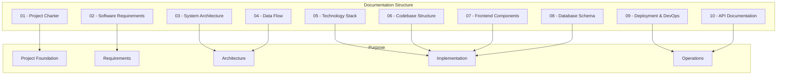
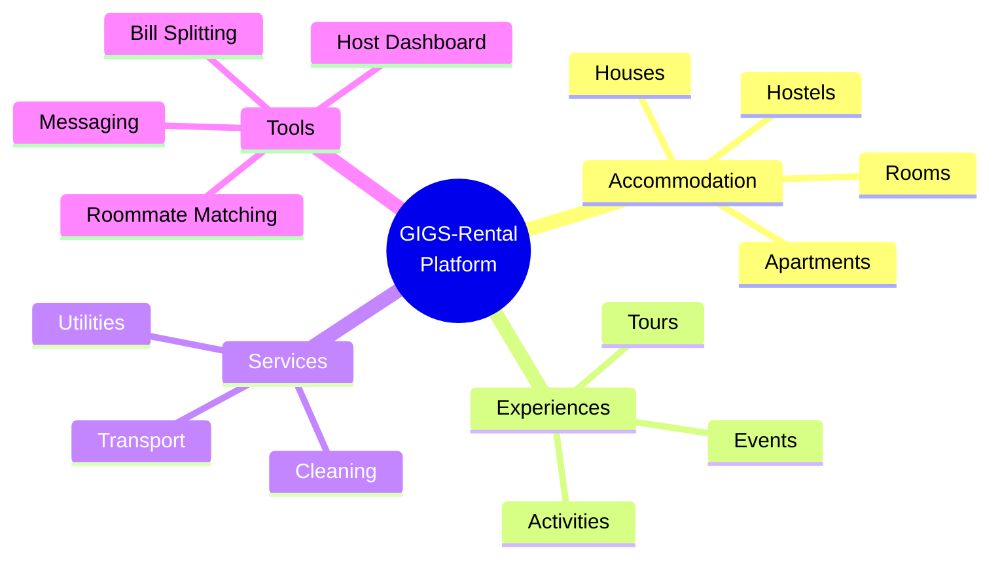

# GIGS-Rental Documentation

**Version:** 1.0  
**Last Updated:** March 24, 2026  
**Status:** Complete

---

## Welcome to GIGS-Rental Documentation

This comprehensive documentation provides detailed information about the GIGS-Rental platform, a student accommodation and rental marketplace built with modern web technologies.

## Documentation Overview



---

## Quick Navigation

### 1. Project Foundation
| Document | Description | Audience |
|----------|-------------|----------|
| [01 - Project Charter](01-project-charter.md) | Project vision, objectives, scope, and success criteria | Stakeholders, Project Managers |
| [02 - Software Requirements Specification](02-software-requirements-specification.md) | Detailed functional and non-functional requirements | Developers, QA, Product Team |

### 2. Architecture & Design
| Document | Description | Audience |
|----------|-------------|----------|
| [03 - System Architecture](03-system-architecture.md) | High-level architecture, component diagrams, and patterns | Architects, Senior Developers |
| [04 - Data Flow Documentation](04-data-flow-documentation.md) | Data flow diagrams for all major features | Developers, Analysts |
| [08 - Database Schema](08-database-schema.md) | Current and future database design | Backend Developers, DBAs |

### 3. Implementation
| Document | Description | Audience |
|----------|-------------|----------|
| [05 - Technology Stack](05-technology-stack.md) | Complete technology inventory and versions | All Developers |
| [06 - Codebase Structure](06-codebase-structure.md) | File organization and naming conventions | All Developers |
| [07 - Frontend Components](07-frontend-components.md) | Component library and usage guide | Frontend Developers |
| [10 - API Documentation](10-api-documentation.md) | REST API endpoints and specifications | Frontend Developers, API Consumers |

### 4. Operations
| Document | Description | Audience |
|----------|-------------|----------|
| [09 - Deployment & DevOps](09-deployment-devops.md) | Deployment procedures and infrastructure | DevOps, System Administrators |

---

## Project Overview

### What is GIGS-Rental?

GIGS-Rental is a comprehensive rental platform designed specifically for students and young professionals seeking affordable accommodation. The platform connects property listers (landlords, hostel owners) with renters while providing additional services like roommate matching, bill splitting, and local experiences.

### Key Features



### Technical Highlights

- **Monorepo Architecture:** Turborepo for efficient workspace management
- **Modern Stack:** Next.js 16, React 19, TypeScript 5.9, Tailwind CSS
- **Responsive Design:** Mobile-first approach with neubrutalist aesthetics
- **Real-time Features:** In-app messaging and notifications
- **Scalable Backend:** NestJS with PostgreSQL and Redis (planned)

---

## Getting Started

### Prerequisites

- Node.js 18.x or 20.x LTS
- npm 11.10.1
- Git

### Quick Start

```bash
# Clone the repository
git clone <repository-url>
cd GIGS-Rental

# Install dependencies
npm install

# Start development servers
npm run dev
```

### Development URLs

| Application | Port | URL |
|-------------|------|-----|
| Marketing Website | 8888 | http://localhost:8888 |
| Dashboard | 3001 | http://localhost:3001 |
| Backend API | 3000 | http://localhost:3000 |

---

## Documentation by Role

### For Project Managers
1. Start with the [Project Charter](01-project-charter.md) to understand project scope and objectives
2. Review [Software Requirements](02-software-requirements-specification.md) for detailed specifications
3. Check [System Architecture](03-system-architecture.md) for technical overview

### For Developers
1. Read [Technology Stack](05-technology-stack.md) to understand the tools
2. Study [Codebase Structure](06-codebase-structure.md) for file organization
3. Reference [Frontend Components](07-frontend-components.md) for UI development
4. Consult [Data Flow](04-data-flow-documentation.md) for feature implementation

### For DevOps Engineers
1. Review [Deployment & DevOps](09-deployment-devops.md) for infrastructure setup
2. Check [Database Schema](08-database-schema.md) for data management
3. Reference [System Architecture](03-system-architecture.md) for deployment patterns

### For QA Engineers
1. Review [Software Requirements](02-software-requirements-specification.md) for test cases
2. Study [Data Flow](04-data-flow-documentation.md) for understanding user journeys
3. Reference [API Documentation](10-api-documentation.md) for API testing

---

## Architecture at a Glance

```mermaid
flowchart TB
    subgraph "Client Layer"
        WEB[Marketing Website<br/>Next.js :8888]
        DASH[Dashboard App<br/>Next.js :3001]
    end
    
    subgraph "API Layer"
        API[NestJS Backend<br/>:3000]
    end
    
    subgraph "Shared Packages"
        UI[@repo/ui]
        AUTH[@repo/auth]
        CONFIG[@repo/config]
    end
    
    subgraph "Data Layer"
        LOCAL[(localStorage<br/>Current)]
        DB[(PostgreSQL<br/>Future)]
        CACHE[(Redis<br/>Future)]
    end
    
    WEB --> UI
    DASH --> UI
    WEB --> AUTH
    DASH --> AUTH
    DASH --> API
    
    WEB --> LOCAL
    DASH --> LOCAL
    API -.-> DB
    API -.-> CACHE
```

---

## Key Decisions Documented

| Decision | Document | Rationale |
|----------|----------|-----------|
| Turborepo for monorepo | [System Architecture](03-system-architecture.md) | Build caching, task orchestration |
| localStorage for MVP | [Database Schema](08-database-schema.md) | Rapid development, offline capability |
| Next.js App Router | [Codebase Structure](06-codebase-structure.md) | Server components, better performance |
| Neubrutalist Design | [Technology Stack](05-technology-stack.md) | Brand differentiation, accessibility |
| PostgreSQL for production | [Database Schema](08-database-schema.md) | ACID compliance, JSON support |

---

## Contributing to Documentation

When updating documentation:

1. **Follow the numbering system** (01-, 02-, etc.)
2. **Update the table of contents** in this README
3. **Add version history** to each document
4. **Use Mermaid diagrams** for visualizations
5. **Keep code examples** up to date with actual implementation

---

## Version History

| Version | Date | Changes |
|---------|------|---------|
| 1.0 | 2026-03-24 | Initial documentation suite creation |

---

## Additional Resources

- [Dynamic Listing Flow Architecture](../plans/dynamic-listing-flow.md) - Detailed listing creation flow
- Project Repository - Source code access
- Team Wiki - Internal team documentation

---

## Support

For questions about the documentation or project:

1. Check the relevant documentation section
2. Review the [Codebase Structure](06-codebase-structure.md) for file locations
3. Consult [API Documentation](10-api-documentation.md) for endpoint details
4. Contact the technical team

---

*This documentation is maintained by the GIGS-Rental technical team and is updated regularly to reflect the current state of the project.*