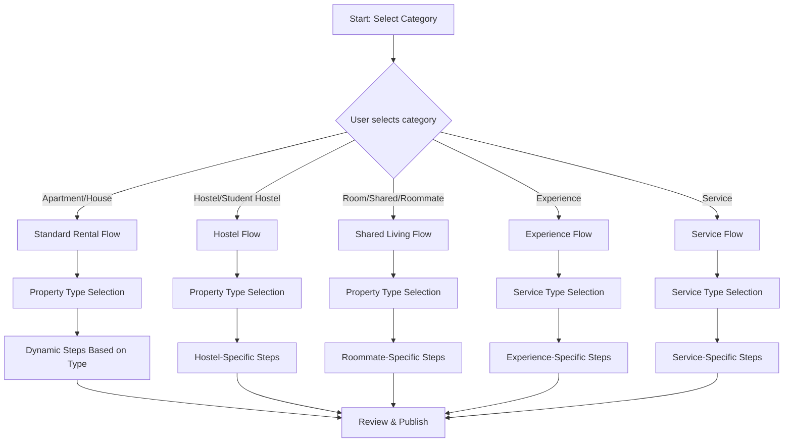

# Dynamic Listing Creation Flow Architecture

## 1. Architecture Overview

### Core Principle
The listing creation flow uses a **dynamic step engine** that adapts based on:
1. **Category Selection (Step 1)** - Determines the high-level flow type
2. **Property Type Selection (Step 2)** - Refines the specific fields and steps

### Flow Architecture Diagram



### Key Architecture Components

#### 1. ListingTypeConfig (Type Definition)
```typescript
interface ListingTypeConfig {
  id: string;
  category: 'accommodation' | 'experience' | 'service';
  flowType: 'standard' | 'hostel' | 'roommate' | 'experience' | 'service';
  steps: StepConfig[];
  validationRules: ValidationRule[];
  fieldMappings: FieldMapping[];
}
```

#### 2. Step Engine
```typescript
interface StepConfig {
  id: number;
  title: string;
  subtitle: string;
  icon: string;
  fields: FieldConfig[];
  isRequired: boolean;
  conditionalFields?: ConditionalField[];
  helperText?: string;
}
```

#### 3. Dynamic Step Resolver
- Takes category + property type as input
- Returns tailored step configuration
- Handles conditional field visibility
- Manages validation rules per step

---

## 2. Step 1: Category Selection UI

### Question
"What would you like to list?"

### Options & Structure

| Category | Icon | Description | Target Users |
|----------|------|-------------|--------------|
| Home / Apartment / House | ph-house-line | Full property for rent | Landlords, property managers |
| Hostel | ph-bed | Hostel beds & rooms | Hostel owners, student housing |
| Student Hostel | ph-graduation-cap | Student-focused accommodation | Student housing providers |
| Room | ph-door | Private room rental | Individual landlords, tenants |
| Shared Room | ph-users-three | Room with roommates | Students, young professionals |
| Roommate Space | ph-person-simple-walk | Looking for roommates | Students seeking flatmates |
| Experience | ph-sparkle | Tours & activities | Tour guides, activity hosts |
| Service | ph-wrench | Cleaning, transport, utilities | Service providers |

### UI Pattern
- Grid of large, tappable cards (2 columns mobile, 3+ desktop)
- Each card shows icon, title, description
- Selected state with brand color border & subtle background
- "Coming Soon" badge for disabled categories

---

## 3. Dynamic Step Outlines by Listing Type

### 3.1 Apartment/House Flow
**Use Case:** Standard rental properties - apartments, houses, villas, townhouses

**Step Structure:**

| Step | Title | Subtitle | Fields |
|------|-------|----------|--------|
| 1 | Category | "What would you like to list?" | Category selector |
| 2 | Property Type | "What type of property?" | Apartment, House, Villa, Townhouse |
| 3 | Location | "Where is it located?" | Country, State, City, Address |
| 4 | Details | "Tell us about your place" | Title, Description, Bedrooms, Bathrooms, Max Occupants, Square footage |
| 5 | Amenities | "What amenities do you offer?" | WiFi, Kitchen, AC, Parking, Security, etc. |
| 6 | Photos | "Add some photos" | Image upload (min 5, max 20) |
| 7 | Pricing | "Set your price" | Monthly/nightly/yearly price, deposit, utility inclusion |
| 8 | Availability | "When is it available?" | Availability calendar, instant book toggle |
| 9 | House Rules | "What are the rules?" | Pet policy, smoking, parties, check-in time |
| 10 | Review | "Review your listing" | Full preview with edit buttons |

**Helper Text Examples:**
- *Location:* "Help students find your property by providing accurate location"
- *Details:* "A catchy title and good description attract more inquiries"
- *Pricing:* "Students often compare prices - be competitive in your area"
- *Photos:* "Good photos make your listing 3x more likely to get booked"

---

### 3.2 Hostel/Student Hostel Flow
**Use Case:** Hostel accommodation with shared spaces, bunk beds, student-focused amenities

**Step Structure:**

| Step | Title | Subtitle | Fields |
|------|-------|----------|--------|
| 1 | Category | "What would you like to list?" | Hostel or Student Hostel |
| 2 | Property Type | "What type of hostel?" | Traditional Hostel, Student Lodge, Boutique Hostel |
| 3 | Location | "Where is it located?" | Country, State, City, Area (near uni/transport) |
| 4 | Rooms & Beds | "Tell us about your hostel" | Total rooms, bed types (bunk/single), total beds, gender-specific options |
| 5 | Room Types | "What room types do you have?" | Dorm (6/8/10 bed), Private ensuite, Mixed/single-gender |
| 6 | Shared Spaces | "What common areas?" | Kitchen, lounge, study room, laundry, outdoor space |
| 7 | Amenities | "Student amenities" | WiFi 24/7, Breakfast included, AC, hot water, locker, bed linen |
| 8 | Pricing | "Set your pricing" | Per bed price, weekly/monthly discounts, deposit |
| 9 | Student Perks | "What makes it student-friendly?" | Near university, transport links, curfew policy, meal plans |
| 10 | Photos | "Show your hostel" | Common areas, rooms, dorms, facilities |
| 11 | House Rules | "Hostel rules" | Quiet hours, guest policy, check-in/out times |
| 12 | Review | "Review your listing" | Preview with student-focused details highlighted |

**Hostel-Specific Fields:**
- `bedTypes`: ['bunk', 'single', 'double'] with pricing per type
- `genderOption`: 'mixed' | 'male_only' | 'female_only'
- `hasMealPlan`: boolean with meal options
- `curfewTime`: string for student safety
- `nearestUniversity`: string for student appeal
- `transportLinks`: array of nearby transit options

**Helper Text Examples:**
- *Rooms & Beds:* "Students book early for semester - showcase your bed availability"
- *Shared Spaces:* "Students value communal spaces for socializing and studying"
- *Student Perks:* "Highlighting proximity to universities and transport makes your listing stand out"
- *Pricing:* "Semester-long bookings often get 10-20% discounts - show your best rate"

---

### 3.3 Room/Shared Room/Roommate Flow
**Use Case:** Individual rooms, shared living spaces, roommate matching for students

**Step Structure:**

| Step | Title | Subtitle | Fields |
|------|-------|----------|--------|
| 1 | Category | "What would you like to list?" | Room, Shared Room, or Roommate Space |
| 2 | Property Type | "What kind of space?" | Private Room, Shared Room, Self-contain, Flat share |
| 3 | Location | "Where is it?" | Country, State, City, Neighborhood |
| 4 | Room Details | "Tell us about the room" | Room size, furnished status, window type, lock availability |
| 5 | Living Situation | "Who else lives there?" | Number of housemates, landlord lives in, common areas |
| 6 | Amenities | "What's included?" | WiFi, kitchen access, laundry, AC, bills included |
| 7 | Roommate Preferences | "Who are you looking for?" (if posting as tenant) | Gender preference, age range, student/professional |
| 8 | Photos | "Add photos" | Room photos, common areas, bathroom |
| 9 | Pricing | "Set your price" | Rent, deposit, bills (included/excluded) |
| 10 | Availability | "When can they move in?" | Available from date, minimum stay |
| 11 | Review | "Review your listing" | Preview with roommate-friendly details |

**Roommate-Specific Fields:**
- `roomSize`: 'small' | 'medium' | 'large' with dimensions
- `furnished`: 'fully' | 'partially' | 'empty'
- `billsIncluded`: boolean
- `housemateCount`: number
- `landlordPresent`: boolean
- `preferredGender`: 'any' | 'male' | 'female'
- `ageRange`: { min: number, max: number }
- `tenantType`: 'student' | 'professional' | 'any'

**Helper Text Examples:**
- *Living Situation:* "Students often prefer living with other students - mention your current housemates"
- *Roommate Preferences:* "Being clear about preferences helps attract compatible roommates"
- *Bills:* "Including bills in rent simplifies budgeting for students"
- *Photos:* "Show the room's best features - natural light, study space, storage"

---

### 3.4 Experience Flow
**Use Case:** Tours, activities, events for travelers and students

**Step Structure:**

| Step | Title | Subtitle | Fields |
|------|-------|----------|--------|
| 1 | Category | "What would you like to list?" | Experience |
| 2 | Experience Type | "What kind of experience?" | Tour, Activity, Workshop, Event |
| 3 | Location | "Where does it happen?" | Meeting point, area coverage |
| 4 | Details | "Describe your experience" | Title, description, duration, language |
| 5 | What's Included | "What's included?" | Equipment, materials, food, transport |
| 6 | Itinerary | "What's the schedule?" | Timeline of activities |
| 7 | Capacity | "How many people?" | Min/max guests, group size |
| 8 | Photos | "Showcase the experience" | Highlight photos, behind-the-scenes |
| 9 | Pricing | "Set your pricing" | Per person price, group discounts |
| 10 | Review | "Review your listing" | Preview |

---

### 3.5 Service Flow
**Use Case:** Cleaning, transport, utilities services for landlords and tenants

**Step Structure:**

| Step | Title | Subtitle | Fields |
|------|-------|----------|--------|
| 1 | Category | "What service do you offer?" | Service |
| 2 | Service Type | "What type?" | Cleaning, Transport, Utilities, Maintenance |
| 3 | Coverage Area | "Where do you operate?" | Service areas, zones |
| 4 | Service Details | "Describe your service" | Title, description, service hours |
| 5 | Pricing Model | "How do you charge?" | Per hour, per job, subscription |
| 6 | Availability | "When are you available?" | Days, time slots, emergency availability |
| 7 | Photos | "Show your work" | Before/after, vehicle, equipment |
| 8 | Reviews | "Review your listing" | Preview |

---

## 4. Implementation UI Patterns

### 4.1 Step Navigator Component

```tsx
// Step indicator with progress
const StepNavigator = ({ steps, currentStep, onStepClick }) => (
  <div className="flex items-center gap-2 overflow-x-auto py-4">
    {steps.map((step, index) => (
      <button
        key={step.id}
        onClick={() => onStepClick(index)}
        className={`
          flex items-center gap-2 px-3 py-2 rounded-full whitespace-nowrap
          ${index + 1 === currentStep 
            ? 'bg-brand-500 text-white' 
            : index + 1 < currentStep 
              ? 'bg-green-100 text-green-700'
              : 'bg-slate-100 text-slate-500'}
        `}
      >
        <i className={`ph ${step.icon}`} />
        <span className="text-sm font-medium">{step.title}</span>
      </button>
    ))}
  </div>
);
```

### 4.2 Dynamic Step Renderer

```tsx
// Renders different step content based on flow type
const StepContent = ({ step, formData, onUpdate, errors }) => {
  switch (step.type) {
    case 'location':
      return <LocationFields values={formData} onChange={onUpdate} errors={errors} />;
    case 'beds':
      return <BedConfiguration values={formData} onChange={onUpdate} />;
    case 'roommates':
      return <RoommatePreferences values={formData} onChange={onUpdate} />;
    case 'pricing':
      return <PricingFields values={formData} onChange={onUpdate} flowType={formData.flowType} />;
    default:
      return <GenericFields step={step} values={formData} onChange={onUpdate} errors={errors} />;
  }
};
```

### 4.3 Conditional Field Logic

```tsx
// Example: Show hostel-specific fields only for hostel flow
const ConditionalField = ({ field, formData, show }) => {
  if (!show) return null;
  
  return (
    <div className="animate-fade-in">
      <label className="block text-sm font-medium text-slate-700 mb-2">
        {field.label}
        {field.required && <span className="text-red-500">*</span>}
      </label>
      {/* Field component */}
    </div>
  );
};

// Usage in step
{step.fields.map(field => (
  <ConditionalField 
    key={field.id}
    field={field}
    show={shouldShowField(field, formData)}
  />
))}
```

### 4.4 Card Selection Pattern (Mobile-First)

```tsx
// Category/Property Type Selection Card
const SelectionCard = ({ option, isSelected, onSelect, disabled }) => (
  <button
    onClick={onSelect}
    disabled={disabled}
    className={`
      p-4 rounded-2xl border-2 text-left transition-all duration-300
      min-h-[100px] flex flex-col justify-between
      ${isSelected 
        ? 'border-brand-500 bg-brand-50 shadow-lg' 
        : disabled
          ? 'border-slate-200 bg-slate-50 opacity-50 cursor-not-allowed'
          : 'border-slate-200 bg-white hover:border-brand-200 hover:shadow-md'}
    `}
  >
    <div className="flex items-start gap-3">
      <div className={`w-12 h-12 rounded-xl flex items-center justify-center ${
        option.color === 'purple' ? 'bg-purple-100 text-purple-600' :
        option.color === 'blue' ? 'bg-blue-100 text-blue-600' :
        option.color === 'green' ? 'bg-green-100 text-green-600' :
        'bg-slate-100 text-slate-600'
      }`}>
        <i className={`ph-bold ${option.icon} text-xl`} />
      </div>
      <div className="flex-1">
        <h3 className="font-bold text-brand-dark">{option.title}</h3>
        <p className="text-sm text-slate-500">{option.description}</p>
      </div>
    </div>
    {option.badge && (
      <span className="self-start mt-2 px-2 py-0.5 bg-brand-100 text-brand-700 text-xs rounded-full">
        {option.badge}
      </span>
    )}
  </button>
);
```

### 4.5 Auto-Save & Continue Later

```tsx
// Draft management hook
const useListingDraft = () => {
  const saveDraft = (formData, currentStep, category) => {
    const draft = {
      ...formData,
      savedAt: new Date().toISOString(),
      currentStep,
      category,
      stepVersion: getStepVersion(category), // Version the steps
    };
    localStorage.setItem('gigs_listing_draft', JSON.stringify(draft));
  };

  const loadDraft = () => {
    const saved = localStorage.getItem('gigs_listing_draft');
    if (saved) {
      const draft = JSON.parse(saved);
      // Check if step version matches current version
      if (draft.stepVersion === getStepVersion(draft.category)) {
        return draft;
      }
    }
    return null;
  };

  const resumeOrDiscard = () => {
    // Show modal asking user to resume or start fresh
  };
};
```

### 4.6 Validation Pattern

```tsx
// Step-level validation
const validateStep = (step, formData) => {
  const errors = {};
  
  step.fields.forEach(field => {
    if (field.required && !formData[field.id]) {
      errors[field.id] = `${field.label} is required`;
    }
    
    // Custom validations
    if (field.id === 'price' && formData.price <= 0) {
      errors.price = 'Price must be greater than 0';
    }
    
    if (field.id === 'beds' && formData.totalBeds < 1) {
      errors.totalBeds = 'Hostel must have at least 1 bed';
    }
  });
  
  return errors;
};

// Can proceed check
const canProceed = (currentStep, formData) => {
  const stepConfig = getStepConfig(currentStep, formData.category, formData.propertyType);
  const errors = validateStep(stepConfig, formData);
  return Object.keys(errors).length === 0;
};
```

---

## 5. Data Models

### Listing Form Data Structure

```typescript
interface ListingFormData {
  // Common fields
  category: string;
  propertyType: string;
  title: string;
  description: string;
  location: {
    country: string;
    state: string;
    city: string;
    address: string;
    coordinates?: { lat: number; lng: number };
  };
  photos: string[];
  price: number;
  priceType: 'month' | 'night' | 'year';
  status: 'draft' | 'pending' | 'published';
  
  // Accommodation-specific
  bedrooms?: number;
  bathrooms?: number;
  maxOccupants?: number;
  amenities?: string[];
  
  // Hostel-specific
  totalBeds?: number;
  bedTypes?: BedTypeConfig[];
  roomTypes?: RoomTypeConfig[];
  hasMealPlan?: boolean;
  curfewTime?: string;
  nearestUniversity?: string;
  genderOption?: 'mixed' | 'male_only' | 'female_only';
  
  // Roommate-specific
  roomSize?: 'small' | 'medium' | 'large';
  furnished?: 'fully' | 'partially' | 'empty';
  billsIncluded?: boolean;
  housemateCount?: number;
  landlordPresent?: boolean;
  preferredGender?: 'any' | 'male' | 'female';
  ageRange?: { min: number; max: number };
  
  // Experience-specific
  duration?: string;
  language?: string;
  capacity?: { min: number; max: number };
  itinerary?: ItineraryItem[];
  
  // Service-specific
  coverageArea?: string[];
  serviceHours?: string;
  pricingModel?: string;
}
```

---

## 6. Summary: Key UX Principles

1. **Progressive Disclosure** - Only show relevant fields for each listing type
2. **Smart Defaults** - Pre-fill based on common patterns for each property type
3. **Mobile-First** - Large touch targets, simple interactions, minimal typing
4. **Save & Resume** - Auto-save drafts, easy to continue later
5. **Clear Progress** - Step indicator shows where user is in the flow
6. **Helpful Context** - Helper text explains why information matters
7. **Validation Feedback** - Immediate, friendly error messages
8. **Review Before Publish** - Full preview with ability to edit each section

---

## Next Steps for Implementation

1. Create the dynamic step configuration system
2. Build the category selection UI (Step 1)
3. Build property type selection with conditional options (Step 2)
4. Implement the dynamic step renderer
5. Add field-specific components (beds, roommates, pricing)
6. Implement auto-save and draft management
7. Build the review and publish step
8. Add validation for each step type